### Context Augmentation

**Context augmentation** in LlamaIndex is the process of adding contextual information to data, allowing large language models (LLM) to better understand and provide more accurate answers. This involves connecting the LLM with external data sources, processing, and indexing data, helping the model include additional context when responding to queries. This is especially useful when the necessary data is not within the model's original training scope.



Suppose you have a language model trained to answer questions about products in a store. When a user asks about a specific product, the model will not only rely on the initial training data but also fetch information from the current product database, customer reviews, and price history to provide a more accurate and detailed response.

```mermaid
graph TD;
    A[🧑‍💻 User Asks About Product] --> B[🔗 Connect with Current Data];
    B --> C[📊 Current Product Data];
    B --> D[💬 Customer Reviews];
    B --> E[📅 Price History];
    C --> F[🧠 Large Language Model];
    D --> F;
    E --> F;
    F --> G[💡 Accurate Answer with Context];
```





### What are Agents?

**Agents** are components or modules responsible for specific tasks such as fetching data from sources, processing information, or interacting with the model to retrieve and enhance data. Agents automate tasks and efficiently manage different parts of the data retrieval and processing pipeline, enabling more complex and flexible interactions between data sources and the large language model.

##### Example:

Suppose you have an agent responsible for querying data from a product database. When a user requests information about a product, this agent will query the database, process the information, and send the results to the language model to answer the user.



### What are Workflows?

**Workflows** are predefined sequences of tasks or operations that automate processes within a system. In LlamaIndex or similar frameworks, workflows guide the steps an application takes to handle specific tasks, such as data ingestion, processing, indexing, and querying. Workflows ensure that tasks are completed consistently and efficiently, often involving multiple agents or components working together.

#### Example:

Suppose you have a system that needs to gather data from a website, process this data to extract important information, index it for search, and then allow users to query that data. A workflow would automate all these steps.



### So, What is LlamaIndex?

**LlamaIndex** is a framework that supports building **context-augmented LLM applications**. This framework imposes no restriction on how you use LLMs and simplifies their integration, whether as **chatbots**, **agents**, or **auto-complete systems**. LlamaIndex provides essential tools such as:

-   **Data connectors** from various sources.
-   **Data indexes** for efficient LLM processing.
-   **Query and chat engines** that provide natural language interfaces.
-   **Agents** as intelligent virtual assistants powered by LLM.
-   **Workflows** that combine these elements into a flexible system.



Suppose you want to build a smart chatbot system for your business. With **LlamaIndex**, you can easily integrate data from various sources like **APIs**, **SQL databases**, and **PDF documents**. This data is then **indexed** so that the large language model (LLM) can process it quickly. When customers ask questions, the **query engine** will search and answer the question from the indexed data, or the **agent** can handle more complex requests.

```mermaid
graph TD;
    A[🌐 Input Data] --> B[🔗 Data Connectors];
    B --> C[📊 Data Indexes];
    C --> D[🔍 Query Engine];
    C --> E[🤖 Agent];
    D --> F[💬 Answer Questions];
    E --> G[🛠️ Process Information];
    G --> F[💡 Final Result];
```





### Use Cases

LlamaIndex can be applied in various use cases, including:

1.  **Enhanced Search Engines**: Improve search functionality by integrating data from multiple sources and structuring it for more accurate query responses.
2.  **Intelligent Chatbots**: Build chatbots that leverage contextual data from diverse sources, enabling them to answer complex user queries effectively.
3.  **Data Integration and Analysis**: Aggregate and analyze data from different formats and sources, making it accessible via natural language interfaces.
4.  **Knowledge Management**: Organize and retrieve company knowledge from unstructured data, improving internal decision-making processes.

### Who is LlamaIndex for?

**LlamaIndex** is designed for:

-   **Developers**: Who need to build context-augmented applications using Large Language Models (LLMs).
-   **Data Scientists**: Looking to integrate and process data from various sources to enhance LLM capabilities.
-   **Businesses**: That require powerful, flexible tools to manage, query, and retrieve information from large datasets.
-   **Researchers**: Interested in experimenting with LLMs for natural language processing tasks.

LlamaIndex is a versatile framework that simplifies using LLMs across different contexts and industries.

### How to Install LlamaIndex Quickly and Easily

**Step 1: Install LlamaIndex**

-   Open the terminal or command prompt, then run the following command to install LlamaIndex:

```bash
    pip install llama-index
    pip install llama-index-embeddings-huggingface
    pip install llama-index-embeddings-instructor
    pip install llama-index-llms-ollama
    pip install torch==2.3.1 torchvision==0.18.1
```

**Step 2: Create a Demo Application**

-   Create a Python file, for example `llama_demo.py`, and write the following code:

```python
from llama_index.core import Settings, SimpleDirectoryReader, VectorStoreIndex
from llama_index.embeddings.huggingface import HuggingFaceEmbedding
from llama_index.llms.ollama import Ollama

documents = SimpleDirectoryReader("data").load_data()

# bge-base embedding model
Settings.embed_model = HuggingFaceEmbedding(model_name="BAAI/bge-base-en-v1.5")

# ollama
Settings.llm = Ollama(model="llama3.1", request_timeout=360.0)

index = VectorStoreIndex.from_documents(
    documents,
)
```

**Step 4: Run the Application**

-   Run your Python file to see the results.

```python
python llama_demo.py
```

After running successfully, you should see results like the one below:



This is a simple and easy way to get started with LlamaIndex and see it in action. [Github](https://github.com/akitectio/llamaindex-from-basics-to-advanced).
