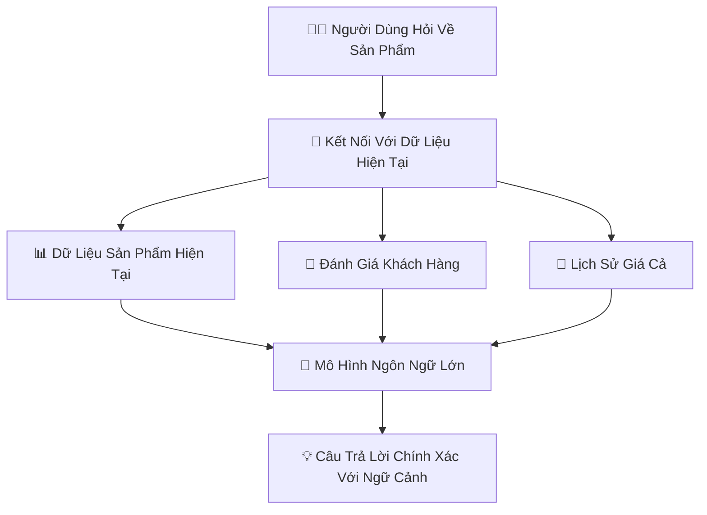
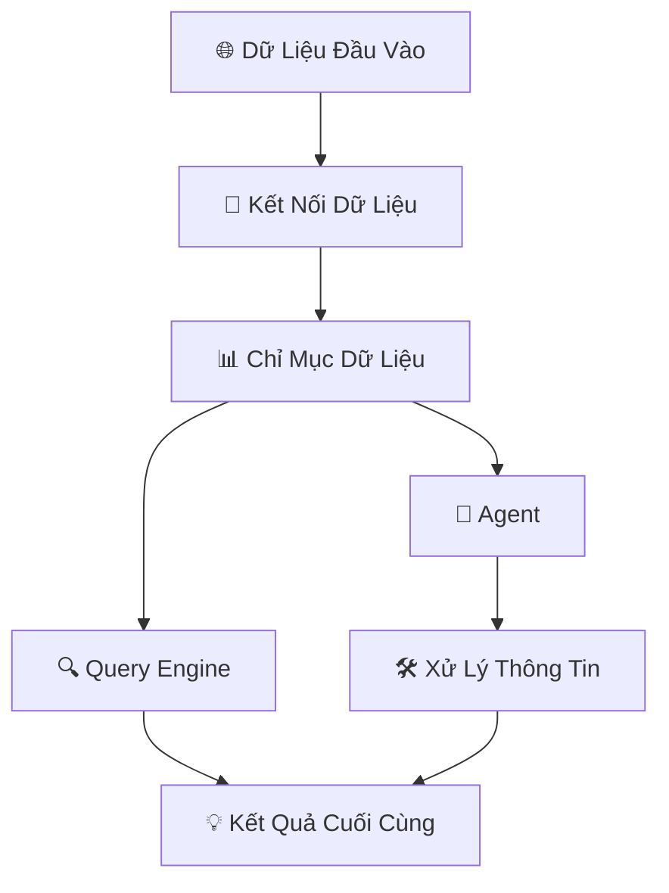

### Context Augmentation là gì?

**Context augmentation** trong LlamaIndex là quá trình bổ sung thông tin ngữ cảnh vào dữ liệu để giúp mô hình ngôn ngữ lớn (LLM) hiểu rõ hơn và trả lời chính xác hơn. Điều này bao gồm việc kết nối LLM với các nguồn dữ liệu bên ngoài, xử lý, và lập chỉ mục dữ liệu, giúp mô hình có ngữ cảnh bổ sung khi trả lời các truy vấn. Việc này đặc biệt hữu ích khi dữ liệu cần thiết không nằm trong phạm vi mà mô hình đã được huấn luyện.



Giả sử bạn có một mô hình ngôn ngữ được huấn luyện để trả lời các câu hỏi về sản phẩm trong cửa hàng. Khi người dùng hỏi về một sản phẩm cụ thể, mô hình sẽ không chỉ dựa vào dữ liệu huấn luyện ban đầu mà còn lấy thêm thông tin từ cơ sở dữ liệu sản phẩm hiện tại, các đánh giá khách hàng, và lịch sử giá cả để cung cấp câu trả lời chính xác và chi tiết hơn.





### Agents là gì?

**agents** là các thành phần hoặc module chịu trách nhiệm thực hiện các nhiệm vụ cụ thể như truy xuất dữ liệu từ các nguồn, xử lý thông tin, hoặc tương tác với mô hình để lấy và cải thiện dữ liệu. Agents giúp tự động hóa các tác vụ và quản lý các phần khác nhau của quy trình truy xuất và xử lý dữ liệu một cách hiệu quả, cho phép các tương tác phức tạp và linh hoạt hơn giữa các nguồn dữ liệu và mô hình ngôn ngữ lớn.

##### Ví dụ:

Giả sử bạn có một agent chịu trách nhiệm truy vấn dữ liệu từ cơ sở dữ liệu sản phẩm. Khi người dùng yêu cầu thông tin về một sản phẩm, agent này sẽ truy vấn cơ sở dữ liệu, xử lý thông tin, và gửi kết quả cho mô hình ngôn ngữ để trả lời người dùng.



### Workflows là gì?

**Workflows** là các chuỗi nhiệm vụ hoặc thao tác được định trước, tự động hóa các quy trình trong hệ thống. Trong LlamaIndex hoặc các framework tương tự, workflows hướng dẫn các bước mà ứng dụng cần thực hiện để xử lý các tác vụ cụ thể như nhập dữ liệu, xử lý, lập chỉ mục và truy vấn. Workflows đảm bảo rằng các nhiệm vụ được hoàn thành một cách nhất quán và hiệu quả, thường bao gồm nhiều agents hoặc thành phần hoạt động cùng nhau.

#### Ví dụ:

Giả sử bạn có một hệ thống cần thu thập dữ liệu từ một website, xử lý dữ liệu này để trích xuất thông tin quan trọng, lập chỉ mục cho việc tìm kiếm, và sau đó cho phép người dùng truy vấn dữ liệu đó. Workflow sẽ tự động hóa tất cả các bước này.



### Vậy LlamaIndex  là gì?

**LlamaIndex** là một framework hỗ trợ xây dựng các **ứng dụng LLM có bổ sung ngữ cảnh**. Framework này không giới hạn cách sử dụng LLMs và chỉ đơn giản hóa việc tích hợp chúng như **chatbot**, **agent**, hoặc **hệ thống hoàn thiện tự động**. LlamaIndex cung cấp các công cụ quan trọng như:

-   **Kết nối dữ liệu** từ các nguồn khác nhau.
-   **Chỉ mục dữ liệu** để LLMs xử lý hiệu quả.
-   **Động cơ truy vấn và trò chuyện** cung cấp giao diện ngôn ngữ tự nhiên.
-   **Agents** là các trợ lý ảo thông minh sử dụng LLM.
-   **Workflows** kết hợp các yếu tố trên thành một hệ thống linh hoạt.



Giả sử bạn muốn xây dựng một hệ thống chatbot thông minh cho doanh nghiệp của mình. Với **LlamaIndex**, bạn có thể dễ dàng tích hợp dữ liệu từ các nguồn khác nhau như **APIs**, **SQL cơ sở dữ liệu**, **PDF tài liệu**. Dữ liệu này sau đó được **chỉ mục** để mô hình ngôn ngữ lớn (LLM) có thể xử lý nhanh chóng. Khi khách hàng hỏi, **query engine** sẽ tìm kiếm và trả lời câu hỏi từ dữ liệu được chỉ mục, hoặc **agent** có thể xử lý các yêu cầu phức tạp hơn.





### Các trường hợp sử dụng

LlamaIndex có thể được áp dụng trong nhiều trường hợp sử dụng, bao gồm:

1.  **Cải thiện công cụ tìm kiếm**: Nâng cao chức năng tìm kiếm bằng cách tích hợp dữ liệu từ nhiều nguồn và tổ chức chúng để đưa ra các phản hồi chính xác hơn.
2.  **Chatbot thông minh**: Xây dựng các chatbot sử dụng dữ liệu ngữ cảnh từ nhiều nguồn, giúp trả lời các câu hỏi phức tạp của người dùng một cách hiệu quả.
3.  **Tích hợp và phân tích dữ liệu**: Tập hợp và phân tích dữ liệu từ các định dạng và nguồn khác nhau, giúp người dùng truy cập qua giao diện ngôn ngữ tự nhiên.
4.  **Quản lý tri thức**: Tổ chức và truy xuất tri thức của công ty từ dữ liệu không cấu trúc, cải thiện quy trình ra quyết định nội bộ.

### Ai là người sử dụng

**LlamaIndex** dành cho:

-   **Nhà phát triển (Developers)**: Cần xây dựng các ứng dụng sử dụng mô hình ngôn ngữ lớn (LLM) với ngữ cảnh bổ sung.
-   **Nhà khoa học dữ liệu (Data Scientists)**: Muốn tích hợp và xử lý dữ liệu từ nhiều nguồn để tăng cường khả năng của LLM.
-   **Doanh nghiệp (Businesses)**: Cần các công cụ mạnh mẽ, linh hoạt để quản lý, truy vấn và truy xuất thông tin từ các tập dữ liệu lớn.
-   **Nhà nghiên cứu (Researchers)**: Quan tâm đến việc thử nghiệm với LLM trong các tác vụ xử lý ngôn ngữ tự nhiên.

LlamaIndex là framework đa năng giúp đơn giản hóa việc sử dụng LLM trong nhiều ngữ cảnh và ngành công nghiệp khác nhau.

### Cách cài đặt LlamaIndex đơn giản và nhanh chóng

**Bước 1: Cài đặt LlamaIndex**

-   Mở terminal hoặc command prompt, sau đó chạy lệnh sau để cài đặt LlamaIndex:

```bash
    pip install llama-index
    pip install llama-index-embeddings-huggingface
    pip install llama-index-embeddings-instructor
    pip install llama-index-llms-ollama
    pip install torch==2.3.1 torchvision==0.18.1
```

**Bước 2: Tạo ứng dụng demo**

-   Tạo một tệp Python, ví dụ `llama_demo.py` và viết mã như sau:

```python
from llama_index.core import Settings, SimpleDirectoryReader, VectorStoreIndex
from llama_index.embeddings.huggingface import HuggingFaceEmbedding
from llama_index.llms.ollama import Ollama

documents = SimpleDirectoryReader("data").load_data()

# bge-base embedding model
Settings.embed_model = HuggingFaceEmbedding(model_name="BAAI/bge-base-en-v1.5")

# ollama
Settings.llm = Ollama(model="llama3.1", request_timeout=360.0)

index = VectorStoreIndex.from_documents(
    documents,
)
```

**Bước 4: Chạy ứng dụng**

-   Chạy tệp Python của bạn để thấy kết quả.

```python
python llama_demo.py
```

Sau khi chạy thành công thì chúng ta sẽ có kết quả như bên dưới:



Như vậy ta đã tìm hiểu qua các định nghĩa của `LlamaIndex` và chạy thử rất đơn giản.

 [Bạn có thể tham khảo code qua github](https://github.com/akitectio/llamaindex-from-basics-to-advanced).
