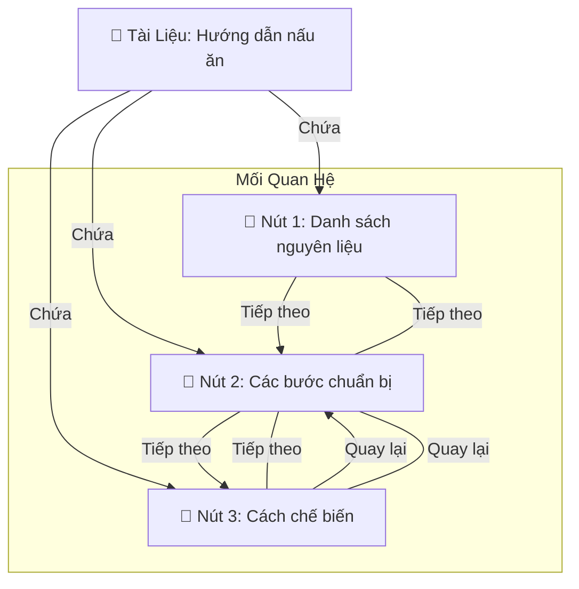

Trong thế giới thông tin ngày càng phức tạp, việc tìm kiếm và truy xuất thông tin hiệu quả không chỉ đơn thuần dựa trên các từ khóa khớp chính xác. LlamaIndex, với sự hỗ trợ của Embeddings, đã vượt qua giới hạn này, mang đến khả năng tìm kiếm thông minh dựa trên ý nghĩa và ngữ cảnh. Embeddings đóng vai trò như một cầu nối giữa ngôn ngữ tự nhiên và biểu diễn toán học, cho phép LlamaIndex hiểu sâu sắc nội dung tài liệu và truy vấn của người dùng, từ đó cung cấp kết quả tìm kiếm chính xác và phù hợp hơn bao giờ hết.

## Khái niệm

Đối tượng `Document` (Tài liệu) và `Node` (Nút) là những khái niệm trừu tượng cơ bản trong LlamaIndex.

-   **Document:** Một `Document` là một vùng chứa chung cho bất kỳ nguồn dữ liệu nào - ví dụ: một tệp PDF, đầu ra API hoặc dữ liệu được truy xuất từ cơ sở dữ liệu. Chúng có thể được xây dựng thủ công hoặc tạo tự động thông qua các trình tải dữ liệu của chúng tôi. Theo mặc định, một `Document` lưu trữ văn bản cùng với một số thuộc tính khác. Một số trong số này được liệt kê dưới đây:
        * `metadata`: một từ điển các chú thích có thể được nối thêm vào văn bản.
        * `relationships`: một từ điển chứa các mối quan hệ với các `Document`/`Node` khác.
    **Lưu ý:** Chúng tôi có hỗ trợ beta cho phép `Document` lưu trữ hình ảnh và đang tích cực làm việc để cải thiện khả năng đa phương thức của nó.

-   **Node:** Một `Node` đại diện cho một "phần" của `Document` nguồn, cho dù đó là một đoạn văn bản, một hình ảnh hay thứ gì khác. Tương tự như `Document`, chúng chứa siêu dữ liệu và thông tin mối quan hệ với các nút khác.
    `Node` là một công dân hạng nhất trong LlamaIndex. Bạn có thể chọn định nghĩa `Node` và tất cả các thuộc tính của nó một cách trực tiếp. Bạn cũng có thể chọn "phân tích cú pháp" `Document` nguồn thành `Node` thông qua các lớp `NodeParser` của chúng tôi. Theo mặc định, mọi `Node` bắt nguồn từ một `Document` sẽ kế thừa cùng một siêu dữ liệu từ `Document` đó (ví dụ: một trường "file_name" trong `Document` được truyền đến mọi `Node`).

## Định nghĩa và Tùy chỉnh Tài liệu (Documents)

### 1.  Định nghĩa Tài liệu

Tài liệu có thể được tạo tự động thông qua các trình tải dữ liệu hoặc được xây dựng thủ công.

-   **Tạo tự động:** Theo mặc định, tất cả các trình tải dữ liệu của chúng tôi (bao gồm cả những trình được cung cấp trên LlamaHub) trả về các đối tượng `Document` thông qua hàm `load_data`.

```python
from llama_index.core import SimpleDirectoryReader
documents = SimpleDirectoryReader("./data").load_data()
```

-   **Xây dựng thủ công:** Bạn cũng có thể chọn xây dựng tài liệu thủ công. LlamaIndex cung cấp cấu trúc `Document`.

```python
from llama_index.core import Document

text_list = [text1, text2, ...]
documents = [Document(text=t) for t in text_list]
```

-   **Tạo nhanh:** Để tăng tốc quá trình tạo mẫu và phát triển, bạn cũng có thể nhanh chóng tạo một tài liệu bằng một số văn bản mặc định:

```python
document = Document.example()
```

### 2. Tùy chỉnh Tài liệu

Phần này bao gồm các cách khác nhau để tùy chỉnh các đối tượng `Document`. Vì đối tượng `Document` là một lớp con của đối tượng `TextNode` của chúng tôi, tất cả các cài đặt và chi tiết này cũng áp dụng cho lớp đối tượng `TextNode`.

#### Metadata (Siêu dữ liệu)

Tài liệu cũng cung cấp cơ hội để bao gồm siêu dữ liệu hữu ích. Sử dụng từ điển `metadata` trên mỗi tài liệu, thông tin bổ sung có thể được đưa vào để giúp thông báo phản hồi và theo dõi các nguồn cho phản hồi truy vấn. Thông tin này có thể là bất cứ thứ gì, chẳng hạn như tên tệp hoặc danh mục. Nếu bạn đang tích hợp với cơ sở dữ liệu vectơ, hãy lưu ý rằng một số cơ sở dữ liệu vectơ yêu cầu các khóa phải là chuỗi và các giá trị phải là phẳng (hoặc là `str`, `float` hoặc `int`).

Bất kỳ thông tin nào được đặt trong từ điển `metadata` của mỗi tài liệu sẽ xuất hiện trong `metadata` của mỗi nút nguồn được tạo từ tài liệu. Ngoài ra, thông tin này được bao gồm trong các nút, cho phép chỉ mục sử dụng nó trên các truy vấn và phản hồi. Theo mặc định, siêu dữ liệu được đưa vào văn bản cho cả nhúng và các lệnh gọi mô hình LLM.

Có một vài cách để thiết lập từ điển này:

-   Trong hàm tạo tài liệu:

```python
document = Document(
    text="text",
    metadata={"filename": "<doc_file_name>", "category": "<category>"},
)
```

-   Sau khi tài liệu được tạo:

```python
document.metadata = {"filename": "<doc_file_name>"}
```

-   Đặt tên tệp tự động bằng `SimpleDirectoryReader` và hook `file_metadata`. Điều này sẽ tự động chạy hook trên mỗi tài liệu để đặt trường `metadata`:

```python
from llama_index.core import SimpleDirectoryReader

filename_fn = lambda filename: {"file_name": filename}

# tự động đặt siêu dữ liệu của mỗi tài liệu theo filename_fn
documents = SimpleDirectoryReader(
    "./data", file_metadata=filename_fn
).load_data()
```

#### Tùy chỉnh id

Như đã nêu chi tiết trong phần Quản lý Tài liệu, `doc_id` được sử dụng để cho phép làm mới hiệu quả các tài liệu trong chỉ mục. Khi sử dụng `SimpleDirectoryReader`, bạn có thể tự động đặt `doc_id` của tài liệu thành đường dẫn đầy đủ đến từng tài liệu:

```python
from llama_index.core import SimpleDirectoryReader

documents = SimpleDirectoryReader("./data", filename_as_id=True).load_data()
print([x.doc_id for x in documents])
```

Bạn cũng có thể đặt `doc_id` của bất kỳ `Document` nào trực tiếp!

```python
document.doc_id = "My new document id!"
```

**Lưu ý:** ID cũng có thể được đặt thông qua thuộc tính `node_id` hoặc `id_` trên một đối tượng Document, tương tự như một đối tượng `TextNode`.

#### Nâng cao - Tùy chỉnh Metadata

Một chi tiết quan trọng được đề cập ở trên là theo mặc định, bất kỳ siêu dữ liệu nào bạn đặt đều được bao gồm trong quá trình tạo embeddings và LLM.

##### Tùy chỉnh Văn bản Metadata LLM

Thông thường, một tài liệu có thể có nhiều khóa siêu dữ liệu, nhưng bạn có thể không muốn tất cả chúng hiển thị cho LLM trong quá trình tổng hợp phản hồi. Trong các ví dụ trên, chúng ta có thể không muốn LLM đọc `file_name` của tài liệu của chúng ta. Tuy nhiên, `file_name` có thể bao gồm thông tin sẽ giúp tạo ra các embeddings tốt hơn. Một lợi ích chính của việc làm này là để định hướng các embeddings để truy xuất mà không thay đổi những gì LLM cuối cùng đọc được.

Chúng ta có thể loại trừ nó như sau:

```python
document.excluded_llm_metadata_keys = ["file_name"]
```

Sau đó, chúng ta có thể kiểm tra những gì LLM thực sự sẽ đọc được bằng cách sử dụng hàm `get_content()` và chỉ định `MetadataMode.LLM`:

```python
from llama_index.core.schema import MetadataMode

print(document.get_content(metadata_mode=MetadataMode.LLM))
```

##### Tùy chỉnh Văn bản Metadata Embedding

Tương tự như tùy chỉnh siêu dữ liệu hiển thị cho LLM, chúng ta cũng có thể tùy chỉnh siêu dữ liệu hiển thị cho embeddings. Trong trường hợp này, bạn có thể loại trừ cụ thể siêu dữ liệu hiển thị cho mô hình nhúng, trong trường hợp bạn KHÔNG muốn văn bản cụ thể làm sai lệch các embeddings.

```python
document.excluded_embed_metadata_keys = ["file_name"]
```

Sau đó, chúng ta có thể kiểm tra những gì mô hình nhúng thực sự sẽ đọc được bằng cách sử dụng hàm `get_content()` và chỉ định `MetadataMode.EMBED`:

```python
from llama_index.core.schema import MetadataMode

print(document.get_content(metadata_mode=MetadataMode.EMBED))
```

##### Tùy chỉnh Định dạng Metadata

Như bạn đã biết, siêu dữ liệu được đưa vào văn bản thực tế của mỗi tài liệu/nút khi được gửi đến LLM hoặc mô hình nhúng. Theo mặc định, định dạng của siêu dữ liệu này được kiểm soát bởi ba thuộc tính:

-   `Document.metadata_seperator` -> mặc định = `"\n"`
    Khi nối tất cả các trường khóa/giá trị của siêu dữ liệu của bạn, trường này kiểm soát dấu phân cách giữa mỗi cặp khóa/giá trị.

-   `Document.metadata_template` -> mặc định = `"{key}: {value}"`
    Thuộc tính này kiểm soát cách mỗi cặp khóa/giá trị trong siêu dữ liệu của bạn được định dạng. Hai biến chuỗi khóa `key` và `value` là bắt buộc.

-   `Document.text_template` -> mặc định = `{metadata_str}\n\n{content}`
    Khi siêu dữ liệu của bạn được chuyển đổi thành một chuỗi bằng cách sử dụng `metadata_seperator` và `metadata_template`, mẫu này kiểm soát siêu dữ liệu đó trông như thế nào khi được nối với nội dung văn bản của tài liệu/nút của bạn. Các khóa chuỗi `metadata` và `content` là bắt buộc.

#### Tóm tắt

Biết tất cả điều này, hãy tạo một ví dụ ngắn sử dụng tất cả sức mạnh này:

```python
from llama_index.core import Document
from llama_index.core.schema import MetadataMode

document = Document(
    text="This is a super-customized document",
    metadata={
        "file_name": "super_secret_document.txt",
        "category": "finance",
        "author": "LlamaIndex",
    },
    excluded_llm_metadata_keys=["file_name"],
    metadata_seperator="::",
    metadata_template="{key}=>{value}",
    text_template="Metadata: {metadata_str}\n-----\nContent: {content}",
)

print(
    "The LLM sees this: \n",
    document.get_content(metadata_mode=MetadataMode.LLM),
)
print(
    "The Embedding model sees this: \n",
    document.get_content(metadata_mode=MetadataMode.EMBED),
)
```

### 3. Nâng cao - Trích xuất siêu dữ liệu tự động

Bạn có thể sử dụng các mô-đun **Metadata Extractor** của LlamaIndex để tự động trích xuất metadata từ văn bản với sự hỗ trợ của LLM.

Các mô-đun trích xuất metadata bao gồm:

-   `SummaryExtractor`: Tự động trích xuất tóm tắt từ một tập hợp các nodes.
-   `QuestionsAnsweredExtractor`: Trích xuất các câu hỏi mà mỗi node có thể trả lời.
-   `TitleExtractor`: Trích xuất tiêu đề từ ngữ cảnh của mỗi node.
-   `EntityExtractor`: Trích xuất các thực thể như tên địa điểm, người, hoặc sự vật được đề cập trong nội dung.

### Ví dụ:

```python
from llama_index.core.extractors import TitleExtractor, QuestionsAnsweredExtractor
from llama_index.core.node_parser import TokenTextSplitter
from llama_index.core.ingestion import IngestionPipeline

# Thiết lập bộ chia văn bản và các trình trích xuất
text_splitter = TokenTextSplitter(separator=" ", chunk_size=512, chunk_overlap=128)
title_extractor = TitleExtractor(nodes=5)
qa_extractor = QuestionsAnsweredExtractor(questions=3)

# Tạo pipeline để xử lý tài liệu
pipeline = IngestionPipeline(transformations=[text_splitter, title_extractor, qa_extractor])
nodes = pipeline.run(documents=documents, in_place=True, show_progress=True)

# Hoặc chèn vào một chỉ mục
from llama_index.core import VectorStoreIndex
index = VectorStoreIndex.from_documents(documents, transformations=[text_splitter, title_extractor, qa_extractor])
```

-   **Bộ chia văn bản (`TokenTextSplitter`)**: Chia tài liệu thành các đoạn nhỏ hơn (nodes) để xử lý.
-   **Trình trích xuất metadata**: `TitleExtractor` trích xuất tiêu đề và `QuestionsAnsweredExtractor` trích xuất các câu hỏi có thể trả lời từ các nodes.
-   **Pipeline xử lý tài liệu**: Sử dụng `IngestionPipeline` để áp dụng các bước chia văn bản và trích xuất metadata.
-   **Chèn vào chỉ mục**: Bạn có thể chèn trực tiếp các tài liệu vào chỉ mục với metadata được trích xuất.

Sử dụng LLM để trích xuất metadata tự động giúp bạn tạo ra các thông tin hữu ích từ tài liệu, tối ưu hóa tìm kiếm và phân tích dữ liệu.

## Định nghĩa và Tùy chỉnh Nodes (Nút)

### 1. Định nghĩa Nodes

Nodes là các phần nhỏ của tài liệu gốc, có thể là đoạn văn bản, hình ảnh, hoặc các loại nội dung khác. Chúng không chỉ chứa nội dung mà còn có metadata và thông tin về mối quan hệ với các nodes khác trong cấu trúc chỉ mục.

Nodes là thành phần quan trọng trong LlamaIndex. Bạn có thể định nghĩa các nodes một cách trực tiếp hoặc "phân tích cú pháp" tài liệu gốc thành các nodes thông qua các lớp `NodeParser`.

**Ví dụ**:

```python
from llama_index.core.node_parser import SentenceSplitter

parser = SentenceSplitter()
nodes = parser.get_nodes_from_documents(documents)
```

Trong ví dụ trên, `SentenceSplitter` phân chia tài liệu thành các nodes dựa trên các câu. Mỗi node sau đó có thể được lưu trữ và truy xuất riêng lẻ.

### 2. Tạo Nodes Thủ Công

Bạn cũng có thể tạo các nodes thủ công nếu bạn muốn kiểm soát hoàn toàn nội dung và cấu trúc của từng node.

**Ví dụ chi tiết**:

```python
from llama_index.core.schema import TextNode, NodeRelationship, RelatedNodeInfo

# Tạo hai nodes văn bản
node1 = TextNode(text="This is the first text chunk.", id_="node_1")
node2 = TextNode(text="This is the second text chunk.", id_="node_2")

# Thiết lập mối quan hệ giữa các nodes
node1.relationships[NodeRelationship.NEXT] = RelatedNodeInfo(
    node_id=node2.node_id
)
node2.relationships[NodeRelationship.PREVIOUS] = RelatedNodeInfo(
    node_id=node1.node_id
)
nodes = [node1, node2]
```

Trong ví dụ này:

-   **TextNode**: Được sử dụng để tạo một node với nội dung văn bản.
-   **NodeRelationship**: Xác định loại mối quan hệ (ví dụ: NEXT, PREVIOUS).
-   **RelatedNodeInfo**: Lưu trữ thông tin về mối quan hệ, bao gồm cả metadata nếu cần.

Bạn cũng có thể thêm metadata vào mối quan hệ giữa các nodes:

```python
node2.relationships[NodeRelationship.PARENT] = RelatedNodeInfo(
    node_id=node1.node_id, metadata={"summary": "This is the parent node"}
)
```

### 3. Tùy chỉnh ID của Nodes

Mỗi node có thuộc tính `node_id`, tự động được tạo nếu không được chỉ định. ID này có thể được sử dụng để:

-   Cập nhật nodes trong bộ nhớ.
-   Xác định mối quan hệ giữa các nodes.

Bạn cũng có thể đặt `node_id` thủ công:

```python
print(node1.node_id)  # "node_1"
node1.node_id = "custom_node_id_1"
```

## Document và Nodes hoạt động thế nào



### 1. **Tạo Tài liệu**

Giả sử chúng ta có một tài liệu hướng dẫn nấu ăn:

```python
from llama_index.core import Document

# Tạo một tài liệu với nội dung về hướng dẫn nấu ăn
document = Document(
    text="Hướng dẫn này cung cấp các bước chi tiết để nấu một món ăn đặc biệt. Bao gồm: danh sách nguyên liệu, các bước chuẩn bị và cách chế biến.",
    metadata={"title": "Hướng dẫn nấu ăn", "author": "Chef Llama"}
)
```

### 2. **Phân tích Tài liệu thành Các nút**

Để quản lý nội dung dễ dàng hơn, chúng ta sẽ phân chia tài liệu này thành các phần nhỏ hơn (các nút), mỗi nút đại diện cho một phần cụ thể của hướng dẫn:

```python
from llama_index.core.node_parser import SentenceSplitter

# Sử dụng SentenceSplitter để phân tích tài liệu thành các nút
parser = SentenceSplitter()
nodes = parser.get_nodes_from_documents([document])

# Kiểm tra các nút đã tạo
for node in nodes:
    print(node.text)
```

### 3. **Tạo Thủ Công Các Nút và Thiết Lập Mối Quan Hệ**

Thay vì tự động tạo các nút, bạn cũng có thể tạo chúng thủ công và thiết lập các mối quan hệ giữa chúng để kiểm soát nội dung tốt hơn:

```python
from llama_index.core.schema import TextNode, NodeRelationship, RelatedNodeInfo

# Tạo các nút cho các phần khác nhau của hướng dẫn nấu ăn
node1 = TextNode(text="Danh sách nguyên liệu", id_="node_1")
node2 = TextNode(text="Các bước chuẩn bị", id_="node_2")
node3 = TextNode(text="Cách chế biến", id_="node_3")

# Thiết lập mối quan hệ giữa các nút
node1.relationships[NodeRelationship.NEXT] = RelatedNodeInfo(node_id=node2.node_id)
node2.relationships[NodeRelationship.NEXT] = RelatedNodeInfo(node_id=node3.node_id)
node3.relationships[NodeRelationship.PREVIOUS] = RelatedNodeInfo(node_id=node2.node_id)

# Thêm các nút vào danh sách
nodes = [node1, node2, node3]
```

-   **Tài liệu:** Đại diện cho toàn bộ hướng dẫn nấu ăn, chứa tất cả các phần khác nhau.
-   **Các nút:** Mỗi nút đại diện cho một phần cụ thể, như "Danh sách nguyên liệu", "Các bước chuẩn bị" và "Cách chế biến".
-   **Mối quan hệ:** Các nút được liên kết với nhau theo trình tự để tạo thành một dòng chảy logic của hướng dẫn, với "NEXT" chỉ định phần tiếp theo và "PREVIOUS" liên kết lại phần trước đó.

Các nút này liên kết với nhau theo trình tự để tạo thành một quy trình hoàn chỉnh trong tài liệu.

## Tổng kết

Việc hiểu và tùy chỉnh nodes trong LlamaIndex cho phép bạn kiểm soát cách dữ liệu được tổ chức và liên kết. Điều này đặc biệt hữu ích trong các ứng dụng yêu cầu cấu trúc dữ liệu phức tạp và truy xuất thông tin hiệu quả.
