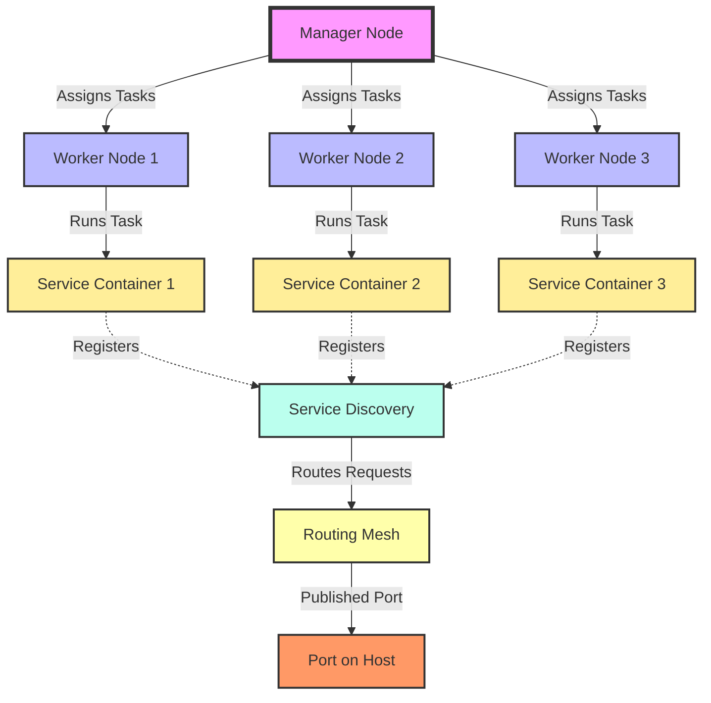

Docker Swarm is an integrated orchestration tool within Docker, allowing you to manage a cluster of Docker nodes as a single unit. With Docker Swarm, you can easily deploy, scale, and manage containerized applications across multiple hosts. Here's a more detailed guide on setting up and using Docker Swarm.

Below is a more detailed description of how a Docker Swarm operates, represented through a diagram and explained in English:



- **Manager Node**: The central control point of Docker Swarm, managing task distribution and maintaining the desired state of the cluster.

- **Worker Nodes (1, 2, 3)**: Nodes that execute tasks assigned by the Manager Node. Each Worker Node can run one or more Service Containers.

- **Service Containers (1, 2, 3)**: Containers that execute specific tasks of a service. Each container runs a replica of the service configured in the Swarm.

- **Service Discovery**: A mechanism that allows containers within the Swarm to find and communicate with each other through services, rather than using direct IP addresses.

- **Routing Mesh**: A routing mechanism that allows requests to a service to be automatically directed to any container running that service, regardless of which Worker Node the container is running on within the cluster.

- **Port on Host**: Ports on Docker hosts used to access services from outside the cluster. The Routing Mesh forwards requests to the appropriate service through this port.

----------------
#### Setting Up Docker Swarm 

### Step 1: Initialize Docker Swarm

To turn a Docker host into a Swarm manager, use the following command on that machine:

```bash
docker swarm init --advertise-addr <manager_ip>
```

- `--advertise-addr` specifies the IP address or interface that other nodes can use to join the Swarm manager.

After initialization, the command will return a `join token` that you will use to add worker nodes to the Swarm.

### Step 2: Add Worker Nodes to the Swarm

On each worker node, use the `join token` received from the manager node to join the Swarm:

```bash
docker swarm join --token <SWMTKN-1-...> <manager_ip>:2377
```

This command will connect the current worker node to the Swarm cluster managed by the manager node at `<manager_ip>`.

### Step 3: Deploy Services in the Swarm

A service in Docker Swarm is a high-level description of the tasks you want to run on the cluster. To deploy a service, use the following command:

```bash
docker service create --name my_service -p 80:80 --replicas 3 nginx
```

- `--name` sets the name of the service.
- `-p` configures port mapping from the host to the container.
- `--replicas` sets the number of container replicas you want to deploy.
- `nginx` is the name of the Docker image you want to use for this service.

### Step 4: Managing and Scaling Services

- **List services:**

  ```bash
  docker service ls
  ```

- **Scale the number of replicas for a service:**

  ```bash
  docker service scale my_service=5
  ```

- **View tasks of a service:**

  ```bash
  docker service ps my_service
  ```

### Step 5: Removing Services and Disbanding the Swarm

- **Remove a service:**

  ```bash
  docker service rm my_service
  ```

- **Disband the Swarm:**

  On the manager node:


  ```bash
  docker swarm leave --force
  ```

  On each worker node:

  ```bash
  docker swarm leave
  ```

### Notes on Using Docker Swarm

- Ensure the security of the cluster by using `--autolock` when initializing the Swarm to encrypt the Raft log and other critical data.
- Use Docker Secrets and Docker Configs to securely manage configurations and sensitive data within the Swarm.
- Monitor the status and performance of the Swarm using tools like Docker Swarm Visualizer or Portainer.

Docker Swarm offers a simple and effective solution for managing containers and services across multiple hosts. With familiar Docker commands and built-in integration, you can easily scale and manage your applications in a distributed environment.