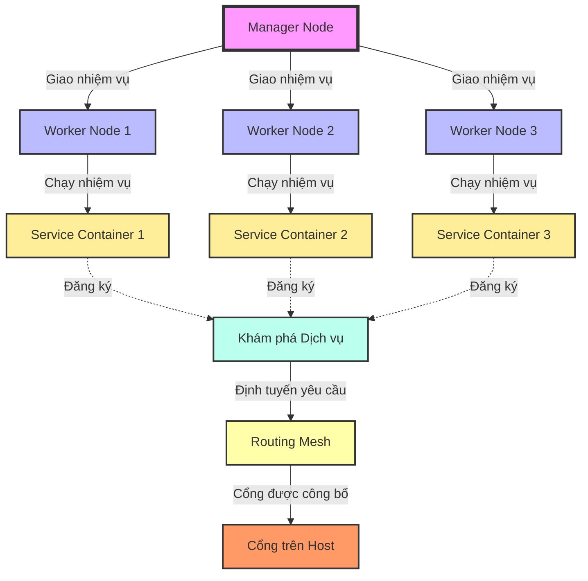

Docker Swarm là công cụ orchestration được tích hợp trong Docker, cho phép bạn quản lý một cluster của Docker nodes như một đơn vị duy nhất. Với Docker Swarm, bạn có thể dễ dàng triển khai, mở rộng và quản lý các ứng dụng container hóa trên nhiều hosts. Dưới đây là hướng dẫn chi tiết hơn về cách thiết lập và sử dụng Docker Swarm.

Dưới đây là mô tả chi tiết hơn về cách một Docker Swarm hoạt động, được biểu diễn qua đồ thị và giải thích bằng tiếng Việt:




- **Manager Node**: Điểm kiểm soát trung tâm của Docker Swarm, quản lý việc phân phối nhiệm vụ và duy trì trạng thái mong muốn của cluster.

- **Worker Nodes (1, 2, 3)**: Các nodes thực thi nhiệm vụ được giao bởi Manager Node. Mỗi Worker Node có thể chạy một hoặc nhiều Service Container.

- **Service Containers (1, 2, 3)**: Các container thực thi các nhiệm vụ cụ thể của dịch vụ. Mỗi container chạy một bản sao của dịch vụ được cấu hình trong Swarm.

- **Khám phá Dịch vụ**: Cơ chế cho phép các container trong Swarm tìm và giao tiếp với nhau thông qua dịch vụ, thay vì sử dụng địa chỉ IP trực tiếp.

- **Routing Mesh**: Một cơ chế định tuyến cho phép yêu cầu đến dịch vụ được tự động chuyển đến bất kỳ container nào đang chạy dịch vụ đó, bất kể container đó đang chạy trên Worker Node nào trong cluster.

- **Cổng trên Host**: Cổng trên các máy chủ Docker được sử dụng để truy cập dịch vụ từ bên ngoài cluster. Routing Mesh sẽ chuyển tiếp yêu cầu đến dịch vụ thích hợp thông qua cổng này.

----------------
#### Cài đặt Docker Swarm 

### Bước 1: Khởi tạo Docker Swarm

Để biến một Docker host thành một Swarm manager, sử dụng lệnh sau trên máy đó:

```bash
docker swarm init --advertise-addr <manager_ip>
```

- `--advertise-addr` định rõ địa chỉ IP hoặc interface mà các nodes khác có thể sử dụng để kết nối vào Swarm manager.

Sau khi khởi tạo, lệnh sẽ trả về một `join token` mà bạn sẽ sử dụng để thêm các worker nodes vào Swarm.

### Bước 2: Thêm Worker Nodes vào Swarm

Trên mỗi worker node, sử dụng `join token` nhận được từ manager node để tham gia vào Swarm:

```bash
docker swarm join --token <SWMTKN-1-...> <manager_ip>:2377
```

Lệnh này sẽ kết nối worker node hiện tại vào Swarm cluster được quản lý bởi manager node có địa chỉ `<manager_ip>`.

### Bước 3: Triển khai Dịch vụ trong Swarm

Dịch vụ trong Docker Swarm là một mô tả ở mức cao của các task mà bạn muốn chạy trên cluster. Để triển khai một dịch vụ, sử dụng lệnh sau:

```bash
docker service create --name my_service -p 80:80 --replicas 3 nginx
```

- `--name` đặt tên cho dịch vụ.
- `-p` cấu hình ánh xạ cổng từ host vào container.
- `--replicas` đặt số lượng bản sao của container bạn muốn triển khai.
- `nginx` là tên của hình ảnh Docker bạn muốn sử dụng cho dịch vụ này.

### Bước 4: Quản lý và Mở rộng Dịch vụ

- **Liệt kê các dịch vụ:**

  ```bash
  docker service ls
  ```

- **Mở rộng số lượng replicas của một dịch vụ:**

  ```bash
  docker service scale my_service=5
  ```

- **Xem các task của một dịch vụ:**

  ```bash
  docker service ps my_service
  ```

### Bước 5: Xóa dịch vụ và Giải tán Swarm

- **Xóa một dịch vụ:**

  ```bash
  docker service rm my_service
  ```

- **Giải tán Swarm:**

  Trên manager node:

  ```bash
  docker swarm leave --force
  ```

  Trên mỗi worker node:

  ```bash
  docker swarm leave
  ```

### Lưu ý khi sử dụng Docker Swarm

- Đảm bảo bảo mật cho cluster bằng cách sử dụng `--autolock` khi khởi tạo Swarm để mã hóa Raft log và các dữ liệu quan trọng khác.
- Sử dụng Docker Secrets và Docker Configs để quản lý cấu hình và dữ liệu nhạy cảm một cách an toàn trong Swarm.
- Theo dõi trạng thái và hiệu suất của Swarm bằng các công cụ như Docker Swarm Visualizer hoặc Portainer.

Docker Swarm cung cấp một giải pháp đơn giản và hiệu quả để quản lý các container và dịch vụ trên nhiều hosts. Với các lệnh Docker quen thuộc và tích hợp sẵn, bạn có thể dễ dàng mở rộng và quản lý ứng dụng của mình trong môi trường phân tán.