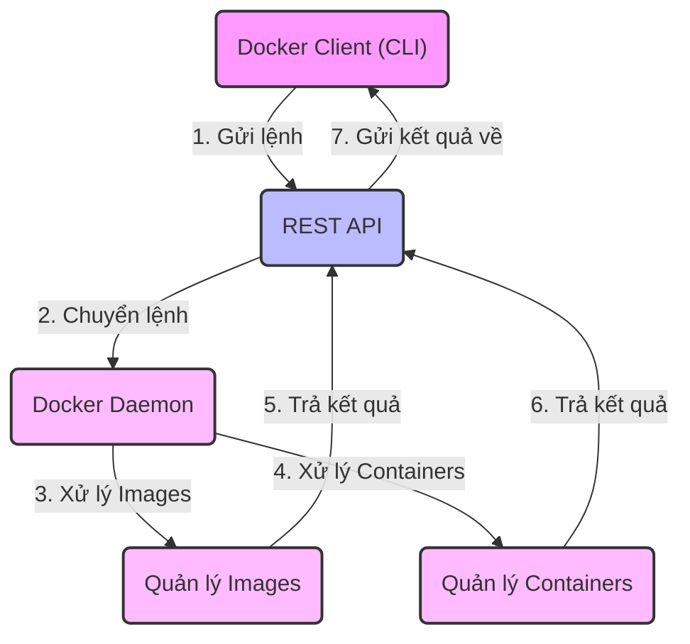

Docker là một trong những công cụ phổ biến nhất để chứa ứng dụng. Docker mang lại hiệu quả và giảm chi phí vận hành để bất kỳ nhà phát triển nào, trong bất kỳ môi trường nhà phát triển nào, đều có thể xây dựng các ứng dụng ổn định và đáng tin cậy.

# Phát triển ứng dụng hiện nay

Phát triển ứng dụng ngày nay gặp nhiều thách thức, nhất là trong việc quản lý các yếu tố kỹ thuật và công nghệ của ứng dụng trên nhiều môi trường đám mây và phát triển. Nhóm DevOps thường phải đảm bảo ứng dụng chạy mượt mà không phụ thuộc vào nơi nó được triển khai.

Trong khi đó, nhóm phát triển lại muốn nhanh chóng cập nhật tính năng mới, nhưng đôi khi lại vô tình làm ảnh hưởng đến sự ổn định của ứng dụng bởi những lỗi phụ thuộc vào môi trường.

Để giảm bớt vấn đề này, nhiều tổ chức chọn giải pháp đóng gói ứng dụng thành container. Đây là cách đóng gói toàn bộ mã, thư viện, và cấu hình cần thiết để ứng dụng chạy được vào một gói độc lập, giúp ứng dụng chạy ổn định mà không làm tăng thêm sự phức tạp, rủi ro bảo mật hay sai sót trong quản lý.

Ban đầu, công nghệ container không được chú ý nhiều do khó sử dụng, nhưng Docker đã thay đổi điều này, làm cho container trở nên phổ biến rộng rãi.

# Docker là gì?

Docker là một nền tảng hóa chứa mã nguồn mở dựa trên Linux mà các nhà phát triển sử dụng để xây dựng, chạy và đóng gói các ứng dụng để triển khai bằng cách sử dụng container. Khác biệt với máy ảo, container Docker mang lại:

- Trừu tượng hóa ở cấp độ hệ điều hành với việc sử dụng tài nguyên tối ưu
- Khả năng tương thích giữa các hệ thống
- Quá trình xây dựng và kiểm thử hiệu quả
- Thực thi ứng dụng nhanh hơn

Cơ bản, container Docker chia nhỏ chức năng của một ứng dụng thành nhiều thành phần, cho phép triển khai, kiểm thử hoặc mở rộng quy mô của chúng một cách độc lập khi cần thiết.

Ví dụ: 

- Một ứng dụng web có thể chia thành 3 container: một container cho máy chủ web, một container cho máy chủ cơ sở dữ liệu, và một container cho máy chủ Redis, mỗi container chạy một dịch vụ cụ thể.
- Một ứng dụng microservice có thể chia thành nhiều container, mỗi container chứa một microservice cụ thể.

# Các thành phần kiến trúc của Docker

Docker có 4 thành phần chính:

- **Hình Ảnh (Images):** Hình ảnh giống như bản thiết kế chứa hướng dẫn để tạo ra một container Docker. Chúng xác định những gì cần cho ứng dụng chạy, như các phụ thuộc và quy trình khi ứng dụng được khởi động. Bạn có thể tải hình ảnh từ `DockerHub` hoặc tự tạo hình ảnh của mình bằng cách viết hướng dẫn trong một tệp gọi là `Dockerfile`.

- **Container:** Container là phiên bản hoạt động của hình ảnh, nơi mà ứng dụng hoặc các module độc lập của nó được chạy. Dùng so sánh với lập trình hướng đối tượng, nếu hình ảnh là một lớp (class) thì container chính là một thể hiện (instance) của lớp đó. Điều này giúp tăng hiệu suất hoạt động bằng cách cho phép bạn tạo nhiều container từ một hình ảnh.

- **Kho Lưu Trữ (Registries):** Một kho lưu trữ Docker giống như một kho chứa các hình ảnh. Docker Hub mặc định là kho lưu trữ công cộng, chứa các hình ảnh công khai và chính thức cho các ngôn ngữ và nền tảng khác nhau. Bạn cũng có thể có kho lưu trữ riêng và cấu hình nó làm nguồn hình ảnh mặc định cho các yêu cầu tùy chỉnh của mình.

- **Docker Engine:** Docker Engine là một trong những thành phần cốt lõi của kiến trúc Docker, nơi ứng dụng chạy. Bạn có thể coi Docker Engine như một ứng dụng được cài đặt trên hệ thống quản lý container, hình ảnh và xây dựng. Docker Engine sử dụng kiến trúc client-server và bao gồm các thành phần phụ sau:

  - **Docker Daemon:** Là server chạy trên máy chủ, chịu trách nhiệm xây dựng và quản lý hình ảnh Docker.
  - **Docker Client:** Là giao diện dòng lệnh (CLI) để gửi lệnh tới Docker Daemon bằng các lệnh Docker đặc biệt. Mặc dù client có thể chạy trên máy chủ, nhưng nó sử dụng API REST của Docker Engine để kết nối từ xa với daemon.
  - **API REST:** Hỗ trợ tương tác giữa client và daemon.

# Lợi ích của Docker trong  chu trình phát triển phần mềm

Docker mang lại nhiều lợi ích cho kiến trúc ứng dụng qua các giai đoạn khác nhau trong chu trình phát triển phần mềm:

- **Xây Dựng.** Docker giúp đội ngũ phát triển tiết kiệm thời gian, công sức và tiền bạc bằng cách đóng gói ứng dụng của họ thành một hoặc nhiều module. Bằng cách bỏ công sức ban đầu để tạo ra một hình ảnh phù hợp với ứng dụng, quy trình xây dựng có thể tránh được thách thức lặp đi lặp lại của việc có nhiều phiên bản phụ thuộc có thể gây ra vấn đề trong môi trường sản xuất.

- **Kiểm Thử.** Với Docker, bạn có thể kiểm thử độc lập từng ứng dụng được container hóa (hoặc các thành phần của nó) mà không ảnh hưởng đến các thành phần khác của ứng dụng. Điều này cũng tạo ra một khuôn khổ bảo mật bằng cách loại bỏ các phụ thuộc chặt chẽ và cho phép khả năng chịu lỗi tốt hơn.

- **Triển Khai & Bảo Trì.** Docker giúp giảm bớt ma sát giữa các nhóm bằng cách đảm bảo các phiên bản thư viện và gói nhất quán được sử dụng ở mỗi giai đoạn của quy trình phát triển. Hơn nữa, việc triển khai một container đã được kiểm thử trước giúp loại bỏ việc giới thiệu lỗi vào quy trình xây dựng, do đó cho phép di chuyển hiệu quả tới sản xuất.

- **Môi Trường Sản Xuất.** Docker giúp giảm bớt thời gian và công sức cần thiết để triển khai ứng dụng, cũng như giảm bớt rủi ro khi triển khai ứng dụng. Bằng cách sử dụng container, bạn có thể chắc chắn rằng ứng dụng của bạn sẽ chạy như mong đợi trên môi trường sản xuất.

# So sánh Docker với máy ảo (Virtual Machines)

Máy ảo và container đều giúp tạo ra môi trường độc lập để chạy ứng dụng, nhưng chúng có những điểm khác biệt quan trọng:

- **Máy Ảo:** Máy ảo chạy trên một hệ điều hành ảo hóa (hypervisor) và cần một hệ điều hành đầy đủ để chạy. Mỗi máy ảo cần một lượng tài nguyên lớn, bao gồm bộ nhớ, CPU, và lưu trữ. Máy ảo cũng cần thời gian khởi động và tắt.

- **Container:** Container chạy trên một hệ điều hành chia sẻ (host OS) và chia sẻ nhân hệ điều hành với các container khác. Mỗi container chia sẻ hệ điều hành và cần ít tài nguyên hơn máy ảo. Container cũng khởi động và tắt nhanh hơn máy ảo.
