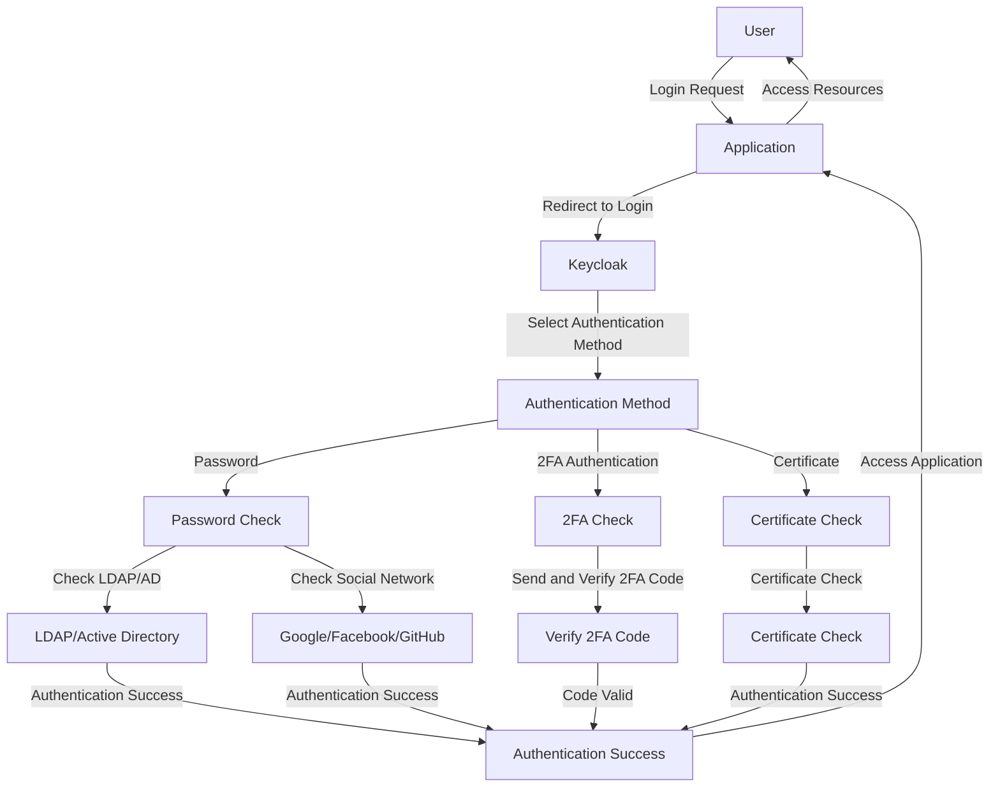
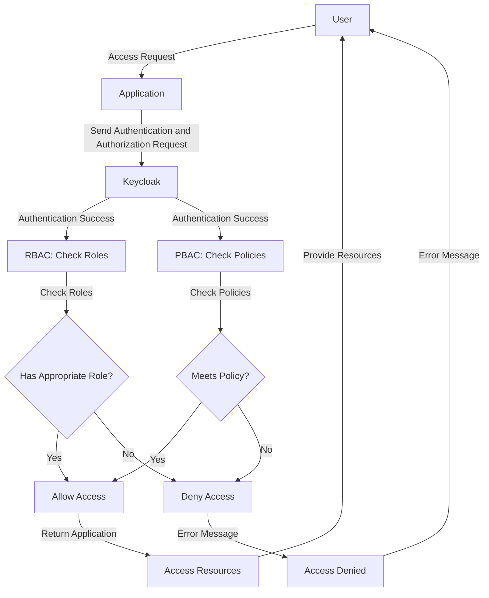
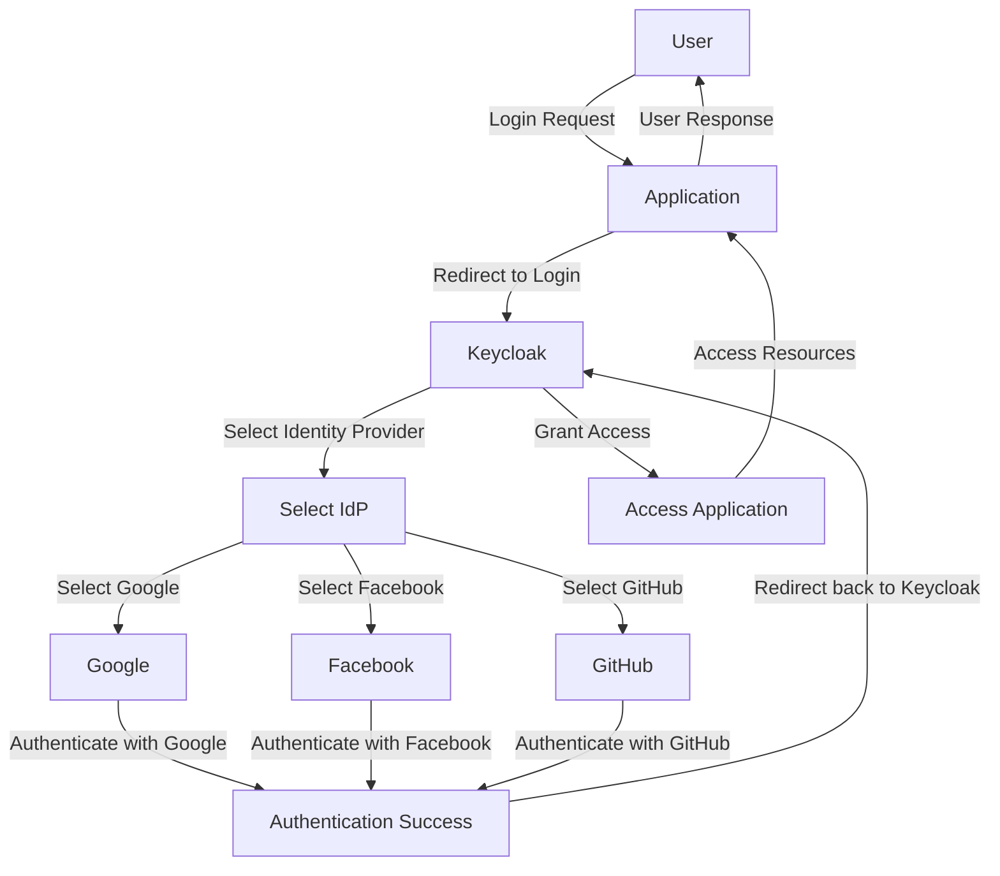
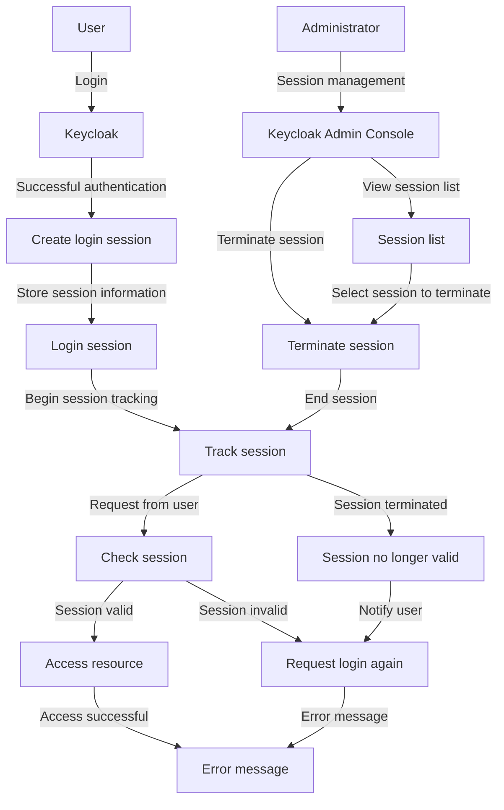
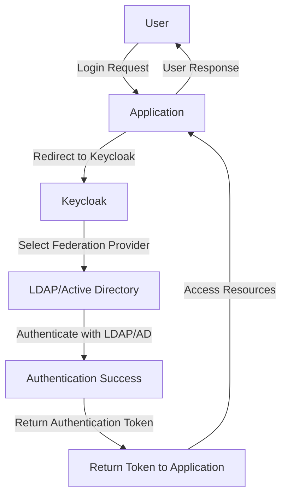

#### Why Use Keycloak?

##### Benefits of Using Keycloak

###### **Simplified Identity Management**

Keycloak significantly simplifies **identity and access management**. Instead of building and maintaining separate user management systems for each application, Keycloak allows you to **centralize this management**. This not only reduces workload for developers but also ensures **consistency and higher security** across the system. With Keycloak, you can easily manage users, groups, roles, and permissions from **a single interface**.

###### **Easy Integration**

One of the major advantages of Keycloak is its **ease of integration** with existing applications and services. Keycloak supports multiple standard protocols such as **OAuth2, OpenID Connect, and SAML**, allowing you to connect with most popular services and applications. This helps you **save time and effort** in setting up and maintaining authentication and authorization mechanisms, while ensuring **flexibility and scalability** for your system.

###### **Strong Security**

Security is crucial in any identity management system, and Keycloak delivers on this front. It provides advanced **security features** such as two-factor authentication (2FA), session management, and role-based access control (RBAC). This helps **protect your data** from potential threats and ensures that only authorized users can access critical resources. Integration with **external identity providers** also enhances security and convenience for users.

###### **Open Source**

Keycloak is an **open-source solution**, offering numerous benefits for your business. You can **customize and extend Keycloak** according to your specific needs without facing restrictions from vendors. Open source also means you **don't have to worry about licensing costs**, reducing financial burden for your enterprise. Moreover, Keycloak benefits from a large and active open-source community that provides support and contributions, helping you **resolve issues quickly and effectively**.

##### Illustrative Examples

-   **Simplified Identity Management:** A large e-commerce company with millions of users can use Keycloak to **centralize identity and access management**, reducing IT workload and enhancing management efficiency.
-   **Easy Integration:** A non-profit organization can quickly integrate Keycloak with existing systems such as **Google Workspace and Microsoft Office 365** to synchronize identity and access rights.
-   **Strong Security:** A bank can utilize Keycloak to implement **two-factor authentication** for all internal applications and online services, ensuring security for sensitive financial data.
-   **Open Source:** A tech startup can **customize Keycloak** to fit their specific needs without incurring licensing costs, saving expenses and enhancing competitiveness.

#### Keycloak vs Other SSO Solutions Comparison

| **Feature**                              | **Keycloak**                                              | **Auth0**                         | **Okta**                          | **IdentityServer**                        |
| ---------------------------------------- | --------------------------------------------------------- | --------------------------------- | --------------------------------- | ----------------------------------------- |
| **Type**                                 | Open Source                                               | Commercial Service                | Commercial Service                | Open Source                               |
| **Cost**                                 | Free                                                      | High cost as user base scales     | High cost                         | Free                                      |
| **User Interface**                       | Powerful and user-friendly                                | User-friendly                     | User-friendly                     | Requires additional configuration         |
| **Integration with IdPs**                | Supports Google, Facebook, GitHub, LDAP, Active Directory | Supports multiple IdPs            | Supports multiple IdPs            | Integrates with some IdPs, needs config   |
| **Supported Protocols**                  | OAuth2, OpenID Connect, SAML                              | OAuth2, OpenID Connect, SAML      | OAuth2, OpenID Connect, SAML      | OAuth2, OpenID Connect, SAML              |
| **Two-Factor Authentication (2FA)**      | Available                                                 | Available                         | Available                         | Needs additional configuration            |
| **Session Management**                   | Managed from user interface                               | Managed from user interface       | Managed from user interface       | Basic session management, needs config    |
| **Role-Based Access Control (RBAC)**     | Available                                                 | Available                         | Available                         | Available                                 |
| **Scalability and Customization**        | High, due to open-source nature                           | Available, limited by costs       | Available, limited by costs       | High, due to open-source nature           |
| **Social Login (Social Authentication)** | Available                                                 | Available                         | Available                         | Available, needs additional configuration |
| **Community and Support**                | Large open-source community, support from Red Hat         | Vendor support, smaller community | Vendor support, smaller community | Open-source community support             |
| **Installation and Deployment**          | Easy installation and deployment on various platforms     | Easy to use online service        | Easy to use online service        | Requires configuration and deployment     |

##### Conclusion

-   **Keycloak** is a great choice for businesses needing a **powerful, open-source, cost-effective, and highly customizable** identity management solution.
-   **Auth0** and **Okta** provide **easy-to-use and powerful solutions** but come with higher costs, suitable for businesses preferring not to manage their own systems.
-   **IdentityServer** offers similar features to Keycloak but requires **more configuration** and lacks the **strong user interface** Keycloak provides.

#### Key Features of Keycloak

##### Authentication

Keycloak supports various authentication methods such as **passwords, two-factor authentication (2FA),** and **certificate-based authentication**. Users can securely log into applications and services.





##### Authorization

Keycloak provides tools to **manage user access rights** based on roles (**Role-Based Access Control - RBAC**) and authorization policies (**Policy-Based Access Control - PBAC**). This helps tightly control access to resources and services.





##### Identity Brokering and Social Login

Keycloak supports **integration with external identity providers** (**IdPs**) such as **Google, Facebook,** and **GitHub**. This allows users to log into the system using their social media accounts.





##### Session Management

Keycloak manages user login sessions, allowing you to track and control login sessions. Administrators can **view and terminate login sessions** from the admin interface.





##### User Federation

Keycloak supports **user federation**, allowing you to **integrate with existing LDAP or Active Directory** services. This enables centralized management of users across different systems.





##### Conclusion

Keycloak provides a **comprehensive identity and access management solution** suitable for various business needs. Whether you need robust authentication, flexible authorization, seamless social login integration, or efficient session management, Keycloak offers a powerful platform to secure your applications and services. Its open-source nature and strong community support make it a compelling choice for organizations looking to enhance security while maintaining flexibility and control over their identity management systems.
