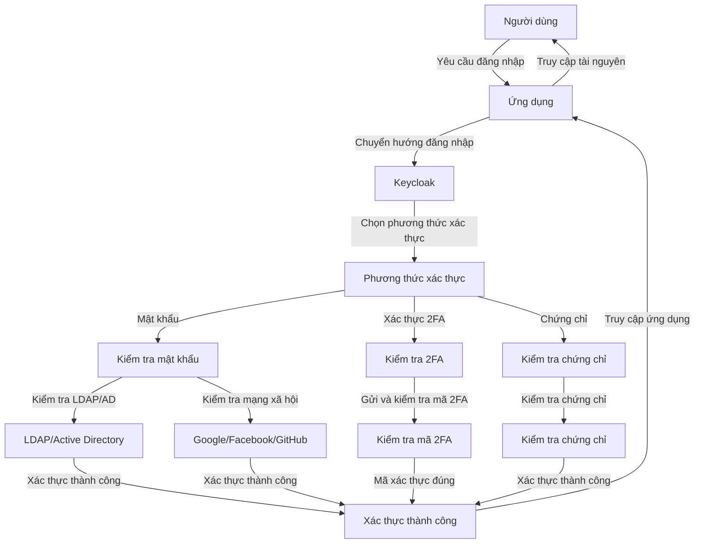
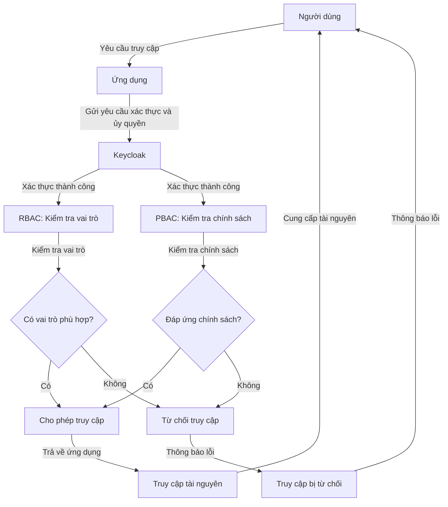
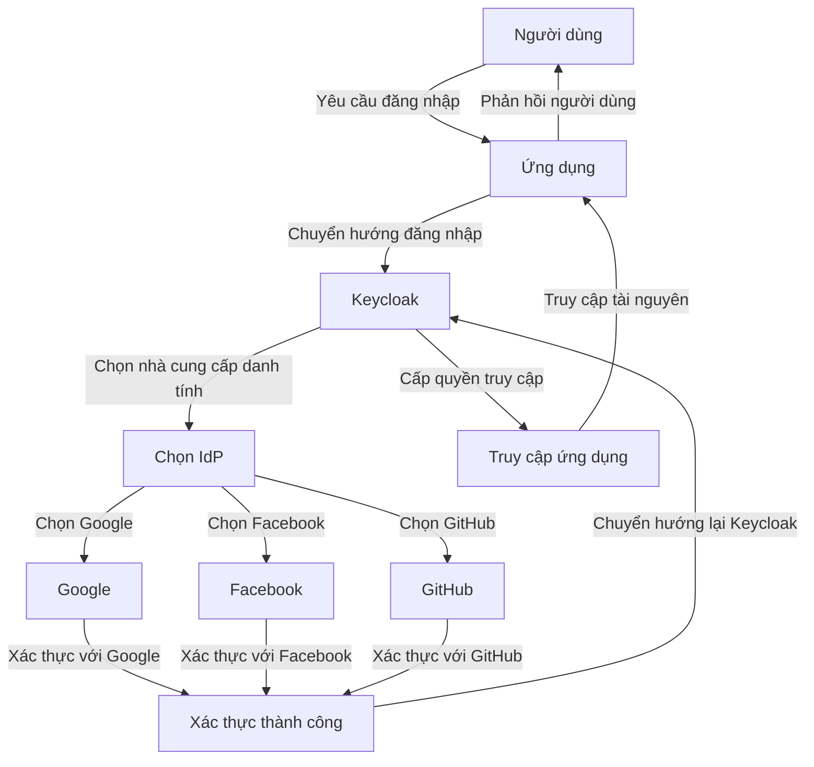
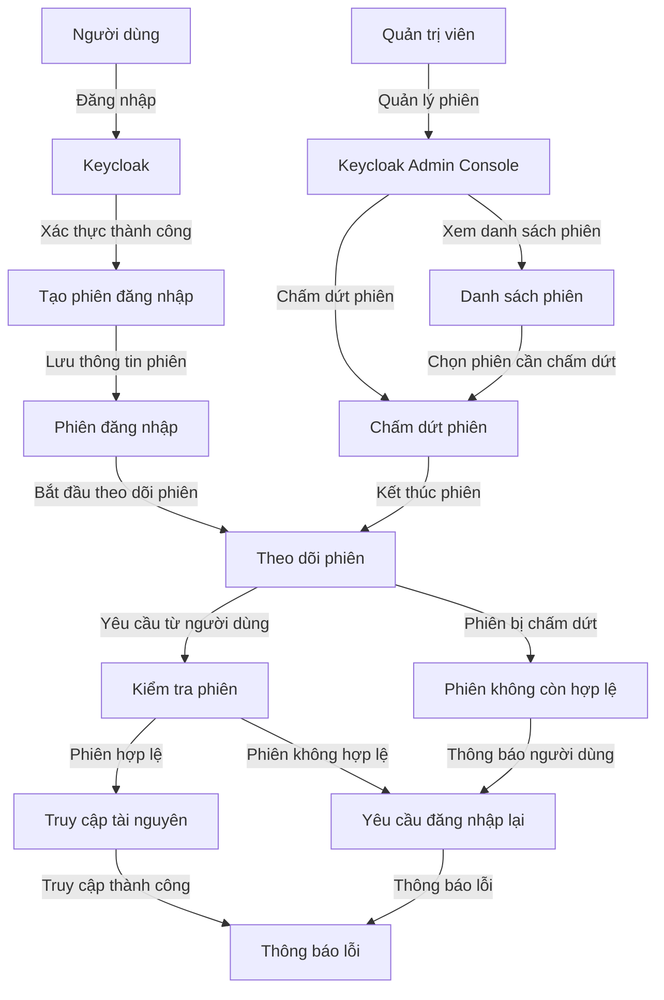
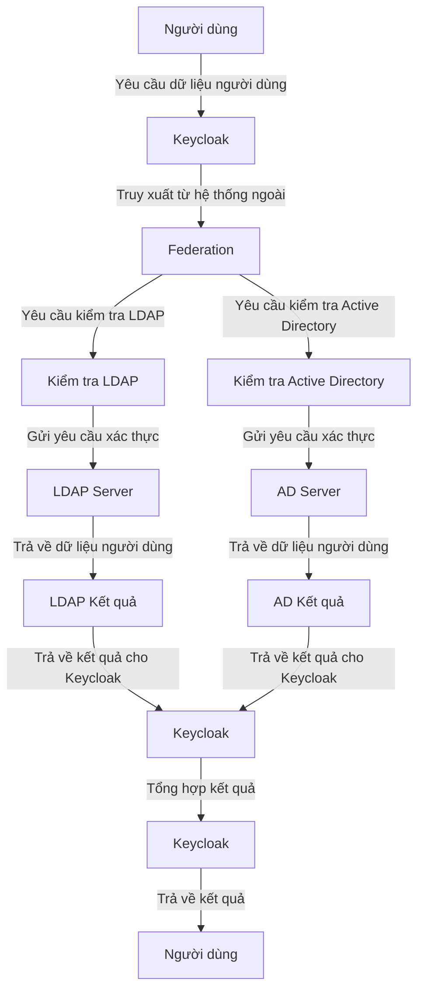

#### Tại sao sử dụng Keycloak?

##### Lợi ích của việc sử dụng Keycloak

###### **Đơn giản hóa việc quản lý danh tính**

Keycloak mang lại **sự đơn giản hóa đáng kể** trong việc quản lý danh tính và truy cập của người dùng. Thay vì phải xây dựng và duy trì hệ thống quản lý người dùng riêng lẻ cho mỗi ứng dụng, Keycloak cho phép bạn **tập trung hóa việc quản lý** này. Điều này không chỉ giảm bớt khối lượng công việc cho các nhà phát triển mà còn **đảm bảo tính nhất quán và bảo mật cao hơn** trên toàn bộ hệ thống. Với Keycloak, bạn có thể dễ dàng quản lý người dùng, nhóm, vai trò và quyền truy cập từ **một giao diện duy nhất**.

###### **Tích hợp dễ dàng**

Một trong những lợi thế lớn nhất của Keycloak là khả năng **tích hợp dễ dàng** với các ứng dụng và dịch vụ hiện có. Keycloak hỗ trợ nhiều giao thức chuẩn như **OAuth2, OpenID Connect và SAML**, cho phép bạn kết nối với hầu hết các dịch vụ và ứng dụng phổ biến. Điều này giúp bạn **tiết kiệm thời gian và công sức** trong việc thiết lập và duy trì các cơ chế xác thực và ủy quyền, đồng thời đảm bảo **tính linh hoạt và khả năng mở rộng** cho hệ thống của bạn.

###### **Bảo mật mạnh mẽ**

Bảo mật là một yếu tố then chốt trong bất kỳ hệ thống quản lý danh tính nào, và Keycloak không làm bạn thất vọng. Keycloak cung cấp nhiều **tính năng bảo mật tiên tiến** như xác thực hai yếu tố (2FA), quản lý phiên và bảo mật truy cập theo vai trò (RBAC). Điều này giúp **bảo vệ dữ liệu** của bạn khỏi các mối đe dọa tiềm tàng và đảm bảo rằng chỉ những người dùng có quyền mới có thể truy cập vào các tài nguyên quan trọng. Việc **tích hợp với các nhà cung cấp danh tính bên ngoài** cũng giúp nâng cao bảo mật và tiện lợi cho người dùng.

###### **Mã nguồn mở**

Keycloak là một giải pháp **mã nguồn mở**, mang lại nhiều lợi ích cho doanh nghiệp của bạn. Bạn có thể **tùy chỉnh và mở rộng Keycloak** theo nhu cầu cụ thể của mình mà không gặp phải hạn chế từ phía nhà cung cấp. Mã nguồn mở cũng có nghĩa là bạn **không phải lo lắng về chi phí bản quyền**, giúp giảm bớt gánh nặng tài chính cho doanh nghiệp. Hơn nữa, cộng đồng mã nguồn mở lớn mạnh của Keycloak luôn sẵn sàng hỗ trợ và đóng góp, giúp bạn **giải quyết các vấn đề một cách nhanh chóng và hiệu quả**.

##### Ví dụ

-   **Đơn giản hóa quản lý danh tính:** Một công ty thương mại điện tử lớn có hàng triệu người dùng có thể sử dụng Keycloak để **quản lý danh tính và quyền truy cập** một cách tập trung, giảm thiểu công việc cho đội ngũ IT và nâng cao hiệu quả quản lý.
-   **Tích hợp dễ dàng:** Một tổ chức phi lợi nhuận có thể nhanh chóng tích hợp Keycloak với các hệ thống hiện có như **Google Workspace và Microsoft Office 365** để đồng bộ hóa danh tính và quyền truy cập.
-   **Bảo mật mạnh mẽ:** Một ngân hàng có thể sử dụng Keycloak để **áp dụng xác thực hai yếu tố** cho tất cả các ứng dụng nội bộ và dịch vụ trực tuyến, đảm bảo an toàn cho **dữ liệu tài chính nhạy cảm**.
-   **Mã nguồn mở:** Một công ty khởi nghiệp công nghệ có thể **tùy chỉnh Keycloak** để phù hợp với nhu cầu đặc thù của họ mà không phải chịu chi phí bản quyền, giúp họ **tiết kiệm chi phí và tăng cường khả năng cạnh tranh**.

#### So sánh Keycloak với các giải pháp SSO khác

| **Tính năng**                      | **Keycloak**                                            | **Auth0**                                 | **Okta**                                  | **IdentityServer**                         |
| ---------------------------------- | ------------------------------------------------------- | ----------------------------------------- | ----------------------------------------- | ------------------------------------------ |
| **Loại hình**                      | Mã nguồn mở                                             | Dịch vụ thương mại                        | Dịch vụ thương mại                        | Mã nguồn mở                                |
| **Chi phí**                        | Miễn phí                                                | Có chi phí cao khi quy mô người dùng tăng | Có chi phí cao                            | Miễn phí                                   |
| **Giao diện người dùng**           | Giao diện quản lý mạnh mẽ và dễ sử dụng                 | Giao diện dễ sử dụng                      | Giao diện dễ sử dụng                      | Cần cấu hình thêm                          |
| **Tích hợp với IdPs**              | Hỗ trợ Google, Facebook, GitHub, LDAP, Active Directory | Hỗ trợ nhiều IdPs                         | Hỗ trợ nhiều IdPs                         | Tích hợp với một số IdPs cần cấu hình thêm |
| **Giao thức hỗ trợ**               | OAuth2, OpenID Connect, SAML                            | OAuth2, OpenID Connect, SAML              | OAuth2, OpenID Connect, SAML              | OAuth2, OpenID Connect, SAML               |
| **Xác thực hai yếu tố (2FA)**      | Có                                                      | Có                                        | Có                                        | Cần cấu hình thêm                          |
| **Quản lý phiên**                  | Quản lý từ giao diện người dùng                         | Quản lý từ giao diện người dùng           | Quản lý từ giao diện người dùng           | Quản lý phiên cơ bản, cần cấu hình thêm    |
| **Ủy quyền theo vai trò (RBAC)**   | Có                                                      | Có                                        | Có                                        | Có                                         |
| **Khả năng mở rộng và tùy chỉnh**  | Cao, nhờ mã nguồn mở                                    | Có, nhưng giới hạn bởi chi phí            | Có, nhưng giới hạn bởi chi phí            | Cao, nhờ mã nguồn mở                       |
| **Xác thực xã hội (Social Login)** | Có                                                      | Có                                        | Có                                        | Có, nhưng cần cấu hình thêm                |
| **Cộng đồng và hỗ trợ**            | Cộng đồng mã nguồn mở lớn, hỗ trợ từ Red Hat            | Hỗ trợ từ nhà cung cấp, cộng đồng nhỏ hơn | Hỗ trợ từ nhà cung cấp, cộng đồng nhỏ hơn | Cộng đồng mã nguồn mở, hỗ trợ từ cộng đồng |
| **Cài đặt và triển khai**          | Dễ cài đặt và triển khai trên các nền tảng khác nhau    | Dễ dàng sử dụng dịch vụ trực tuyến        | Dễ dàng sử dụng dịch vụ trực tuyến        | Cần cấu hình và triển khai                 |
| **Tích hợp microservices**         | Có, hỗ trợ tốt cho kiến trúc microservices              | Có                                        | Có                                        | Có, nhưng cần cấu hình thêm                |

##### Kết luận

-   **Keycloak** là lựa chọn tốt cho các doanh nghiệp cần một **giải pháp mạnh mẽ, mã nguồn mở, không tốn phí bản quyền và có khả năng tùy chỉnh cao**.
-   **Auth0** và **Okta** cung cấp **giải pháp dễ sử dụng và mạnh mẽ** nhưng có chi phí cao hơn, phù hợp cho các doanh nghiệp không muốn tự quản lý hệ thống.
-   **IdentityServer** cung cấp tính năng tương tự như Keycloak nhưng cần **nhiều cấu hình** và không có **giao diện người dùng mạnh mẽ** như Keycloak.

##### Các tính năng chính của Keycloak

###### Xác thực (Authentication)

Keycloak hỗ trợ nhiều phương thức xác thực như **mật khẩu, xác thực hai yếu tố (2FA),** và các phương thức xác thực dựa trên **chứng chỉ**. Người dùng có thể đăng nhập vào các ứng dụng và dịch vụ một cách **an toàn và dễ dàng**.





###### Ủy quyền (Authorization)

Keycloak cung cấp các công cụ để **quản lý quyền truy cập của người dùng** dựa trên vai trò (**Role-Based Access Control - RBAC**) và các chính sách ủy quyền (**Policy-Based Access Control - PBAC**). Điều này giúp kiểm soát chặt chẽ hơn việc truy cập vào các tài nguyên và dịch vụ.





###### Identity Brokering và Social Login

Keycloak hỗ trợ việc **tích hợp với các nhà cung cấp danh tính bên ngoài** (**Identity Providers - IdPs**) như **Google, Facebook,** và **GitHub**. Điều này cho phép người dùng đăng nhập vào hệ thống bằng tài khoản mạng xã hội của họ.





###### Quản lý phiên (Session Management)

Keycloak quản lý phiên đăng nhập của người dùng, giúp theo dõi và kiểm soát các phiên đăng nhập. Quản trị viên có thể **xem và chấm dứt các phiên đăng nhập từ giao diện quản lý**.





###### Federation và User Storage

Keycloak hỗ trợ việc **liên kết với các hệ thống quản lý danh tính bên ngoài** như **LDAP và Active Directory**. Điều này cho phép sử dụng danh tính và dữ liệu người dùng từ các hệ thống hiện có mà **không cần phải nhập lại dữ liệu**.





Như vậy, chúng ta đã tìm hiểu về **lợi ích của việc sử dụng Keycloak** và **so sánh Keycloak với các giải pháp SSO khác**. Tiếp theo, chúng ta sẽ tìm hiểu về **cách cài đặt và cấu hình Keycloak trên hệ điều hành Ubuntu Linux**. Hãy cùng tìm hiểu trong bài học tiếp theo!
