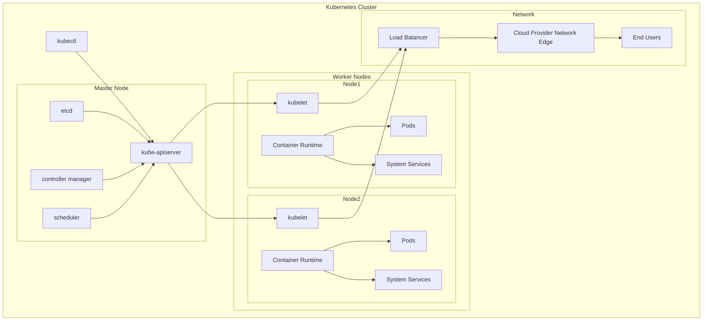

#### **Bài 1: Kubernetes là gì?**

-   **Định nghĩa và Mục đích:**
    -   Kubernetes, thường được gọi là K8s, là một nền tảng mã nguồn mở để tự động hóa việc triển khai, mở rộng và quản lý các ứng dụng container. Nó giúp các tổ chức dễ dàng quản lý và điều phối các container ở quy mô lớn, đảm bảo hiệu suất cao và khả năng chịu lỗi tốt.

-   **Lịch sử và Sự phát triển:**
    -   **Nguồn gốc từ Google:**
        -   Kubernetes được phát triển bởi Google dựa trên kinh nghiệm từ việc quản lý hàng tỷ container mỗi tuần thông qua các hệ thống như Borg và Omega. Vào năm 2014, Google mở mã nguồn Kubernetes, mang đến cho cộng đồng công cụ mạnh mẽ để quản lý container.
    -   **Phát triển bởi CNCF:**
        -   Kubernetes nhanh chóng nhận được sự ủng hộ từ cộng đồng và được chuyển giao cho Cloud Native Computing Foundation (CNCF), một tổ chức phi lợi nhuận thuộc Linux Foundation, để thúc đẩy sự phát triển của các công nghệ nguồn mở trong lĩnh vực điện toán đám mây.
    -   **Các phiên bản và cải tiến:**
        -   Kubernetes liên tục được cập nhật với các phiên bản mới, cải thiện hiệu suất và thêm các tính năng mới để đáp ứng nhu cầu ngày càng tăng của các tổ chức.

-   **Tính năng nổi bật của Kubernetes:**
    -   **Tự động hóa triển khai và quản lý container:**
        -   Kubernetes cho phép tự động triển khai, quản lý và mở rộng các container, đảm bảo sự liên tục và không gián đoạn dịch vụ.
    -   **Điều phối tài nguyên thông minh:**
        -   Sử dụng các thuật toán thông minh để điều phối và phân bổ tài nguyên hiệu quả, điều chỉnh linh hoạt theo nhu cầu thực tế của ứng dụng.
    -   **Khả năng mở rộng và linh hoạt:**
        -   Hỗ trợ mở rộng dễ dàng từ vài container đến hàng ngàn container, cung cấp khả năng mở rộng theo chiều ngang (scale-out) và chiều dọc (scale-up).
    -   **Hỗ trợ đa nền tảng và đa môi trường:**
        -   Có khả năng chạy trên nhiều nền tảng và môi trường khác nhau, từ máy chủ vật lý, máy ảo đến các dịch vụ đám mây như AWS, Azure và Google Cloud.

-   **Kiến trúc của Kubernetes:**
    -   **Master Node:**
        -   Chịu trách nhiệm điều phối toàn bộ hệ thống.
            -   **API Server:** Cổng giao tiếp chính cho tất cả các thành phần của Kubernetes.
            -   **Scheduler:** Phân bổ các ứng dụng tới các node phù hợp dựa trên tài nguyên.
            -   **Controller Manager:** Giám sát trạng thái của cluster và thực hiện các điều chỉnh cần thiết.
            -   **etcd:** Lưu trữ dữ liệu cấu hình của toàn bộ cluster.
    -   **Worker Node:**
        -   Chạy các ứng dụng container.
            -   **Kubelet:** Đảm bảo các container đang chạy như được chỉ định.
            -   **Container Runtime:** Thực thi các container (ví dụ: Docker).
            -   **Kube-proxy:** Cung cấp các dịch vụ mạng cho các ứng dụng container.

-   **Các lợi ích của việc sử dụng Kubernetes:**
    -   **Đảm bảo độ sẵn sàng cao với thời gian chết bằng không:**
        -   Kubernetes giúp đảm bảo các ứng dụng luôn sẵn sàng và không bị gián đoạn nhờ khả năng tự động phục hồi và quản lý tài nguyên hiệu quả.
    -   **Hiệu suất và khả năng mở rộng cao:**
        -   Cung cấp hiệu suất cao và khả năng mở rộng linh hoạt, đáp ứng nhu cầu tăng trưởng của doanh nghiệp.
    -   **Hạ tầng tin cậy hỗ trợ sao lưu và phục hồi dữ liệu:**
        -   Kubernetes cung cấp một hạ tầng tin cậy giúp dễ dàng sao lưu và phục hồi dữ liệu khi cần thiết.

-   **Cách cài đặt và thiết lập Kubernetes:**
    -   **Cài đặt Docker:**
        -   Tải và cài đặt Docker Desktop cho hệ điều hành của bạn.
    -   **Cài đặt Kubernetes trên Docker:**
        -   Mở Docker, vào phần Settings và kích hoạt Kubernetes.
    -   **Cài đặt Dashboard của Kubernetes:**
        -   Tải file YAML và triển khai dashboard bằng lệnh `kubectl apply -f`.
        -   Truy cập dashboard qua proxy và đăng nhập bằng token.
