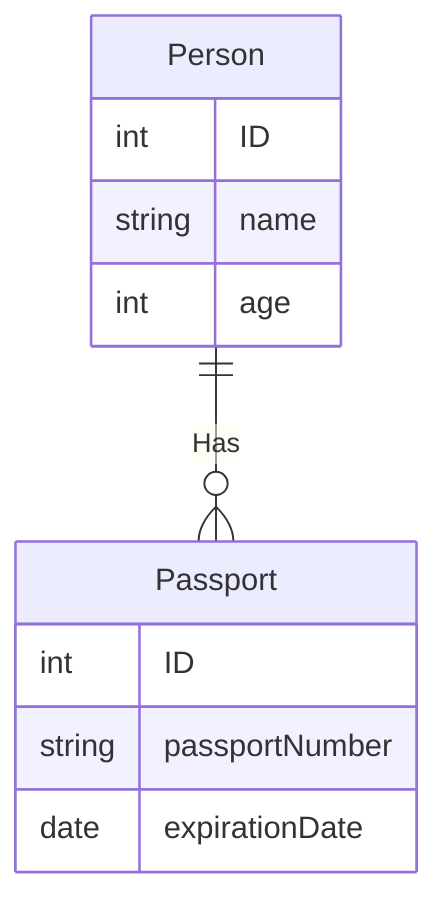
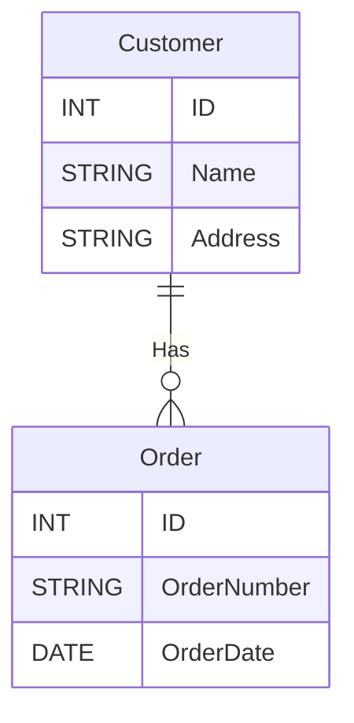
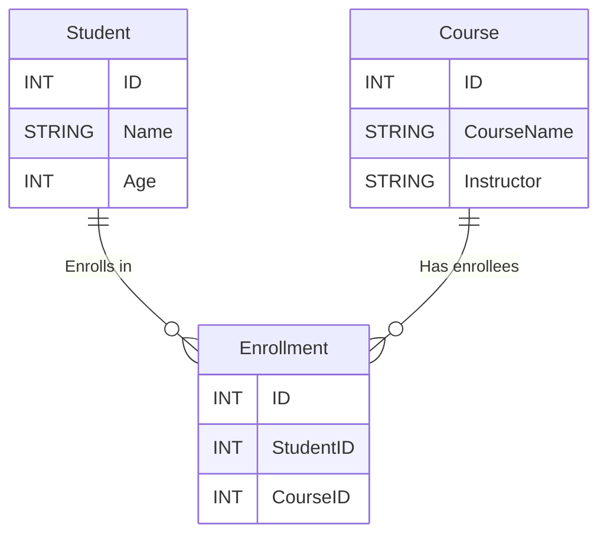

---
categories:
  - database
date: 2023-11-20T08:00:00+08:00
description: PostgreSQL is a powerful and open-source Object-Relational Database Management System (ORDBMS), known for its stability, scalability, and SQL compliance. Initially developed at the University of California, Berkeley, in the 1980s, it has since become one of the most popular open-source databases worldwide.
draft: false
series:
  - postgresql-dba-series
featuredImage: /series/postgresql-dba/postgresql-dba-01-introduction-to-postgresql-database.webp
images:
  - /series/postgresql-dba/postgresql-dba-01-introduction-to-postgresql-database.webp
  - /postgresql-dba-01-introduction-to-postgresql-database/images/index.en.png
license: <a rel="license external nofollow noopener noreffer" href="https://creativecommons.org/licenses/by-nc/4.0/" target="_blank">CC BY-NC 4.0</a>
tags:
  - database
  - postgresql
  - ubuntu
  - database-administrator
title: Lesson 1 - Introduction to PostgreSQL Database
url: /postgresql-dba-01-introduction-to-postgresql-database
weight: 1
---

# What is PostgreSQL?

PostgreSQL is a powerful and open-source Object-Relational Database Management System (ORDBMS), known for its stability, scalability, and SQL compliance. Initially developed at the University of California, Berkeley, in the 1980s, it has since become one of the most popular open-source databases worldwide.

In this introductory guide, we will discuss some of the important features and capabilities of PostgreSQL, as well as its use cases and benefits. This guide aims to provide a starting point for users who are exploring the world of PostgreSQL and want to have a basic understanding of this system.

## Key Features

1. [ACID](/what-is-acid) Compliance: PostgreSQL fully complies with the [ACID](/what-is-acid) standard, ensuring data reliability and integrity.

2. Scalability: PostgreSQL allows users to define data types, operators, functions, and many other features, making it highly customizable and suitable for various use cases.

3. Concurrency Control: Through its Multi-Version Concurrency Control (MVCC) mechanism, PostgreSQL handles concurrent queries efficiently without causing lock contention.

4. Full-Text Search: PostgreSQL provides powerful text search capabilities, including creating text indexes and various search functions.

5. Geodatabase Capability: Through the [PostGIS](https://postgis.net) extension, PostgreSQL supports geographic objects and spatial queries, making it ideal for GIS applications.

6. High Availability: PostgreSQL natively integrates replication capabilities, allowing for high availability and fault tolerance.

## Benefits of PostgreSQL

1. One of the main benefits of PostgreSQL is its open-source and community-oriented approach, meaning it is free to use and continuously developed and improved by a dedicated team of developers.

2. It has high scalability, suitable for both small-scale projects and large-scale enterprise applications.

3. It is platform-independent, meaning it can run on various operating systems such as Windows, Linux, and macOS.

## When to use PostgreSQL

PostgreSQL can be used for various applications thanks to its flexibility and scalability. Some common use cases include:



# What is a relational database?



A relational database is a type of database management system (DBMS) that stores and organizes data in a structured format called a table. These tables are made up of rows, also known as records or datasets, and columns, also known as attributes or fields. The term "relational" comes from the fact that these tables can be related to each other through keys and relationships.

## Key Definitions

**Table**: A table is a collection of data organized into rows and columns. Each table has a unique name and represents a specific object or activity in the database.

**Row**: A row is a single entry in a table, containing a specific instance of data. Each row in a table has the same columns and represents a unique record.

**Column**: A column is a data field in a table, representing a specific attribute of the data. Columns have unique names and a specific data type.

**Primary Key**: A primary key is a column (or a set of columns) in a table that uniquely identifies each row. No two rows have the same primary key value.

**Foreign Key**: A foreign key is a column (or a set of columns) in a table that references the primary key of another table. It is used to establish relationships between tables.

Below is an example of a simple table:

| ID (Primary Key) | Name  | Age | Address     |
| ---------------- | ----- | --- | ----------- |
| 1                | John  | 30  | 123 Main St |
| 2                | Mary  | 25  | 456 Elm St  |
| 3                | David | 35  | 789 Oak St  |

In the above example, we have a table named "Person" with four columns: "ID" is the primary key, "Name" represents the person's name, "Age" represents the person's age, and "Address" represents the person's address. Each row in the table represents a specific person.

## Relationships

One of the main benefits of a relational database is the ability to represent relationships between tables. These relationships can be one-to-one, one-to-many, or many-to-many. They allow for efficient querying and manipulation of related data across multiple tables.

**One-to-One Relationship**: This is a relationship in which a row in one table has a corresponding row in another table. For example, a person can have only one passport, and a passport can belong to only one person.

**One-to-One Relationship Example**:

"Person" Table:
| ID | Name | Age |
|----|------|-----|
| 1 | John | 30 |
| 2 | Mary | 25 |

"Passport" Table:
| ID | Passport Number | Expiration Date |
|----|-----------------|-----------------|
| 1 | 12345 | 2025-12-31 |
| 2 | 67890 | 2024-08-15 |

**One-to-Many Relationship**: This is a relationship in which a row in one table can have multiple corresponding rows in another table. For example, a customer can have multiple orders, but an order can only belong to one customer.

**One-to-Many Relationship Example**:

"Customer" Table:
| ID | Name | Address |
|----|------|---------|
| 1 | Alice | 123 Elm St |
| 2 | Bob | 456 Oak St |

"Order" Table:
| ID | Order Number | Order Date |
|----|--------------|------------|
| 1 | 1001 | 2025-01-15 |
| 2 | 1002 | 2025-02-20 |
| 3 | 1003 | 2025-03-10 |

**Many-to-Many Relationship**: This is a relationship in which multiple rows in one table can have multiple corresponding rows in another table. To represent a many-to-many relationship, a third table is needed, called a linking or junction table. For example, a student can enroll in multiple courses, and a course can have multiple students enrolled.

**Many-to-Many Relationship Example**:

"Student" Table:
| ID | Name | Age |
|----|------|-----|
| 1 | Alice | 18 |
| 2 | Bob | 20 |

"Course" Table:
| ID | Course Name | Instructor |
|----|-------------|------------|
| 101| Basic Math | Dr. Smith |
| 102| Literature | Prof. Jones|

"Enrollment" Junction Table:
| ID | Student ID | Course ID |
|----|------------|-----------|
| 1 | 1 | 101 |
| 2 | 1 | 102 |
| 3 | 2 | 102 |

In the above example, the "Enrollment" table is the junction table between "Student" and "Course" to represent the many-to-many relationship between students and courses.
