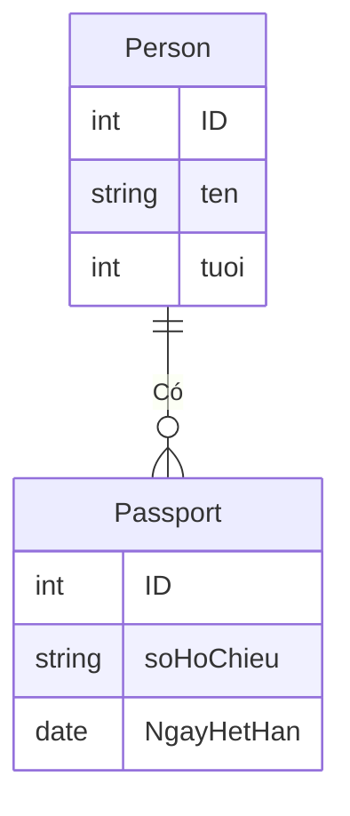
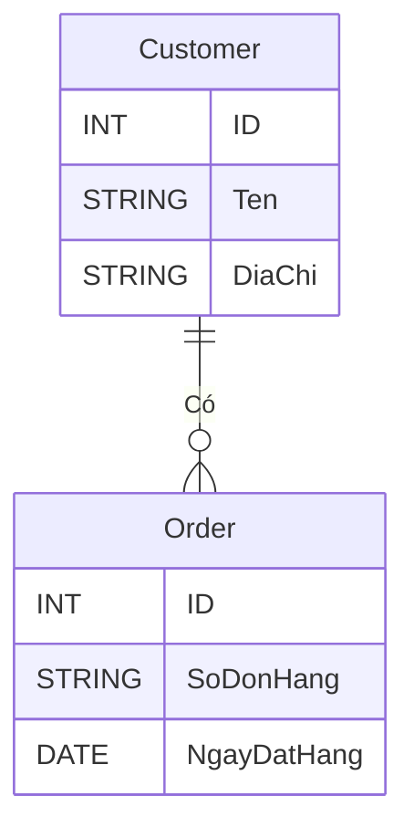
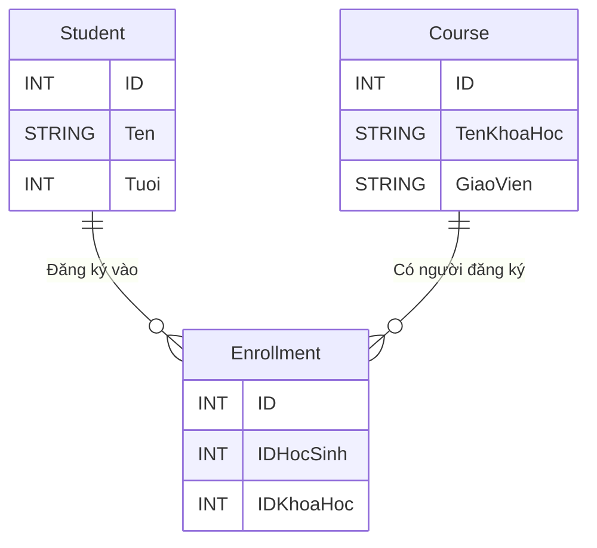

---
categories:
  - database
date: 2023-11-20T08:00:00+08:00
description: PostgreSQL là một hệ thống quản lý cơ sở dữ liệu Mối quan hệ Đối tượng (ORDBMS) mạnh mẽ và mã nguồn mở, nổi tiếng với tính ổn định, tính mở rộng và tuân thủ SQL. Ban đầu được phát triển tại Đại học California, Berkeley, vào những năm 1980 và sau đó trở thành một trong những cơ sở dữ liệu mã nguồn mở phổ biến nhất trên toàn thế giới.
draft: false
series:
  - postgresql-dba-series
featuredImage: /series/postgresql-dba/postgresql-dba-01-introduction-to-postgresql-database.webp
images:
  - /series/postgresql-dba/postgresql-dba-01-introduction-to-postgresql-database.webp
  - /postgresql-dba-01-gioi-thieu-ve-postgresql-database/images/index.png
license: <a rel="license external nofollow noopener noreffer" href="https://creativecommons.org/licenses/by-nc/4.0/" target="_blank">CC BY-NC 4.0</a>
tags:
  - database
  - postgresql
  - ubuntu
  - database-administrator
title: Lesson 1 - Giới thiệu về PostgreSQL Database
url: /postgresql-dba-01-gioi-thieu-ve-postgresql-database
weight: 1
---

# PostgreSQL là gì?

PostgreSQL là một hệ thống quản lý cơ sở dữ liệu Mối quan hệ Đối tượng (ORDBMS - Object Oriented Relational Database Management System) mạnh mẽ và mã nguồn mở, nổi tiếng với tính ổn định, tính mở rộng và tuân thủ SQL. Ban đầu được phát triển tại Đại học California, Berkeley, vào những năm 1980 và sau đó trở thành một trong những cơ sở dữ liệu mã nguồn mở phổ biến nhất trên toàn thế giới.

Trong hướng dẫn giới thiệu này, chúng ta sẽ thảo luận về một số tính năng và khả năng quan trọng của PostgreSQL, cũng như các trường hợp sử dụng và lợi ích của nó. Hướng dẫn này nhằm mục đích cung cấp một điểm khởi đầu cho người dùng đang tìm hiểu về thế giới của PostgreSQL và muốn có kiến thức cơ bản về hệ thống này.

## Các Tính Năng Quan Trọng

1. Tuân Thủ [ACID](/acid-la-gi) : PostgreSQL tuân thủ đầy đủ chuẩn [ACID](/acid-la-gi), đảm bảo tính tin cậy và toàn vẹn dữ liệu.

2. Khả Năng Mở Rộng: PostgreSQL cho phép người dùng định nghĩa các loại dữ liệu, toán tử, hàm và nhiều tính năng khác, điều này làm cho nó có tính tùy chỉnh cao và phù hợp với nhiều trường hợp sử dụng khác nhau.

3. Kiểm Soát Đồng Thời: Thông qua cơ chế Kiểm Soát Đồng Thời Đa Phiên Bản [(ACID)](/mvcc-la-gi) của mình, PostgreSQL xử lý các truy vấn đồng thời một cách hiệu quả mà không gây tranh chấp khóa.

4. Tìm Kiếm Văn Bản Đầy Đủ (): PostgreSQL cung cấp khả năng tìm kiếm văn bản mạnh mẽ, bao gồm việc tạo chỉ mục văn bản và nhiều hàm tìm kiếm khác nhau.

5. Khả Năng Cơ Sở Dữ Liệu Vị Trí: Thông qua tiện ích mở rộng [PostGIS](https://postgis.net), PostgreSQL hỗ trợ các đối tượng địa lý và truy vấn không gian, làm cho nó lý tưởng cho các ứng dụng GIS.

6. Tính sẵn sàng cao (High Availability): PostgreSQL tích hợp sẵn khả năng sao chép (replication), cho phép khả năng sẵn sàng cao và khả năng chịu lỗi.

## Lợi ích của PostgreSQL

1. Một trong những lợi ích chính của PostgreSQL là cách tiếp cận nguồn mở và hướng đến cộng đồng, có nghĩa là nó được sử dụng miễn phí và liên tục được phát triển và cải tiến bởi một nhóm các nhà phát triển tận tâm.

2. Nó có khả năng mở rộng cao, phù hợp cho cả dự án quy mô nhỏ và ứng dụng doanh nghiệp quy mô lớn.

3. Nó độc lập với nền tảng, có nghĩa là nó có thể chạy trên nhiều hệ điều hành khác nhau như Windows, Linux và macOS.

## Trường hợp nào sử dụng PostgreSQL

PostgreSQL có thể được sử dụng cho nhiều ứng dụng khác nhau nhờ tính linh hoạt và khả năng mở rộng của nó. Một số trường hợp sử dụng phổ biến bao gồm:



# Cơ sở dữ liệu quan hệ là gì?



Cơ sở dữ liệu quan hệ là một loại hệ thống quản lý cơ sở dữ liệu (DBMS - Database Management System) lưu trữ và sắp xếp dữ liệu theo định dạng có cấu trúc được gọi là bảng (table). Các bảng này được tạo thành từ các hàng (record), còn được gọi là bản ghi hoặc bộ dữ liệu và các cột, còn được gọi là thuộc tính hoặc trường. Thuật ngữ "quan hệ" xuất phát từ thực tế là các bảng này có thể liên quan với nhau thông qua các khóa và mối quan hệ.

## Các định nghĩa chính

**Bảng (Table)**: Bảng là một tập hợp dữ liệu được tổ chức thành các hàng và cột. Mỗi bảng có một tên duy nhất và đại diện cho một đối tượng hoặc hoạt động cụ thể trong cơ sở dữ liệu.

**Hàng (Row)**: Hàng là một mục nhập đơn trong bảng, chứa một trường hợp cụ thể của dữ liệu. Mỗi hàng trong bảng có các cột giống nhau và đại diện cho một bản ghi duy nhất.

**Cột (Column)**: Cột là một trường dữ liệu trong bảng, đại diện cho một thuộc tính cụ thể của dữ liệu. Các cột có tên duy nhất và một kiểu dữ liệu cụ thể.

**Khóa Chính (Primary Key)**: Khóa chính là một cột (hoặc một tập hợp các cột) trong bảng mà định danh mỗi hàng một cách duy nhất. Không có hai hàng nào có giá trị khóa chính giống nhau.

**Khóa Ngoại (Foreign Key)**: Khóa ngoại là một cột (hoặc một tập hợp các cột) trong bảng mà tham chiếu đến khóa chính của bảng khác. Nó được sử dụng để thiết lập mối quan hệ giữa các bảng.

Dưới đây là một ví dụ về bảng đơn giản:

| ID (Khóa Chính) | Tên   | Tuổi | Địa chỉ     |
| --------------- | ----- | ---- | ----------- |
| 1               | John  | 30   | 123 Main St |
| 2               | Mary  | 25   | 456 Elm St  |
| 3               | David | 35   | 789 Oak St  |

Trong ví dụ trên, chúng ta có một bảng có tên "Người" (Person) với bốn cột: "ID" là khóa chính, "Tên" đại diện cho tên của người, "Tuổi" đại diện cho tuổi của người, và "Địa chỉ" đại diện cho địa chỉ của người. Mỗi hàng trong bảng đại diện cho một người cụ thể.

## Các mối quan hệ (Relationships)

Một trong những lợi ích chính của cơ sở dữ liệu quan hệ là khả năng biểu diễn các mối quan hệ giữa các bảng. Các mối quan hệ này có thể là mối quan hệ một-một, một-nhiều hoặc nhiều-nhiều. Chúng cho phép truy vấn và thao tác dữ liệu liên quan một cách hiệu quả qua nhiều bảng khác nhau.

**Mối Quan Hệ Một-Một (One-to-One)**: Đây là một mối quan hệ trong đó một hàng trong một bảng có một hàng tương ứng trong một bảng khác. Ví dụ, một người có thể có một hộ chiếu duy nhất, và một hộ chiếu chỉ có thể thuộc về một người duy nhất.

**Ví dụ Mối Quan Hệ Một-Một**:

Bảng "Người" (Person):
| ID | Tên | Tuổi |
|----|---------|------|
| 1 | John | 30 |
| 2 | Mary | 25 |

Bảng "Hộ Chiếu" (Passport):
| ID | Số Hộ Chiếu | Ngày Hết Hạn |
|----|-------------|--------------|
| 1 | 12345 | 2025-12-31 |
| 2 | 67890 | 2024-08-15 |

**Mối Quan Hệ Một-Nhiều (One-to-Many)**: Đây là một mối quan hệ trong đó một hàng trong một bảng có thể có nhiều hàng tương ứng trong một bảng khác. Ví dụ, một khách hàng có thể có nhiều đơn hàng, nhưng một đơn hàng chỉ có thể thuộc về một khách hàng.

**Ví dụ Mối Quan Hệ Một-Nhiều**:

Bảng "Khách Hàng" (Customer):
| ID | Tên | Địa Chỉ |
|----|---------|---------------|
| 1 | Alice | 123 Elm St |
| 2 | Bob | 456 Oak St |

Bảng "Đơn Hàng" (Order):
| ID | Số Đơn Hàng | Ngày Đặt Hàng |
|----|-------------|---------------|
| 1 | 1001 | 2025-01-15 |
| 2 | 1002 | 2025-02-20 |
| 3 | 1003 | 2025-03-10 |

**Mối Quan Hệ Nhiều-Nhiều (Many-to-Many)**: Đây là một mối quan hệ trong đó nhiều hàng trong một bảng có thể có nhiều hàng tương ứng trong một bảng khác. Để biểu diễn mối quan hệ nhiều-nhiều, cần có một bảng thứ ba, được gọi là bảng liên kết hoặc bảng kết hợp. Ví dụ, một học sinh có thể đăng ký nhiều khóa học, và một khóa học có thể có nhiều học sinh đăng ký.

**Ví dụ Mối Quan Hệ Nhiều-Nhiều**:

Bảng "Học Sinh" (Student):
| ID | Tên | Tuổi |
|----|---------|------|
| 1 | Alice | 18 |
| 2 | Bob | 20 |

Bảng "Khóa Học" (Course):
| ID | Tên Khóa Học | Giảng Viên |
|----|----------------|------------|
| 101| Toán Học Cơ Bản| Dr. Smith |
| 102| Văn Học | Prof. Jones|

Bảng Liên Kết "Đăng Ký" (Enrollment):
| ID | ID Học Sinh | ID Khóa Học |
|----|-------------|-------------|
| 1 | 1 | 101 |
| 2 | 1 | 102 |
| 3 | 2 | 102 |

Trong ví dụ trên, bảng "Đăng Ký" là bảng liên kết giữa "Học Sinh" và "Khóa Học" để biểu diễn mối quan hệ nhiều-nhiều giữa học sinh và khóa học.

# Ưu điểm của cơ sở dữ liệu quan hệ

| Ưu điểm               | Mô tả                                                                                                                                                                                     |
| --------------------- | ----------------------------------------------------------------------------------------------------------------------------------------------------------------------------------------- |
| Dữ liệu Cấu trúc      | Tổ chức dựa trên bảng của các cơ sở dữ liệu quan hệ làm cho chúng phù hợp cho việc xử lý dữ liệu có cấu trúc, có cấu trúc và có thể dễ dàng được ánh xạ vào các cột và hàng của một bảng. |
| Tính toàn vẹn dữ liệu | Cơ sở dữ liệu quan hệ sử dụng khóa chính và khóa ngoại để duy trì mối quan hệ nhất quán giữa dữ liệu liên quan, giảm nguy cơ không nhất quán và trùng lặp dữ liệu.                        |
| Khả năng mở rộng      | Cơ sở dữ liệu quan hệ có thể xử lý lượng lớn dữ liệu có cấu trúc và có thể được mở rộng để đáp ứng yêu cầu dữ liệu ngày càng tăng.                                                        |
| Truy vấn              | SQL (Structured Query Language) được sử dụng để truy vấn, cập nhật và quản lý cơ sở dữ liệu quan hệ, cung cấp một cách mạnh mẽ và chuẩn hóa để truy cập và điều chỉnh dữ liệu.            |
