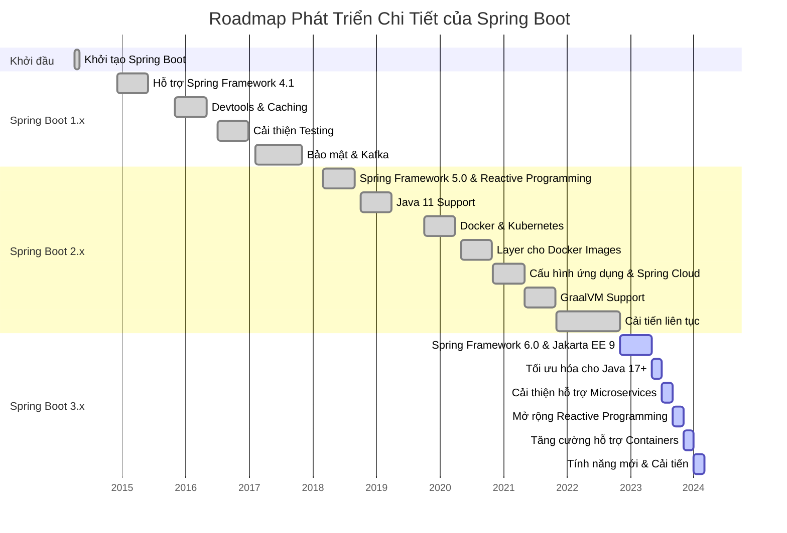
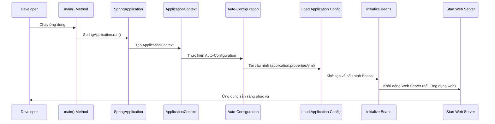

Spring là màu xuân, Boot là khởi động, nên chúng ta có thể gọi là Khởi động mùa xuân, nhưng mà theo mình nên gọi là Spring Boot

Spring Boot là một dự án con trong hệ sinh thái lớn của Spring Framework, được thiết kế để giúp các nhà phát triển nhanh chóng tạo ra các ứng dụng Spring dựa trên Java mà không cần phải lo lắng về quá trình cấu hình ứng dụng một cách thủ công. Spring Boot được phát triển và duy trì bởi Pivotal Team (nay là một phần của VMware) và cộng đồng mở rộng, được phát hành lần đầu vào năm 2014.






- `04/2014` : Release phiên bản Spring boot 1.0 hổ trợ Hỗ trợ Spring Framework 4.1.
-  `03/2018` : Tiếp tục Release phiên bản Spring boot 1.0m hổ trợ java 11, Docker,Kubernetes, Layer cho docker, tích hợp với Spring cloud, hổ trợ GraalVM.
- `11/2022 `: Bản Spring Boot 3 ra đời, hổ trợ phiên bản Spring Framework 6 và Jakarta EE 9, Tối ưu hoá hơn cho java 17 trở lên, Cả thiện hổ trợ cho Microservices, Tăng cường hoá cho Containers, tung ra thêm nhiều tính năng mới hơn.


<!-- ```mermaid
sequenceDiagram
    participant N as Nhà Phát Triển
    participant M as Phương thức main()
    participant SA as SpringApplication
    participant AC as ApplicationContext
    participant CA as Cấu Hình Ứng Dụng
    participant ACfg as Tự Động Cấu Hình
    participant B as Các Bean
    participant S as Server Nhúng (Tomcat, Jetty,...)

    N->>M: Chạy ứng dụng
    M->>SA: SpringApplication.run()
    SA->>AC: Khởi tạo ApplicationContext
    AC->>CA: Tải cấu hình từ application.properties/yml
    CA->>ACfg: Kiểm tra điều kiện tự động cấu hình
    ACfg->>B: Khởi tạo và cấu hình Các Bean
    B->>AC: Đăng ký Các Bean với ApplicationContext
    AC->>S: Kiểm tra và Khởi động Server Nhúng nếu cần
    S->>AC: Server Nhúng sẵn sàng, thông báo ApplicationContext
    AC->>N: Ứng dụng sẵn sàng để sử dụng
``` -->

