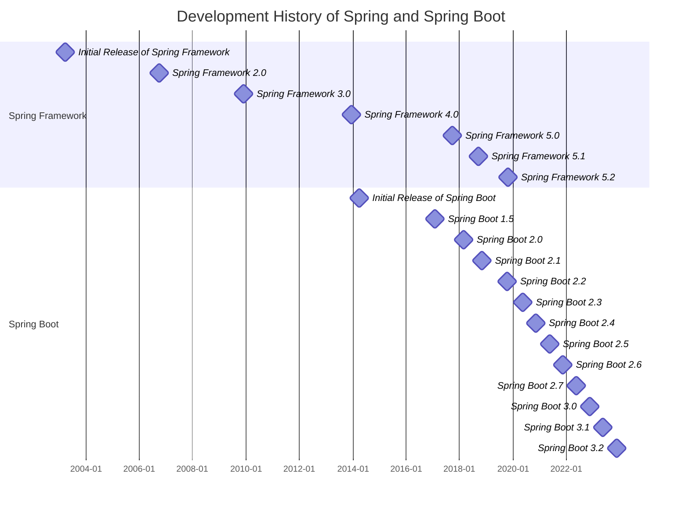

#### 1. Introduction to Spring Framework

-   **History and Evolution**:
    -   **Origins**: Spring Framework was created by Rod Johnson and first released in 2003. This framework was developed to address the complexities of earlier Java EE technologies, such as EJB (Enterprise JavaBeans), by providing a simpler and more flexible programming model.
    -   **Key Development Stages**: Discuss the major versions of Spring, from Spring Framework 1.0 to the current version, highlighting significant improvements such as support for annotations, integration with Spring Boot, and reactive programming support.

-   **Core Concepts and Philosophy**:
    -   **Dependency Injection (DI)**: Explain in detail what dependency injection is and how it helps reduce coupling between software components, thereby increasing modularity and reusability of code. Provide a code example demonstrating how to configure a bean in Spring using DI.
    -   **Aspect-Oriented Programming (AOP)**: Describe how AOP helps separate cross-cutting concerns (such as logging or transaction management) from the main business logic of the application. Provide a simple example of how to apply AOP in a Spring application.

-   **Components and Modules of Spring**:
    -   **Spring MVC**: Introduce Spring MVC and explain how it facilitates the development of web applications using the MVC (Model-View-Controller) pattern. Describe how to create a simple controller and handle web requests.
    -   **Spring Data**: Discuss Spring Data and how it simplifies data access from various data sources such as JPA, MongoDB, or JDBC.
    -   **Spring Security**: Explain the robust authentication and authorization capabilities of Spring Security, including an example of securing a web application.

#### 2. Introduction to Spring Boot

-   **What is Spring Boot?**:
    -   Define and explain how Spring Boot accelerates development by eliminating boilerplate configuration tasks. Describe the concept of "opinionated defaults" that Spring Boot applies to minimize configuration time.

-   **Key Features**:
    -   **Auto-configuration**: Provide details about the auto-configuration mechanism of Spring Boot, including examples of how Spring Boot selects the best configuration based on the project's dependencies.
    -   **Standalone Applications and Embedded Servlet Containers**: Discuss the benefits of having an embedded web server directly within the application, allowing for easy and quick deployment.
    -   **Spring Boot Actuator**: Introduce Spring Boot Actuator in detail, including the endpoints it provides for monitoring and managing applications in production environments.

#### 3. Development History of Spring Framework and Spring Boot

### Version Details

#### Spring Framework

-   **Spring Framework 2.0 (2006-10-04)**
    -   Enhanced XML configuration.
    -   Improved AOP support.
    -   Improved JDBC access.

-   **Spring Framework 3.0 (2009-12-01)**
    -   Full support for Java 5.
    -   Introduction of Spring Expression Language (SpEL).
    -   RESTful Web Services support.

-   **Spring Framework 4.0 (2013-12-12)**
    -   Support for Java 8.
    -   WebSocket support.
    -   Improved messaging system.

-   **Spring Framework 5.0 (2017-09-28)**
    -   Reactive Programming with Spring WebFlux.
    -   Kotlin support.
    -   Improved performance and reduced memory usage.

-   **Spring Framework 5.1 (2018-09-21)**
    -   Support for Java 11.
    -   HTTP/2 support.
    -   Improved bean initialization process.

-   **Spring Framework 5.2 (2019-10-22)**
    -   RSocket support.
    -   Integration with Micrometer.
    -   Improved configuration and cloud environment support.

#### Spring Boot

-   **Spring Boot 1.0 (2014-04-01)**
    -   Auto-configuration of Spring ApplicationContext.
    -   Ability to create standalone applications with embedded server.
    -   Introduction of starter POMs.

-   **Spring Boot 1.5 (2017-02-01)**
    -   Improved security features and OAuth2 support.
    -   Expanded Actuator Endpoints.

-   **Spring Boot 2.0 (2018-03-01)**
    -   Full integration with Spring Framework 5.
    -   Reactive programming support through Spring WebFlux.
    -   Improved properties configuration system.

-   **Spring Boot 2.1 (2018-10-30)**
    -   Java 11 support.
    -   Improved Spring Boot Actuator.
    -   Integration with Micrometer for monitoring and metrics.

-   **Spring Boot 2.2 (2019-10-16)**
    -   Support for lazy initialization.
    -   Improved startup performance and reduced memory usage.
    -   Kotlin Coroutines support.

-   **Spring Boot 2.3 (2020-05-14)**
    -   Docker support and image creation.
    -   Improved startup performance.
    -   Enhanced Actuator Endpoints.

-   **Spring Boot 2.4 (2020-11-12)**
    -   Introduction of Config Data API.
    -   Improved startup and memory usage.
    -   Better Docker Image support.

-   **Spring Boot 2.5 (2021-05-20)**
    -   Java 16 support.
    -   Layered JARs support.
    -   Improved configuration and cloud environment support.

-   **Spring Boot 2.6 (2021-11-18)**
    -   Java 17 support.
    -   Improved dependency management and library upgrades.
    -   Docker Compose support.

-   **Spring Boot 2.7 (2022-05-19)**
    -   Improved testing support, including JUnit 5.
    -   Introduction of Micrometer Observation.
    -   Enhanced configuration system.

-   **Spring Boot 3.0 (2022-11-24)**
    -   Java 17 LTS support.
    -   Native compilation with GraalVM.
    -   Improved API for reactive applications and microservices.

-   **Spring Boot 3.1 (2023-05-18)**
    -   Java 20 support.
    -   Enhanced native compilation support.
    -   Improved Kubernetes integration and support.

-   **Spring Boot 3.2 (2023-11-23)**
    -   Full integration with Spring Framework 6.
    -   AI/ML support.
    -   Advanced configuration management.

### Conclusion

This lesson has introduced Spring Framework and Spring Boot, two crucial technologies in Java programming. Spring Framework helps developers build Java applications more easily and quickly, while Spring Boot reduces configuration time and accelerates application development. The next lesson will focus on using Spring Boot to efficiently build Java applications.
