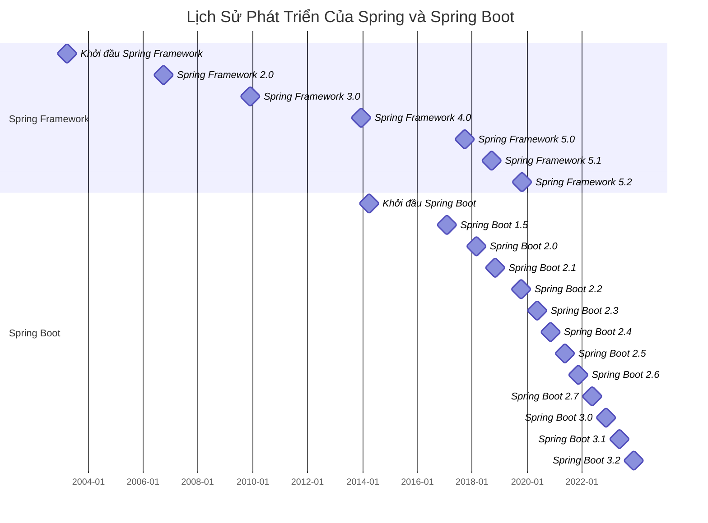

#### 1. Giới thiệu về Spring Framework

-   **Lịch sử và Sự tiến hóa**:
    -   **Nguồn gốc**: Spring Framework được tạo ra bởi Rod Johnson và được phát hành lần đầu vào năm 2003. Framework này ra đời nhằm giải quyết các vấn đề phức tạp của các công nghệ Java EE trước đó, như EJB (Enterprise JavaBeans), bằng cách cung cấp một mô hình lập trình đơn giản hơn và linh hoạt hơn.
    -   **Các bước phát triển chính**: Thảo luận về các phiên bản chính của Spring, từ Spring Framework 1.0 đến phiên bản hiện tại, và nhấn mạnh các cải tiến quan trọng như hỗ trợ annotation, hỗ trợ Spring Boot, và tích hợp reactive programming.

-   **Các khái niệm cốt lõi và Triết lý**:
    -   **Tiêm phụ thuộc (DI)**: Giải thích chi tiết về tiêm phụ thuộc là gì và làm thế nào nó giúp giảm sự phụ thuộc giữa các thành phần của phần mềm, qua đó làm tăng tính mô-đun và khả năng tái sử dụng của mã. Cung cấp một ví dụ mã nguồn về cách cấu hình một bean trong Spring sử dụng DI.
    -   **Lập trình hướng khía cạnh (AOP)**: Mô tả làm thế nào AOP giúp tách biệt các vấn đề chéo (cross-cutting concerns) như logging hoặc transaction management ra khỏi logic nghiệp vụ chính của ứng dụng. Đưa ra một ví dụ đơn giản về cách áp dụng AOP trong một ứng dụng Spring.

-   **Các thành phần và Mô-đun của Spring**:
    -   **Spring MVC**: Giới thiệu về Spring MVC và nó như thế nào giúp phát triển các ứng dụng web dễ dàng hơn bằng cách sử dụng mô hình MVC (Model-View-Controller). Mô tả cách tạo một controller đơn giản và cách xử lý các yêu cầu web.
    -   **Spring Data**: Thảo luận về Spring Data và làm thế nào nó đơn giản hóa truy cập dữ liệu từ các nguồn dữ liệu khác nhau như JPA, MongoDB, hoặc JDBC.
    -   **Spring Security**: Giải thích các khả năng xác thực và ủy quyền mạnh mẽ của Spring Security, kèm theo ví dụ về cách bảo mật một ứng dụng web.

#### 2. Giới thiệu về Spring Boot

-   **Spring Boot là gì?**:
    -   Định nghĩa và giải thích cách Spring Boot giúp phát triển nhanh hơn bằng cách loại bỏ công việc cấu hình "boilerplate". Mô tả khái niệm "opinionated defaults" mà Spring Boot áp dụng để giảm thiểu thời gian cấu hình.

-   **Các tính năng chính**:
    -   **Tự động cấu hình (Auto-configuration)**: Chi tiết về cơ chế tự động cấu hình của Spring Boot, cho thấy các ví dụ về cách Spring Boot chọn cấu hình tốt nhất dựa trên các phụ thuộc có trong dự án.
    -   **Ứng dụng độc lập và Máy chủ Servlet nhúng**: Thảo luận về lợi ích của việc có máy chủ web nhúng trực tiếp trong ứng dụng, cho phép triển khai dễ dàng và nhanh chóng.
    -   **Spring Boot Actuator**: Giới thiệu chi tiết về Actuator, bao gồm các endpoint mà nó cung cấp để giám sát và quản lý ứng dụng trong môi trường sản xuất.

#### 3. Lịch sử phát triển Spring Framework và Spring Boot

### Chi tiết các phiên bản

#### Spring Framework

-   **Spring Framework 2.0 (2006-10-04)**
    -   Tăng cường cấu hình XML.
    -   Cải thiện hỗ trợ AOP.
    -   Cải tiến truy cập JDBC.

-   **Spring Framework 3.0 (2009-12-01)**
    -   Hỗ trợ đầy đủ cho Java 5.
    -   Giới thiệu Spring Expression Language (SpEL).
    -   Hỗ trợ RESTful Web Services.

-   **Spring Framework 4.0 (2013-12-12)**
    -   Hỗ trợ Java 8.
    -   Hỗ trợ WebSocket.
    -   Cải tiến hệ thống messaging.

-   **Spring Framework 5.0 (2017-09-28)**
    -   Lập trình phản ứng (Reactive Programming) với Spring WebFlux.
    -   Hỗ trợ Kotlin.
    -   Cải thiện hiệu suất và giảm bộ nhớ sử dụng.

-   **Spring Framework 5.1 (2018-09-21)**
    -   Hỗ trợ Java 11.
    -   Hỗ trợ HTTP/2.
    -   Cải thiện quy trình khởi tạo bean.

-   **Spring Framework 5.2 (2019-10-22)**
    -   Hỗ trợ RSocket.
    -   Tích hợp Micrometer.
    -   Cải thiện cấu hình và hỗ trợ môi trường đám mây.

#### Spring Boot

-   **Spring Boot 1.0 (2014-04-01)**
    -   Tự động cấu hình Spring ApplicationContext.
    -   Khả năng tạo ứng dụng độc lập với embedded server.
    -   Giới thiệu các starter POMs.

-   **Spring Boot 1.5 (2017-02-01)**
    -   Cải thiện tính năng bảo mật và hỗ trợ OAuth2.
    -   Mở rộng các Actuator Endpoints.

-   **Spring Boot 2.0 (2018-03-01)**
    -   Tích hợp hoàn toàn với Spring Framework 5.
    -   Hỗ trợ lập trình phản ứng thông qua Spring WebFlux.
    -   Cải thiện hệ thống cấu hình properties.

-   **Spring Boot 2.1 (2018-10-30)**
    -   Hỗ trợ Java 11.
    -   Cải thiện Spring Boot Actuator.
    -   Tích hợp Micrometer cho giám sát và metrics.

-   **Spring Boot 2.2 (2019-10-16)**
    -   Hỗ trợ khởi tạo lười (lazy initialization).
    -   Cải thiện hiệu suất khởi động và giảm bộ nhớ sử dụng.
    -   Hỗ trợ Kotlin Coroutines.

-   **Spring Boot 2.3 (2020-05-14)**
    -   Hỗ trợ Docker và tạo Docker image.
    -   Cải thiện hiệu suất khởi động.
    -   Tăng cường các Actuator Endpoints.

-   **Spring Boot 2.4 (2020-11-12)**
    -   Giới thiệu Config Data API mới.
    -   Cải thiện khởi động và sử dụng bộ nhớ.
    -   Hỗ trợ Docker Image tốt hơn.

-   **Spring Boot 2.5 (2021-05-20)**
    -   Hỗ trợ Java 16.
    -   Hỗ trợ tạo JAR phân lớp (layered JARs).
    -   Cải thiện cấu hình và hỗ trợ môi trường đám mây và Kubernetes.

-   **Spring Boot 2.6 (2021-11-18)**
    -   Hỗ trợ Java 17.
    -   Quản lý phụ thuộc và nâng cấp các thư viện.
    -   Hỗ trợ Docker Compose.

-   **Spring Boot 2.7 (2022-05-19)**
    -   Cải thiện hỗ trợ kiểm thử, bao gồm JUnit 5.
    -   Giới thiệu Micrometer Observation.
    -   Nâng cao hệ thống cấu hình.

-   **Spring Boot 3.0 (2022-11-24)**
    -   Hỗ trợ Java 17 LTS.
    -   Hỗ trợ biên dịch native với GraalVM.
    -   Cải tiến API cho các ứng dụng phản ứng và microservices.

-   **Spring Boot 3.1 (2023-05-18)**
    -   Hỗ trợ Java 20.
    -   Tăng cường hỗ trợ biên dịch native.
    -   Cải thiện tích hợp và hỗ trợ cho Kubernetes.

-   **Spring Boot 3.2 (2023-11-23)**
    -   Tích hợp hoàn toàn với Spring Framework 6.
    -   Hỗ trợ AI/ML.
    -   Quản lý cấu hình nâng cao.

### Kết luận

Bài học này đã giới thiệu về Spring Framework và Spring Boot, hai công nghệ quan trọng trong lập trình Java. Spring Framework giúp lập trình viên xây dựng các ứng dụng Java một cách dễ dàng và nhanh chóng, trong khi Spring Boot giúp giảm thời gian cấu hình và tăng tốc quá trình phát triển ứng dụng. Bài học tiếp theo sẽ tập trung vào cách sử dụng Spring Boot để xây dựng các ứng dụng Java một cách hiệu quả.
