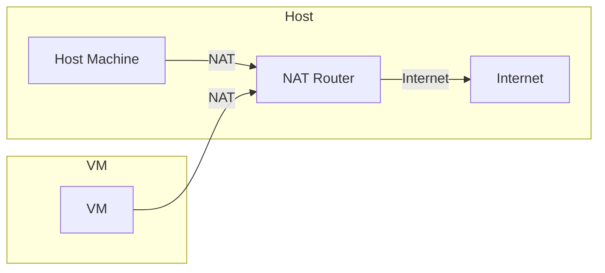
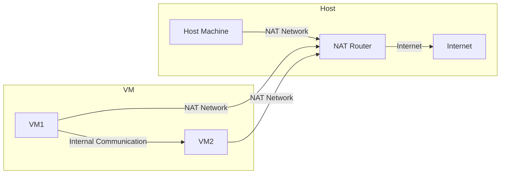
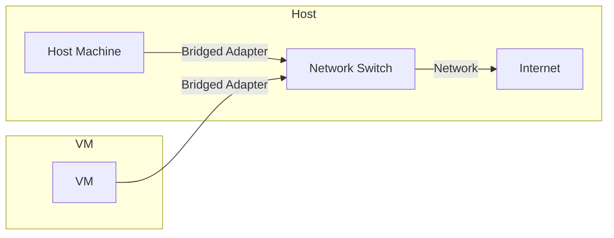
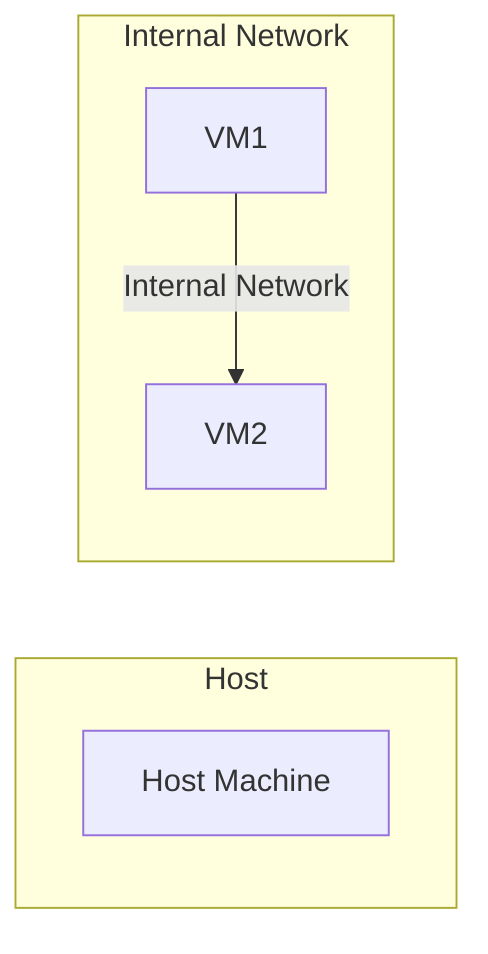
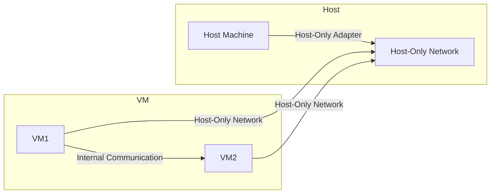
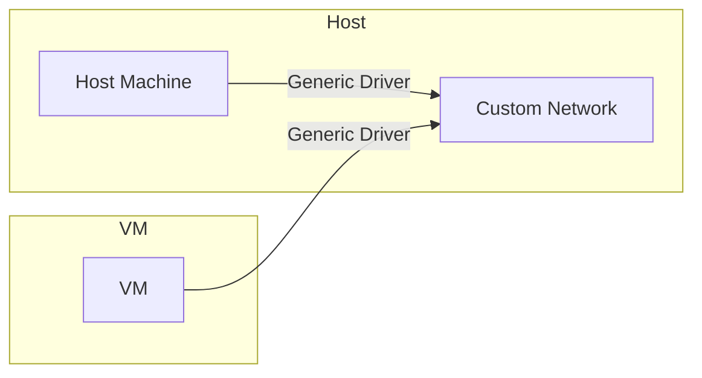

Welcome to the series on practical Linux, from basic to advanced. In this article, we will explore how to create a new virtual machine for Ubuntu Server on Oracle VM VirtualBox and configure important parameters such as RAM, CPU, virtual hard disk, and network settings.

Oracle VM VirtualBox is a powerful and flexible tool that allows us to easily create and manage virtual machines. Creating a virtual machine enables you to practice and experiment with configurations without affecting your main system.

## Step 1: Open Oracle VM VirtualBox

- Double-click the Oracle VM VirtualBox icon on the desktop or search for it in the Start menu.

## Step 2: Start Creating a New Virtual Machine



- Click the "New" button on the toolbar. The "Create Virtual Machine" window will appear.

## Step 3: Name and Choose the Operating System



- In this window, enter a name for your virtual machine (e.g., "Ubuntu Server").
- For "Type," select "Linux."
- For "Version," select "Ubuntu (64-bit)."
- Click "Next" to continue.

### Configure RAM and CPU



- In the "Base Memory" section, use the slider or directly enter the amount of RAM you want to allocate to the virtual machine (recommended at least 1024 MB), here we set it to 4096 MB.
- In the "Processor" section, you can adjust the number of CPUs (recommended at least 1 CPU), here we set it to 2 CPUs.
- Click "Next" to continue.



- **Ubuntu Server:** It is recommended to allocate at least 1024 MB (1 GB) of RAM to ensure that the Ubuntu Server operating system runs smoothly and stably. However, if you have enough resources, allocating more RAM will improve performance.
- **RAM Allocation Formula:** If you're unsure how much RAM to allocate to the virtual machine, you can use the following simple formula:

$$
\text{Minimum RAM} = \text{Physical RAM of the computer} \times \frac{1}{2}
$$

  For example: If your computer has 8 GB of physical RAM, you can allocate up to 4 GB (4096 MB) to the virtual machine without significantly affecting the performance of the main operating system.

- **Computer with 4 GB RAM:** It is recommended to allocate 1024 MB RAM for the Ubuntu Server virtual machine.
- **Computer with 8 GB RAM:** It is recommended to allocate 2048 MB RAM for the Ubuntu Server virtual machine.
- **Computer with 16 GB RAM:** It is recommended to allocate 4096 MB RAM for the Ubuntu Server virtual machine.

#### Note When Allocating RAM

- **Ensure enough RAM for the host operating system:** When allocating RAM to the virtual machine, ensure that the host operating system (main computer) still has enough RAM to operate normally. For example, if your computer has 8 GB of RAM, allocating 6 GB to the virtual machine may reduce the performance of the main operating system.
- **Check performance:** After allocating RAM and starting the virtual machine, check the performance to ensure that the virtual machine runs smoothly. If the virtual machine runs slowly or the main operating system is affected, you can adjust the RAM amount.



### Configure Virtual Hard Disk



- Select "Create a virtual hard disk now."
- Set the maximum size for the virtual hard disk (recommended at least 10 GB), here we set it to 50 GB. Click "Next" to finalize the virtual hard disk setup.



- **Ubuntu Server:** It is recommended to allocate at least 10 GB of virtual hard disk space to install the Ubuntu Server operating system and basic applications. However, if you have enough space, allocating more space will allow you to store data and applications comfortably.
- **Virtual Hard Disk Size Formula:** If you're unsure how much space to allocate for the virtual hard disk, you can use the following simple formula:
- **Minimum size:** The minimum size for the virtual hard disk depends on the intended use and the number of applications you want to install.



### Confirm and Finish



- Click "Finish" to create the new virtual machine with the selected settings.



- The new virtual machine will appear in the list of virtual machines on the main interface of Oracle VM VirtualBox.

## Configure Network



- In the "Settings" window, go to the "Network" section.
- Select "Attached to: NAT" so the virtual machine can access the internet through the host's network.



- Click "OK" to save the network settings.



### 1. NAT (Network Address Translation)

- **NAT (Network Address Translation)**: The virtual machine (VM) uses the NAT Router to access the internet. The VM cannot receive connections from outside, only initiate outbound connections. This is the easiest configuration to set up and is suitable for testing or learning purposes.

### 2. NAT Network

- **NAT Network**: Similar to NAT, but VMs on the same NAT Network can communicate with each other. The VMs can access the internet and also communicate internally with other VMs on the same NAT network. This configuration is good for application development and learning.

### 3. Bridged Adapter

- **Bridged Adapter**: The VM connects directly to the physical network through a Network Switch, as if it were another device on the network. The VM can obtain an IP address from the DHCP server and access the internet as well as other devices on the network. This configuration is suitable when you need the VM to function as a physical machine on the network, such as for servers.

### 4. Internal Network

- **Internal Network**: VMs can only communicate with each other within an internal network without any external access or access to the host's network. This configuration is useful when you want to create a separate network between VMs.

### 5. Host-Only Adapter

- **Host-Only Adapter**: VMs communicate with the host and each other through the Host-Only Network but do not have internet access. This configuration is suitable when VMs need to communicate with the host and each other without needing internet access.

### 6. Generic Driver

- **Generic Driver**: Uses custom network drivers for special needs that other network configurations do not meet. This configuration is rarely used and requires deeper knowledge about networks and VirtualBox.



By following these steps, you have successfully created a new virtual machine for Ubuntu Server on Oracle VM VirtualBox and configured its main parameters. This setup allows you to experiment with Linux configurations in a safe and isolated environment.
