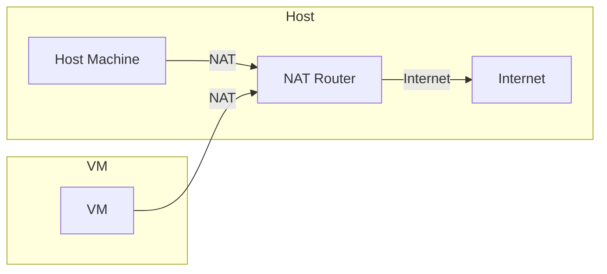
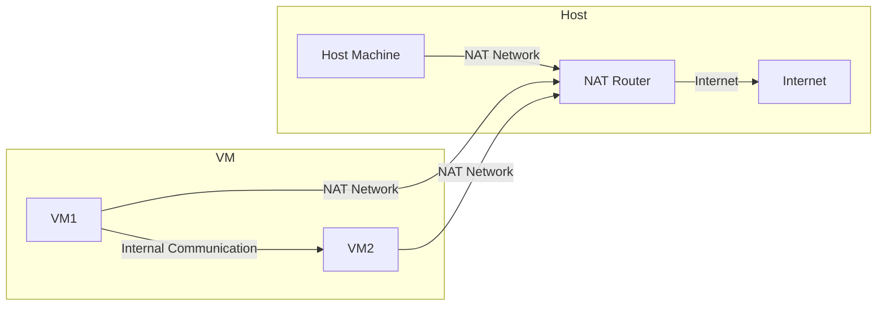
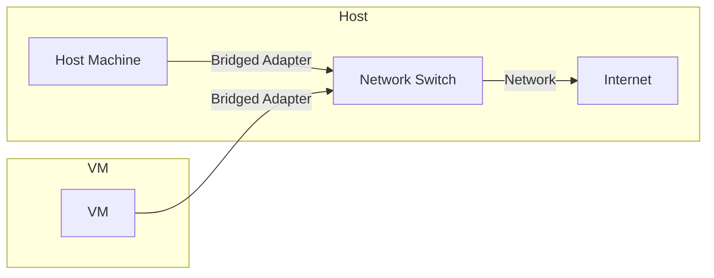
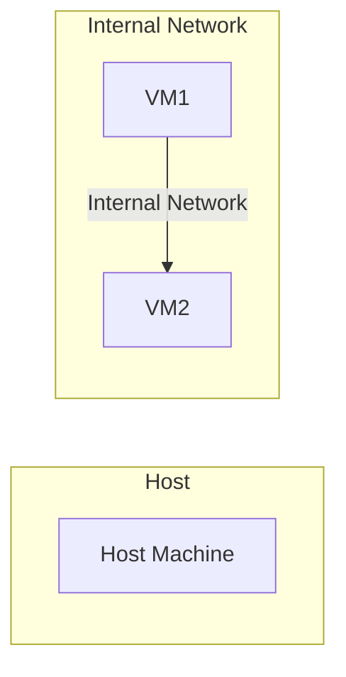
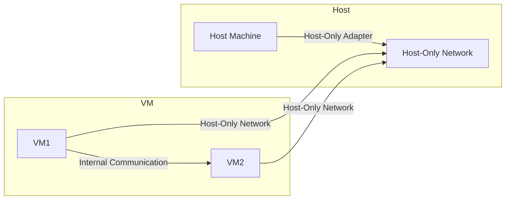
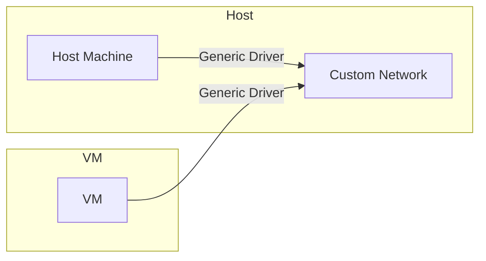

Chào mừng bạn đến với loạt bài về thực chiến Linux, từ cơ bản đến nâng cao. Trong bài viết này, chúng ta sẽ khám phá cách tạo một máy ảo mới cho Ubuntu Server trên Oracle VM VirtualBox và cấu hình các thông số quan trọng như RAM, CPU, ổ cứng ảo và cài đặt mạng.

Oracle VM VirtualBox là một công cụ mạnh mẽ và linh hoạt cho phép chúng ta dễ dàng tạo và quản lý các máy ảo. Việc tạo máy ảo cho phép bạn thực hành và thử nghiệm các cấu hình mà không ảnh hưởng đến hệ thống chính của bạn.

## Bước 1: Mở Oracle VM VirtualBox

- Nhấp đúp vào biểu tượng Oracle VM VirtualBox trên màn hình desktop hoặc tìm kiếm trong menu Start.

## Bước 2: Bắt Đầu Tạo Máy Ảo Mới



- Nhấp vào nút "New" trên thanh công cụ. Cửa sổ "Create Virtual Machine" sẽ xuất hiện.

## Bước 3: Đặt Tên và Chọn Hệ Điều Hành



- Trong cửa sổ này, nhập tên cho máy ảo của bạn (ví dụ: "Ubuntu Server").
- Trong phần "Type," chọn "Linux."
- Trong phần "Version," chọn "Ubuntu (64-bit)."
- Nhấp "Next" để tiếp tục.

### Cấu Hình RAM và CPU



- Trong phần "***Base Memory***" sử dụng thanh trượt hoặc nhập trực tiếp số RAM bạn muốn cấp phát cho máy ảo (khuyến nghị ít nhất 1024 MB), ở đây mình để ***4096 MB***.
- Trong phần "***Processor***" bạn có thể điều chỉnh số lượng CPU (khuyến nghị ít nhất 1 CPU), ở đây mình để ***2 CPU***.
- Nhấp "***Next***" để tiếp tục.



- **Ubuntu Server:** Khuyến nghị ít nhất 1024 MB (1 GB) RAM để đảm bảo hệ điều hành Ubuntu Server chạy mượt mà và ổn định. Tuy nhiên, nếu bạn có đủ tài nguyên, việc cấp phát nhiều RAM hơn sẽ cải thiện hiệu suất.
- **Công thức tính RAM:** Nếu bạn không chắc chắn nên cấp phát bao nhiêu RAM cho máy ảo, bạn có thể sử dụng công thức đơn giản sau:

$$
\text{RAM tối thiểu} = \text{RAM vật lý của máy tính} \times \frac{1}{2}
$$

  Ví dụ: Nếu máy tính của bạn có 8 GB RAM vật lý, bạn có thể cấp phát tối đa 4 GB (4096 MB) cho máy ảo mà không ảnh hưởng quá nhiều đến hiệu suất của hệ điều hành chính.

- **Máy tính với 4 GB RAM:** Khuyến nghị cấp phát 1024 MB RAM cho máy ảo Ubuntu Server.
- **Máy tính với 8 GB RAM:** Khuyến nghị cấp phát 2048 MB RAM cho máy ảo Ubuntu Server.
- **Máy tính với 16 GB RAM:** Khuyến nghị cấp phát 4096 MB RAM cho máy ảo Ubuntu Server.

#### Lưu Ý Khi Cấp Phát RAM

- **Đảm bảo đủ RAM cho hệ điều hành chính:** Khi cấp phát RAM cho máy ảo, bạn cần đảm bảo rằng hệ điều hành chính (máy chủ) vẫn còn đủ RAM để hoạt động bình thường. Ví dụ, nếu máy tính của bạn có 8 GB RAM, cấp phát 6 GB cho máy ảo có thể làm giảm hiệu suất của hệ điều hành chính.
- **Kiểm tra hiệu suất:** Sau khi cấp phát RAM và khởi động máy ảo, bạn nên kiểm tra hiệu suất để đảm bảo rằng máy ảo chạy mượt mà. Nếu thấy máy ảo chạy chậm hoặc hệ điều hành chính bị ảnh hưởng, bạn có thể điều chỉnh lại dung lượng RAM.


### Cấu Hình Ổ Cứng Ảo

  

- Chọn "Create a virtual hard disk now"
- Đặt dung lượng tối đa cho ổ cứng ảo (khuyến nghị ít nhất 10 GB), ở đây mình để ***50 GB***. Nhấp "Next" để hoàn tất thiết lập ổ cứng ảo.



- **Ubuntu Server:** Khuyến nghị ít nhất 10 GB dung lượng ổ cứng ảo để cài đặt hệ điều hành Ubuntu Server và các ứng dụng cơ bản. Tuy nhiên, nếu bạn có đủ dung lượng, việc cấp phát nhiều dung lượng hơn sẽ giúp bạn lưu trữ dữ liệu và ứng dụng một cách thoải mái.
- **Công thức tính dung lượng ổ cứng ảo:** Nếu bạn không chắc chắn nên cấp phát bao nhiêu dung lượng cho ổ cứng ảo, bạn có thể sử dụng công thức đơn giản sau:
- **Dung lượng tối thiểu:** Dung lượng tối thiểu cho ổ cứng ảo phụ thuộc vào mục đích sử dụng và số lượng ứng dụng bạn muốn cài đặt.


### Xác Nhận và Hoàn Tất



- Nhấp "Finish" để tạo máy ảo mới với các cài đặt đã chọn.
  
- Máy ảo mới sẽ xuất hiện trong danh sách máy ảo trên giao diện chính của Oracle VM VirtualBox.
  
## Cấu Hình Mạng



- Trong cửa sổ "Settings," vào phần "Network."
- Chọn "Attached to: NAT" để máy ảo có thể truy cập internet thông qua mạng của máy chủ.

- Nhấp "OK" để lưu cài đặt mạng.


### 1. NAT (Network Address Translation)

- **NAT (Network Address Translation)**: Máy ảo (VM) sử dụng NAT Router để truy cập internet. Máy ảo không thể nhận kết nối từ ngoài, chỉ có thể thực hiện kết nối ra ngoài. Đây là cấu hình dễ thiết lập nhất và thích hợp cho các mục đích thử nghiệm hoặc học tập.

### 2. NAT Network

- **NAT Network**: Tương tự như NAT, nhưng các máy ảo trên cùng một NAT Network có thể liên lạc với nhau. Máy ảo có thể truy cập internet và cũng có thể liên lạc nội bộ với các máy ảo khác trên cùng mạng NAT. Đây là cấu hình tốt cho phát triển ứng dụng và học tập.

### 3. Bridged Adapter

- **Bridged Adapter**: Máy ảo kết nối trực tiếp với mạng vật lý thông qua Network Switch, như thể nó là một thiết bị khác trong mạng đó. Máy ảo có thể nhận địa chỉ IP từ DHCP server và truy cập internet cũng như các thiết bị khác trong mạng. Đây là cấu hình thích hợp khi cần máy ảo hoạt động như một máy vật lý trong mạng, có thể sử dụng cho các máy chủ.

### 4. Internal Network

- **Internal Network**: Các máy ảo chỉ có thể liên lạc với nhau trong một mạng nội bộ mà không có truy cập ra ngoài hoặc vào mạng chủ. Đây là cấu hình hữu ích khi muốn tạo một mạng riêng biệt giữa các máy ảo.

### 5. Host-Only Adapter

- **Host-Only Adapter**: Máy ảo liên lạc với máy chủ và nhau thông qua Host-Only Network, nhưng không có truy cập internet. Đây là cấu hình thích hợp khi cần các máy ảo liên lạc với máy chủ và nhau mà không cần truy cập internet.

### 6. Generic Driver

- **Generic Driver**: Sử dụng trình điều khiển mạng tùy chỉnh cho các nhu cầu đặc biệt mà các cấu hình mạng khác không đáp ứng được. Cấu hình này thường ít được sử dụng và yêu cầu kiến thức sâu hơn về mạng và VirtualBox.
  



Bằng cách làm theo các bước này, bạn đã tạo thành công một máy ảo mới cho Ubuntu Server trên Oracle VM VirtualBox và cấu hình các thông số chính của nó. Thiết lập này cho phép bạn thử nghiệm các cấu hình Linux trong một môi trường an toàn và biệt lập.
