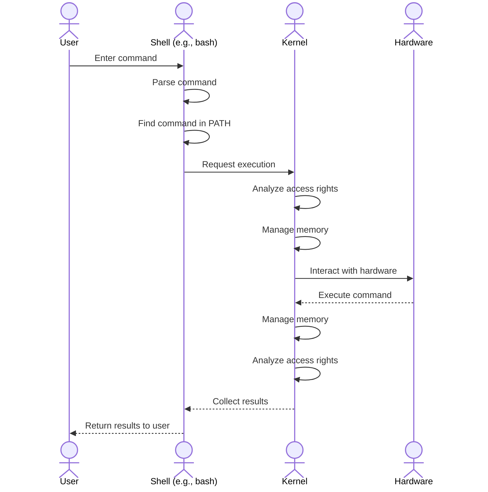

In this lesson, we will learn about the basic Linux commands for navigating directories, managing files and directories, and viewing and editing files. These commands are essential for effectively operating and managing a Linux system.

### How a Command Works in the Linux System

Below is a diagram illustrating how a command works in the Linux system using mermaid syntax:

### 1. Navigating Directories

| Command | Description | Example |
|---------|-------------|---------|
| `ls`    | List files and directories in the current directory | `ls` |
| `cd`    | Change the current working directory | `cd /home/user/Documents` |
| `pwd`   | Display the full path of the current directory | `pwd` |

### 2. Managing Files and Directories

| Command | Description | Example |
|---------|-------------|---------|
| `cp`    | Copy files or directories from one location to another | `cp file1.txt /home/user/backup/` |
| `mv`    | Move or rename files and directories | `mv file1.txt /home/user/Documents/` |
| `rm`    | Delete files or directories | `rm file1.txt` |
| `mkdir` | Create a new directory | `mkdir /home/user/newfolder` |

### 3. Viewing and Editing Files

| Command | Description | Example |
|---------|-------------|---------|
| `cat`   | Display the contents of a file | `cat file1.txt` |
| `nano`  | Open a file in the Nano text editor | `nano file1.txt` |
| `vim`   | Open a file in the Vim text editor | `vim file1.txt` |

### Conclusion

In this lesson, you have mastered the basic commands for navigating directories, managing files and directories, and viewing and editing files on a Linux system. These commands are essential for effectively operating and managing a system. We hope you practice these commands successfully and apply this knowledge to your daily work.