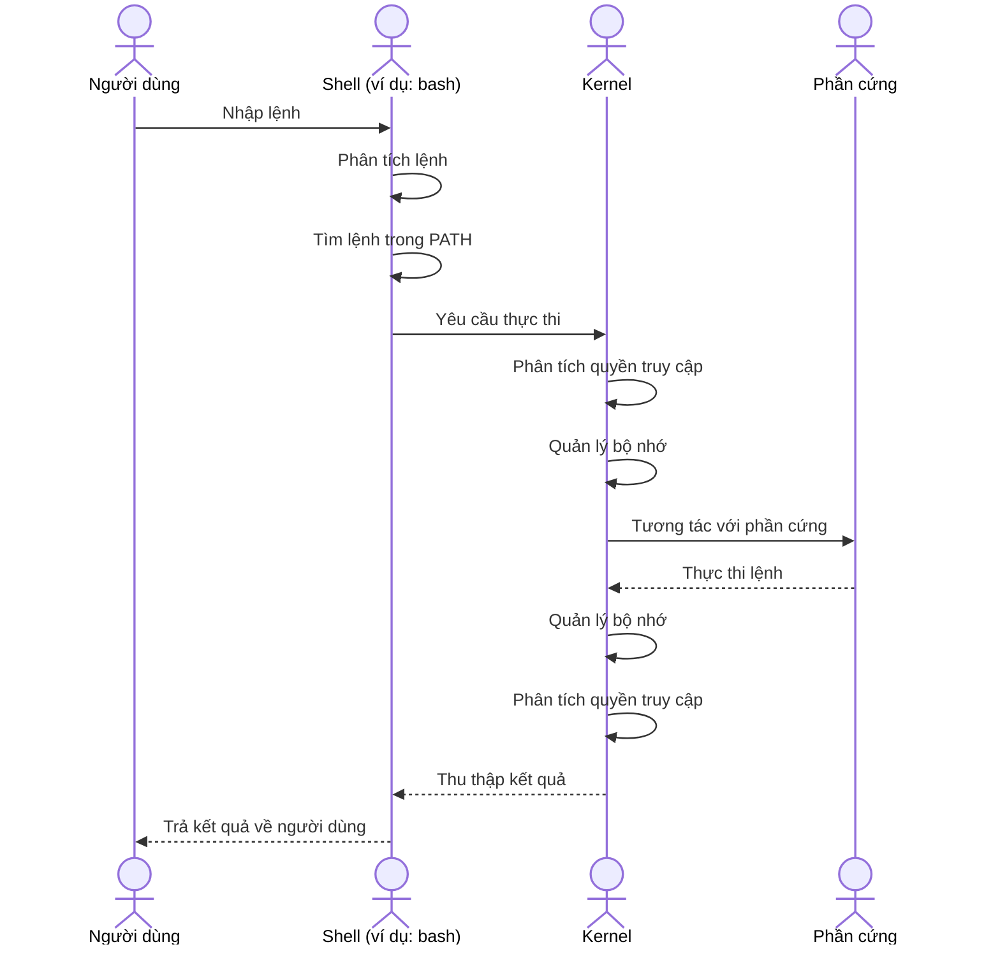

Trong bài học này, chúng ta sẽ tìm hiểu về các lệnh cơ bản của Linux để điều hướng thư mục, quản lý tập tin và thư mục, cũng như xem và chỉnh sửa tệp. Những lệnh này là nền tảng quan trọng giúp bạn thao tác và quản lý hệ thống Linux một cách hiệu quả.

### Cách Một Cú Pháp Hoạt Động Như Thế Nào Trong Hệ Thống Linux

Dưới đây là sơ đồ minh họa cách một cú pháp lệnh hoạt động trong hệ thống Linux bằng cú pháp mermaid:

### 1. Điều Hướng Thư Mục

| Lệnh | Mô tả | Ví dụ |
|------|-------|-------|
| `ls` | Liệt kê các tệp và thư mục trong thư mục hiện tại | `ls` |
| `cd` | Thay đổi thư mục làm việc hiện tại | `cd /home/user/Documents` |
| `pwd` | Hiển thị đường dẫn đầy đủ của thư mục hiện tại | `pwd` |

### 2. Quản Lý Tập Tin và Thư Mục

| Lệnh | Mô tả | Ví dụ |
|------|-------|-------|
| `cp` | Sao chép các tệp hoặc thư mục từ vị trí này sang vị trí khác | `cp file1.txt /home/user/backup/` |
| `mv` | Di chuyển hoặc đổi tên tệp và thư mục | `mv file1.txt /home/user/Documents/` |
| `rm` | Xóa các tệp hoặc thư mục | `rm file1.txt` |
| `mkdir` | Tạo thư mục mới | `mkdir /home/user/newfolder` |

### 3. Xem và Chỉnh Sửa Tệp

| Lệnh | Mô tả | Ví dụ |
|------|-------|-------|
| `cat` | Hiển thị nội dung của một tệp | `cat file1.txt` |
| `nano` | Mở một tệp trong trình soạn thảo văn bản Nano | `nano file1.txt` |
| `vim` | Mở một tệp trong trình soạn thảo văn bản Vim | `vim file1.txt` |

### Kết Luận

Qua bài học này, bạn đã nắm vững các lệnh cơ bản để điều hướng thư mục, quản lý tập tin và thư mục, cũng như xem và chỉnh sửa tệp trên hệ thống Linux. Những lệnh này là nền tảng quan trọng giúp bạn thao tác và quản lý hệ thống một cách hiệu quả. Chúc bạn thực hành thành công và áp dụng kiến thức này vào công việc hàng ngày của mình.