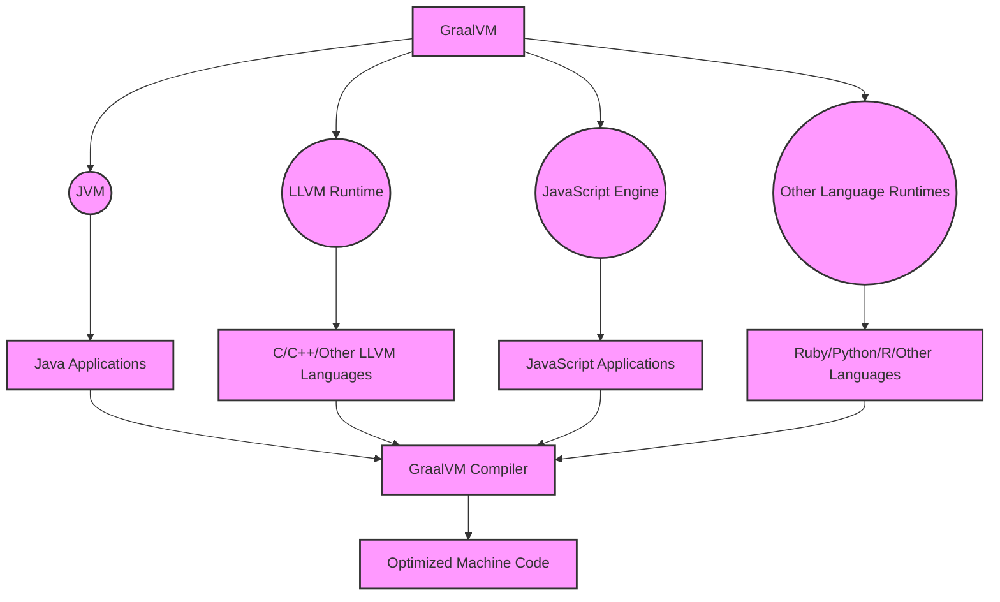

### 1. Introduction to GraalVM

GraalVM is a polyglot virtual machine developed by Oracle. It extends the Java Virtual Machine (JVM) to support additional languages and programming techniques beyond Java. GraalVM not only supports JVM-based languages like Scala, Kotlin but also supports JavaScript, Ruby, R, Python, and even LLVM-compatible languages like C and C++. A notable feature of GraalVM is its ability to perform Ahead-of-Time Compilation to generate native code, improving application performance and startup time.

### 2. Why use GraalVM?

-   **High Performance**: GraalVM improves application performance through a modern JIT compiler and AOT compilation capabilities, optimizing execution speed and reducing startup time.

-   **Multi-Language Support**: Compatibility with multiple programming languages is a significant advantage, allowing for smooth development and integration of applications in different languages.

-   **Cloud and Microservices Optimization**: GraalVM is very suitable for cloud applications and microservices architecture due to its fast startup and low memory consumption.

-   **Extensibility and Integration**: GraalVM provides the ability to integrate with existing Java tools and libraries, helping to expand the functionality of traditional Java applications.

### 3. How does GraalVM work?

GraalVM operates based on a multi-layered and multi-language architecture, allowing it to support and optimize various programming languages.

-   **A [GraalVM]**: The multi-language virtual machine at the center.
-   **B [JVM]**: JVM is the main platform, allowing GraalVM to run Java applications.
-   **C [LLVM Runtime]**: Provides the ability to run languages that can be compiled into LLVM bitcode such as C and C++.
-   **D [JavaScript Engine]**: The execution environment for JavaScript applications.
-   **E [Other Language Runtimes]**: Supports other languages such as Ruby, Python, R, etc.
-   **F, G, H, I**: Applications written in different languages running on GraalVM.
-   **J [GraalVM Compiler]**: GraalVM's powerful JIT/AOT compiler, optimizing code for all supported languages.
-   **K [Optimized Machine Code]**: Optimized machine code, the result of the compilation process.

### 4. Features of GraalVM

-   **Ahead-of-Time Compilation (AOT)**: Creates standalone executable files, reducing application startup time and memory consumption.
-   **JIT Compiler**: Improves application execution performance through a modern JIT compiler.
-   **Multi-Language Support**: Allows running applications written in various languages on the same virtual machine.
-   **Performance Optimization**: Advanced JIT compiler helps optimize the execution performance of different languages.
-   **Polyglot Interop Support**: Allows smooth and efficient interaction between different languages.
-   **GraalVM Native Image**: Provides the ability to create applications as a native image, helping to speed up startup and reduce memory consumption.
-   **Cloud Native Technology Support**: Optimized for cloud applications and microservices, supports containerized architecture and Kubernetes.

### 5. Versions of GraalVM

GraalVM has two main versions: Community Edition and Enterprise Edition.
| Version | Source Code | License | Support | Features |
\| ------------------ \| ----------- \| --------- \| --------- \| ---------------------- \|
| Community Edition | Open Source | GPL v2 | Community | Basic Features |
| Enterprise Edition | Open Source | GPL v2 | Oracle | Advanced Features |

### 6. Supported Languages

GraalVM supports the following languages:

-   **Java**: Java 8, 11, 15, 17, 21
-   **JavaScript**: ECMAScript 2020 (ES11) and ECMAScript 2021 (ES12)
-   **Python**: Python 3.7 and 3.8
-   **Ruby**: Ruby 2.6
-   **R**: R 4.0
-   **LLVM**: C, C++, Fortran, and Rust
-   **WebAssembly**: WebAssembly MVP

### 7. Supported Tools

GraalVM supports the following tools:

-   **GraalVM Updater**: A tool for updating GraalVM. This tool is pre-installed in GraalVM.
-   **GraalVM Language Servers**: Language servers support compilers and language analysis tools.
-   **GraalVM Debugger**: A debugging tool for Java applications and other languages.
-   **GraalVM Profiler**: A performance analysis tool for Java applications and other languages.
-   **GraalVM VisualVM**: A performance analysis tool for Java applications and other languages.
-   **GraalVM Mission Control**: A performance analysis tool for Java applications and other languages.
-   **GraalVM LLVM Runtime**: A tool that supports LLVM applications.
-   **GraalVM LLVM Toolchain**: A tool that supports LLVM applications.
-   **GraalVM LLVM Bitcode Parser**: A tool that supports LLVM applications.
-   **GraalVM LLVM Bitcode Writer**: A tool that supports LLVM applications.
-   **GraalVM LLVM Instrumentation**: A tool that supports LLVM applications.
-   **GraalVM LLVM Runtime**: A tool that supports LLVM applications.

### 8. Supported Libraries

GraalVM supports the following libraries:

-   **Truffle**: Provides APIs for developing compilers for new languages. Truffle is a powerful tool for developing new languages.
-   **Substrate VM**: Provides APIs for developing native image applications.
-   **GraalVM Polyglot API**: Provides APIs for developing multi-language applications.
-   **GraalVM TruffleRuby**: Provides APIs for developing Ruby applications.
-   **GraalVM FastR**: Provides APIs for developing R applications.
-   **GraalVM JavaScript**: Provides APIs for developing JavaScript applications.
-   **GraalVM Python**: Provides APIs for developing Python applications.
-   **GraalVM LLVM Runtime**: Provides APIs for developing LLVM applications.
-   **GraalVM LLVM Toolchain**: Provides APIs for developing LLVM applications.
-   **GraalVM LLVM Bitcode Parser**: Provides APIs for developing LLVM applications.
-   **GraalVM LLVM Bitcode Writer**: Provides APIs for developing LLVM applications.
-   **GraalVM LLVM Instrumentation**: Provides APIs for developing LLVM applications.
-   **GraalVM LLVM Runtime**: Provides APIs for developing LLVM applications.

### 9. Conclusion

In this article, we have learned about GraalVM, a polyglot virtual machine developed by Oracle.

GraalVM is a polyglot virtual machine developed by Oracle. It extends the Java Virtual Machine (JVM) to support additional languages and programming techniques beyond Java. GraalVM not only supports JVM-based languages like Scala, Kotlin but also supports JavaScript, Ruby, R, Python, and even LLVM-compatible languages like C and C++. A notable feature of GraalVM is its ability to perform Ahead-of-Time Compilation to generate native code, improving application performance and startup time.

GraalVM provides a powerful solution for developers who want to maximize performance and flexibility in developing multi-language and multi-platform applications.
