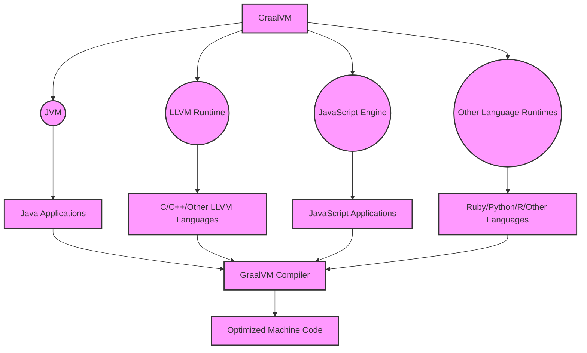

### 1. Giới thiệu GraalVM

GraalVM là một máy ảo đa ngôn ngữ (polyglot virtual machine) được phát triển bởi Oracle. Nó mở rộng Java Virtual Machine (JVM) để hỗ trợ thêm các ngôn ngữ và kỹ thuật lập trình khác ngoài Java. GraalVM không chỉ hỗ trợ các ngôn ngữ dựa trên JVM như Scala, Kotlin mà còn hỗ trợ JavaScript, Ruby, R, Python và thậm chí cả các ngôn ngữ tương thích LLVM như C và C++. Một điểm nổi bật của GraalVM là khả năng biên dịch trước thời gian chạy (Ahead-of-Time Compilation) để tạo ra mã máy gốc, giúp cải thiện hiệu suất và thời gian khởi động của ứng dụng.

### 2. Tại sao nên sử dụng GraalVM?

-   **Hiệu Suất Cao**: GraalVM cải thiện hiệu suất ứng dụng thông qua trình biên dịch JIT hiện đại và khả năng biên dịch AOT, giúp tối ưu hóa tốc độ thực thi và giảm thời gian khởi động.

-   **Hỗ Trợ Đa Ngôn Ngữ**: Khả năng tương thích với nhiều ngôn ngữ lập trình là một lợi thế lớn, cho phép phát triển và tích hợp ứng dụng trong các ngôn ngữ khác nhau một cách mượt mà.

-   **Tối Ưu Hóa Đám Mây và Microservices**: GraalVM rất phù hợp với các ứng dụng đám mây và kiến trúc microservices nhờ khả năng khởi động nhanh và tiêu thụ ít bộ nhớ.

-   **Mở Rộng và Tích Hợp**: GraalVM cung cấp khả năng tích hợp với các công cụ và thư viện Java hiện có, giúp mở rộng chức năng của các ứng dụng Java truyền thống.

### 3. GraalVM hoạt động như thế nào?

GraalVM hoạt động dựa trên một kiến trúc đa tầng và đa ngôn ngữ, cho phép nó hỗ trợ và tối ưu hóa nhiều ngôn ngữ lập trình khác nhau.

-   **A [GraalVM]**: Là máy ảo đa ngôn ngữ ở trung tâm.
-   **B [JVM]**: JVM là nền tảng chính, cho phép GraalVM chạy các ứng dụng Java.
-   **C [LLVM Runtime]**: Cung cấp khả năng chạy các ngôn ngữ có thể biên dịch thành LLVM bitcode như C và C++.
-   **D [JavaScript Engine]**: Môi trường thực thi dành cho ứng dụng JavaScript.
-   **E [Other Language Runtimes]**: Hỗ trợ các ngôn ngữ khác như Ruby, Python, R, v.v.
-   **F, G, H, I**: Các ứng dụng được viết bằng các ngôn ngữ khác nhau chạy trên GraalVM.
-   **J [GraalVM Compiler]**: Trình biên dịch JIT/AOT mạnh mẽ của GraalVM, tối ưu hóa code của tất cả các ngôn ngữ hỗ trợ.
-   **K [Optimized Machine Code]**: Mã máy được tối ưu hóa, kết quả của quá trình biên dịch.

### 4. Các Tính Năng của GraalVM

-   **Biên Dịch Trước Thời Gian Chạy (AOT)**: Tạo ra tệp thực thi độc lập, giảm thời gian khởi động và tiêu thụ bộ nhớ của ứng dụng.
-   **Trình Biên Dịch JIT**: Cải thiện hiệu suất thực thi của ứng dụng thông qua trình biên dịch JIT hiện đại.
-   **Hỗ Trợ Đa Ngôn Ngữ**: Cho phép chạy ứng dụng viết bằng nhiều ngôn ngữ khác nhau trên cùng một máy ảo.
-   **Tối Ưu Hóa Hiệu Suất**: Trình biên dịch JIT tiên tiến giúp tối ưu hóa hiệu suất thực thi của các ngôn ngữ khác nhau.
-   **Hỗ Trợ Polyglot Interop**: Cho phép tương tác giữa các ngôn ngữ khác nhau một cách mượt mà và hiệu quả.
-   **GraalVM Native Image**: Cung cấp khả năng tạo ra ứng dụng dưới dạng native image, giúp tăng tốc độ khởi động và giảm tiêu thụ bộ nhớ.
-   **Hỗ Trợ Công Nghệ Cloud Native**: Tối ưu cho các ứng dụng đám mây và microservices, hỗ trợ kiến trúc container hóa và Kubernetes.

### 5. Các Phiên Bản Của GraalVM

GraalVM có hai phiên bản chính là Community Edition và Enterprise Edition.
| Phiên Bản | Mã Nguồn | Giấy Phép | Hỗ Trợ | Tính Năng |
\| ------------------ \| ----------- \| --------- \| --------- \| ---------------------- \|
| Community Edition | Mã nguồn mở | GPL v2 | Cộng đồng | Các tính năng cơ bản |
| Enterprise Edition | Mã nguồn mở | GPL v2 | Oracle | Các tính năng nâng cao |

### 6. Các Ngôn Ngữ Hỗ Trợ

GraalVM hỗ trợ các ngôn ngữ sau:

-   **Java**: Java 8, 11, 15, 17, 21
-   **JavaScript**: ECMAScript 2020 (ES11) và ECMAScript 2021 (ES12)
-   **Python**: Python 3.7 và 3.8
-   **Ruby**: Ruby 2.6
-   **R**: R 4.0
-   **LLVM**: C, C++, Fortran và Rust
-   **WebAssembly**: WebAssembly MVP

### 7. Các Công Cụ Hỗ Trợ

GraalVM hỗ trợ các công cụ sau:

-   **GraalVM Updater**: Công cụ cập nhật GraalVM. Công cụ này được cài đặt sẵn trong GraalVM.
-   **GraalVM Language Servers**: Các máy chủ ngôn ngữ hỗ trợ các trình biên dịch và các công cụ phân tích ngôn ngữ.
-   **GraalVM Debugger**: Công cụ gỡ lỗi cho các ứng dụng Java và các ngôn ngữ khác.
-   **GraalVM Profiler**: Công cụ phân tích hiệu suất cho các ứng dụng Java và các ngôn ngữ khác.
-   **GraalVM VisualVM**: Công cụ phân tích hiệu suất cho các ứng dụng Java và các ngôn ngữ khác.
-   **GraalVM Mission Control**: Công cụ phân tích hiệu suất cho các ứng dụng Java và các ngôn ngữ khác.
-   **GraalVM LLVM Runtime**: Công cụ hỗ trợ các ứng dụng LLVM.
-   **GraalVM LLVM Toolchain**: Công cụ hỗ trợ các ứng dụng LLVM.
-   **GraalVM LLVM Bitcode Parser**: Công cụ hỗ trợ các ứng dụng LLVM.
-   **GraalVM LLVM Bitcode Writer**: Công cụ hỗ trợ các ứng dụng LLVM.
-   **GraalVM LLVM Instrumentation**: Công cụ hỗ trợ các ứng dụng LLVM.
-   **GraalVM LLVM Runtime**: Công cụ hỗ trợ các ứng dụng LLVM.

### 8. Các Thư Viện Hỗ Trợ

GraalVM hỗ trợ các thư viện sau:

-   **Truffle**: Cung cấp các API để phát triển các trình biên dịch cho các ngôn ngữ mới. Truffle là một công cụ mạnh mẽ cho phát triển các ngôn ngữ mới.
-   **Substrate VM**: Cung cấp các API để phát triển các ứng dụng native image.
-   **GraalVM Polyglot API**: Cung cấp các API để phát triển các ứng dụng đa ngôn ngữ.
-   **GraalVM TruffleRuby**: Cung cấp các API để phát triển các ứng dụng Ruby.
-   **GraalVM FastR**: Cung cấp các API để phát triển các ứng dụng R.
-   **GraalVM JavaScript**: Cung cấp các API để phát triển các ứng dụng JavaScript.
-   **GraalVM Python**: Cung cấp các API để phát triển các ứng dụng Python.
-   **GraalVM LLVM Runtime**: Cung cấp các API để phát triển các ứng dụng LLVM.
-   **GraalVM LLVM Toolchain**: Cung cấp các API để phát triển các ứng dụng LLVM.
-   **GraalVM LLVM Bitcode Parser**: Cung cấp các API để phát triển các ứng dụng LLVM.
-   **GraalVM LLVM Bitcode Writer**: Cung cấp các API để phát triển các ứng dụng LLVM.
-   **GraalVM LLVM Instrumentation**: Cung cấp các API để phát triển các ứng dụng LLVM.
-   **GraalVM LLVM Runtime**: Cung cấp các API để phát triển các ứng dụng LLVM.

### 9. Kết Luận

Trong bài viết này, chúng ta đã tìm hiểu về GraalVM, một máy ảo đa ngôn ngữ (polyglot virtual machine) được phát triển bởi Oracle.

GraalVM là một máy ảo đa ngôn ngữ (polyglot virtual machine) được phát triển bởi Oracle. Nó mở rộng Java Virtual Machine (JVM) để hỗ trợ thêm các ngôn ngữ và kỹ thuật lập trình khác ngoài Java. GraalVM không chỉ hỗ trợ các ngôn ngữ dựa trên JVM như Scala, Kotlin mà còn hỗ trợ JavaScript, Ruby, R, Python và thậm chí cả các ngôn ngữ tương thích LLVM như C và C++. Một điểm nổi bật của GraalVM là khả năng biên dịch trước thời gian chạy (Ahead-of-Time Compilation) để tạo ra mã máy gốc, giúp cải thiện hiệu suất và thời gian khởi động của ứng dụng.

GraalVM cung cấp một giải pháp mạnh mẽ cho các nhà phát triển muốn tận dụng tối đa hiệu suất và tính linh hoạt trong việc phát triển ứng dụng đa ngôn ngữ và đa nền tảng.
