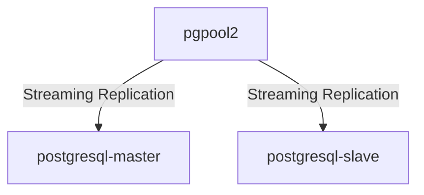

---
categories:
  - database
date: 2024-02-22T08:00:00+08:00
draft: true
featuredImage: /series/postgresql.png
images:
  - /cai-dat-va-bao-mat-postgresql-16-tren-ubuntu-2304/images/index.png
  - /series/postgresql.png
license: <a rel="license external nofollow noopener noreffer" href="https://creativecommons.org/licenses/by-nc/4.0/" target="_blank">CC BY-NC 4.0</a>
tags:
  - Database
  - PostgreSQL
  - Ubuntu
  - PostgreSQL 16
title: Pgpool-II và PostgreSQL 16 Replication
url: /labs/postgresql/pgpool-postgresql-16-replication
description : PostgreSQL có tính năng sao chép tầng, cho phép sao chép dữ liệu từ DB này sang DB khác, tạo nhiều bản sao dữ liệu. Tính năng này giúp phân phối dữ liệu, đảm bảo dữ liệu mới nhất và hỗ trợ thay thế máy chủ chính.
weight: 1
---

# Pgpool-II là gì 

PGpool-II là một giải pháp trung gian độc đáo, được thiết kế đặc biệt để tối ưu hóa và mở rộng khả năng của hệ quản trị cơ sở dữ liệu PostgreSQL. Nó mang lại nhiều lợi ích như việc tối ưu hóa kết nối, phân phối tải đều và thực hiện sao chép dữ liệu, biến PGpool-II thành công cụ không thể thiếu trong quản lý các triển khai PostgreSQL. Trong hướng dẫn chi tiết này, chúng ta sẽ đi qua các bước để cài đặt và cấu hình PGpool-II trên hệ điều hành Ubuntu Linux, giúp bạn khai thác tối đa hiệu suất và tính sẵn sàng cao của cơ sở dữ liệu của mình.

# Kiến trúc cài đặt

Trước khi bắt đầu ta cần chuẩn bị 3 máy chủ

| IP           | Hostname          | vCPU   | RAM | DISK | OS           |
| ------------ | ----------------- | ------ | --- | ---- | ------------ |
| 192.168.56.1 | pgpool2           | 2 core | 4G  | 50G  | Ubuntu 22.04 |
| 192.168.56.2 | postgresql-master | 4 core | 8G  | 50G  | Ubuntu 22.04 |
| 192.168.56.3 | postgresql-slave  | 4 core | 8G  | 50G  | Ubuntu 22.04 |

## Cài đặt PostgreSQL 16

[Cài đặt và bảo mật PostgreSQL 16 trên Ubuntu 22.04](/cai-dat-va-bao-mat-postgresql-16-tren-ubuntu-2304)
trên 2 máy chủ `postgresql-master` và `postgresql-slave`