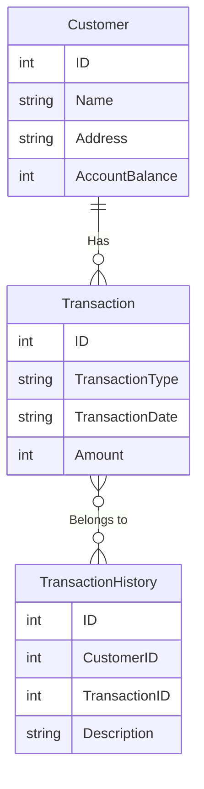

# What is ACID?

ACID is an acronym for four important properties in transaction management in database systems:

1.  **_Atomicity_**: Atomicity ensures that a transaction will be performed atomically. It means that the transaction will either complete or not complete, there is no intermediate state. If a part of the transaction fails, the entire transaction will be cancelled and the data will return to its original state.

2.  **_Consistency_**: Consistency ensures that a transaction will bring the database from one valid state to another valid state. It ensures that the data will always comply with the rules and constraints previously defined in the database.

3.  **_Isolation_**: Isolation ensures that a transaction does not affect other transactions happening simultaneously. It prevents access to uncommitted data of a transaction by other transactions.

4.  **_Durability_**: Durability ensures that once a transaction has been committed, the stored data will persist and will not be lost even in the event of system failures such as hardware errors or power outages.

# Example

We have the following tables:

**"Customers" Table:**

| ID (Primary Key) | Name    | Address          | Account Balance |
| ---------------- | ------- | ---------------- | --------------- |
| 1                | Alice   | 123 Elm Street   | 1000            |
| 2                | Bob     | 456 Oak Street   | 800             |
| 3                | Charlie | 789 Maple Avenue | 1500            |

**"Transactions" Table:**

| ID (Primary Key) | Transaction Type | Transaction Date | Amount |
| ---------------- | ---------------- | ---------------- | ------ |
| 1                | Transfer         | 2023-11-01       | 200    |
| 2                | Withdrawal       | 2023-11-02       | 50     |
| 3                | Deposit          | 2023-11-03       | 100    |
| 4                | Transfer         | 2023-11-04       | 300    |
| 5                | Withdrawal       | 2023-11-05       | 75     |

**"Transaction History" Table:**

| ID (Primary Key) | Customer ID (Foreign Key) | Transaction ID (Foreign Key) | Description              |
| ---------------- | ------------------------- | ---------------------------- | ------------------------ |
| 1                | 1                         | 1                            | Transfer 200 to Bob      |
| 2                | 2                         | 2                            | Withdraw 50 from Bob     |
| 3                | 1                         | 3                            | Deposit 100 to Alice     |
| 4                | 1                         | 4                            | Transfer 300 to Charlie  |
| 5                | 3                         | 5                            | Withdraw 75 from Charlie |

In this example, the "Customers" table contains information about the customers and their account balances. The "Transactions" table contains information about the bank transactions, including the type of transaction, the transaction date, and the amount involved. The "Transaction History" table records the transaction history of each customer, including a detailed description of each transaction.

The ACID properties such as Atomicity, Consistency, Isolation, and Durability ensure that the transactions are performed safely, and the data is not lost or inconsistent in case of failures.
