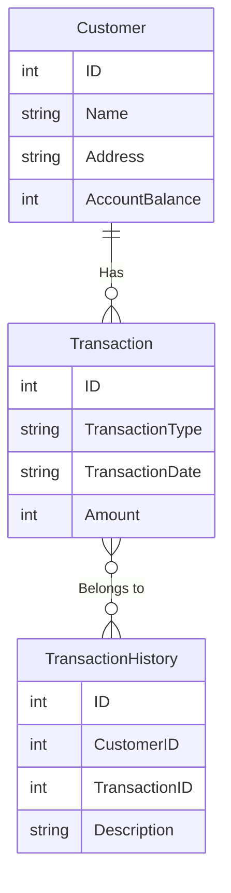

# ACID là gì?

ACID là viết tắt của bốn thuộc tính quan trọng trong quản lý giao dịch trong hệ thống cơ sở dữ liệu:

1.  **_Atomicity (Nguyên tử hóa)_**: Atomicity đảm bảo rằng một giao dịch sẽ được thực hiện một cách nguyên tử. Nó có nghĩa là giao dịch sẽ hoàn thành hoặc không hoàn thành, không có trạng thái trung gian. Nếu một phần của giao dịch thất bại, toàn bộ giao dịch sẽ bị hủy và dữ liệu sẽ trở lại trạng thái ban đầu.

2.  **_Consistency (Nhất quán)_**: Consistency đảm bảo rằng một giao dịch sẽ đưa cơ sở dữ liệu từ một trạng thái hợp lệ đến một trạng thái hợp lệ khác. Nó đảm bảo rằng dữ liệu sẽ luôn tuân theo các quy tắc và ràng buộc được định nghĩa trước trong cơ sở dữ liệu.

3.  **_Isolation (Cô lập)_**: Isolation đảm bảo rằng một giao dịch không ảnh hưởng đến các giao dịch khác đang diễn ra đồng thời. Nó ngăn chặn việc truy cập dữ liệu chưa được commit của một giao dịch bởi các giao dịch khác.

4.  **_Durability (Bền vững)_**: Durability đảm bảo rằng khi một giao dịch đã được commit, thì dữ liệu đã được lưu trữ sẽ tồn tại và không bị mất ngay cả khi có sự cố trong hệ thống như lỗi phần cứng hoặc mất điện.

# Ví dụ

Chúng ta có các bảng sau:

**Bảng "Khách hàng":**

| ID (Khóa chính) | Tên     | Địa chỉ          | Số dư tài khoản |
| --------------- | ------- | ---------------- | --------------- |
| 1               | Alice   | 123 Elm Street   | 1000            |
| 2               | Bob     | 456 Oak Street   | 800             |
| 3               | Charlie | 789 Maple Avenue | 1500            |

**Bảng "Giao dịch":**

| ID (Khóa chính) | Loại giao dịch | Ngày giao dịch | Số tiền |
| --------------- | -------------- | -------------- | ------- |
| 1               | Chuyển khoản   | 2023-11-01     | 200     |
| 2               | Rút tiền       | 2023-11-02     | 50      |
| 3               | Nạp tiền       | 2023-11-03     | 100     |
| 4               | Chuyển khoản   | 2023-11-04     | 300     |
| 5               | Rút tiền       | 2023-11-05     | 75      |

**Bảng "Lịch Sử Giao Dịch" (Transaction History):**

| ID (Khóa chính) | ID Khách Hàng (Khóa ngoại) | ID Giao Dịch (Khóa ngoại) | Mô Tả                  |
| --------------- | -------------------------- | ------------------------- | ---------------------- |
| 1               | 1                          | 1                         | Chuyển 200 đến Bob     |
| 2               | 2                          | 2                         | Rút 50 từ Bob          |
| 3               | 1                          | 3                         | Nạp 100 vào Alice      |
| 4               | 1                          | 4                         | Chuyển 300 đến Charlie |
| 5               | 3                          | 5                         | Rút 75 từ Charlie      |

Trong ví dụ này, bảng "Lịch Sử Giao Dịch" chứa thông tin về lịch sử giao dịch của các khách hàng, bao gồm một mô tả chi tiết về từng giao dịch. Các trường dữ liệu bao gồm ID (khóa chính) để xác định mỗi bản ghi một cách duy nhất, ID Khách Hàng (khóa ngoại) để liên kết với bảng "Khách Hàng," ID Giao Dịch (khóa ngoại) để liên kết với bảng "Giao Dịch," và Mô Tả để ghi chú về mỗi giao dịch.
