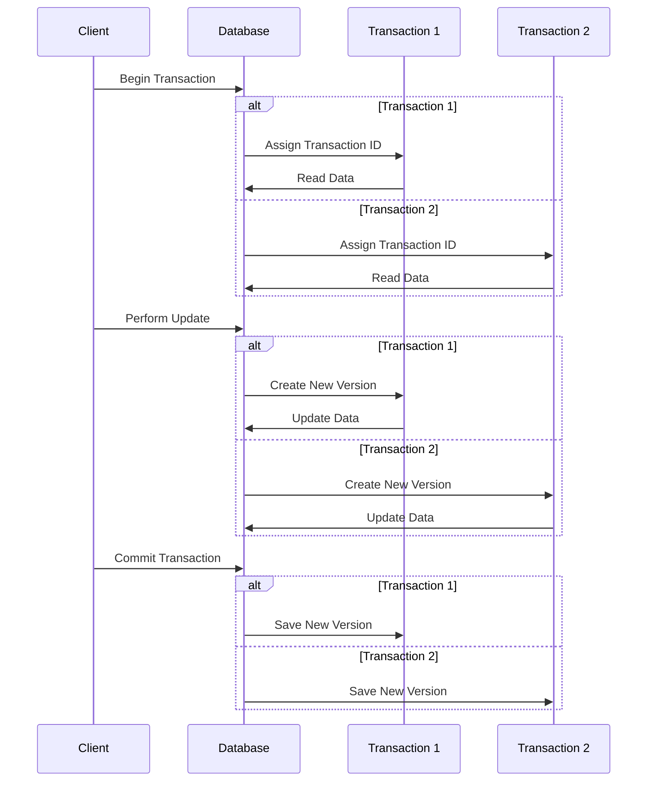
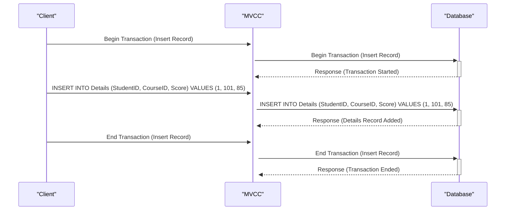
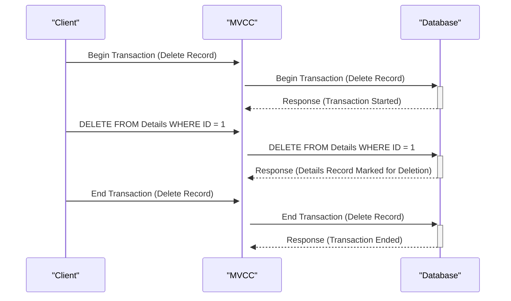
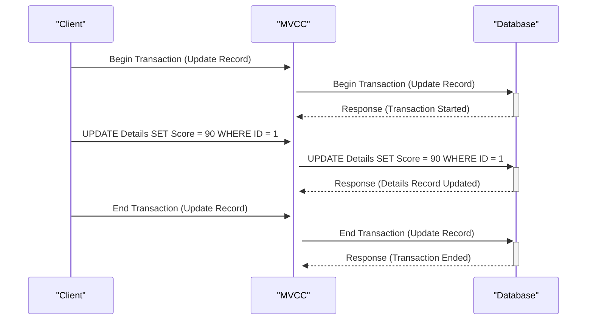
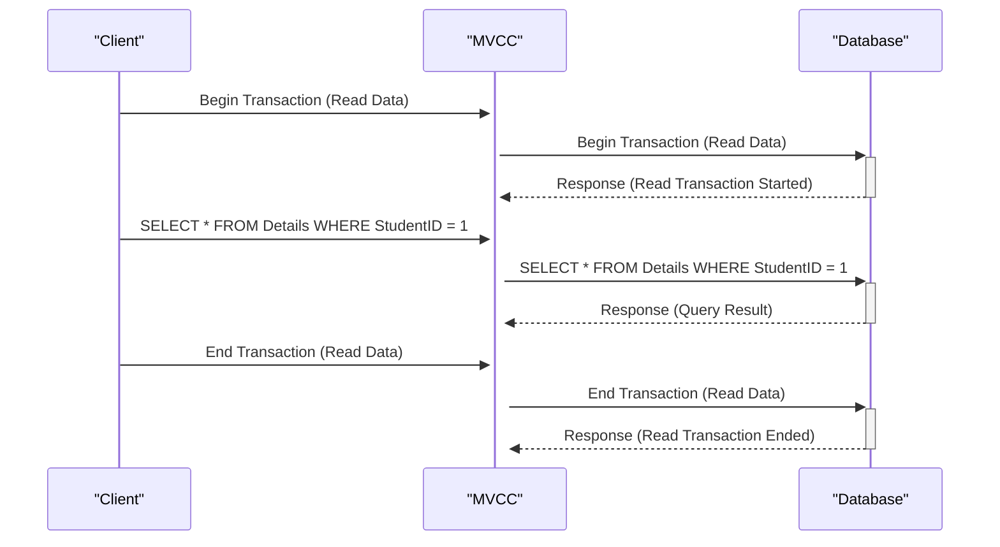

## What is MVCC?

One of the important and attractive points of the PostgreSQL database management system is how it handles contention between transactions. In PostgreSQL, reading data never blocks writing data and vice versa. This is accomplished through a mechanism called "Multi Version Concurrency Control" (MVCC).

MVCC is not a unique feature of PostgreSQL, it is also implemented in some other database management systems such as Oracle, Berkeley DB, CouchDB, and many other systems. What's important is understanding how PostgreSQL implements MVCC, as this helps software developers design applications capable of concurrent operation using PostgreSQL, and also helps solve a range of complex problems that may arise in the future.

## How does MVCC work?

In the above sequence diagram, we have two transactions, Transaction 1 and Transaction 2, being performed concurrently on the database.

1.  Each transaction starts with the Client calling "Begin Transaction" with the database.
2.  The database then assigns a unique transaction ID to each transaction to track them.
3.  Transaction 1 and Transaction 2 perform data reading (Read Data) from the database.
4.  After reading the data, both transactions perform data updating (Perform Update). The database creates a new version of the data to ensure consistency.
5.  Finally, both transactions end by calling "Commit Transaction" and the database saves the new version of the data.

### Detailed process of inserting a record into the database

1.  **_Client_** starts the transaction by sending a request to insert a record to **_MVCC_**.

2.  **_MVCC_** receives the request from **_Client_** and proceeds by sending a request to insert a record to **_Database_**.

3.  **_Database_** receives the request from **_MVCC_** and confirms that the transaction has started.

4.  **_Client_** executes the **_INSERT INTO_** query to insert a record into the database. In this example, the record is inserted into the **_Details_** table with the values **_StudentID_**, **_CourseID_**, and **_Score_** being **_1_**, **_101_**, and **_85_** respectively.

5.  **_MVCC_** receives the **_INSERT INTO_** query from **_Client_** and proceeds by sending it to **_Database_**.

6.  **_Database_** performs the insertion of the record into the **_Details_** table and then sends a response to MVCC to inform that the **_Details_** record has been successfully added.

7.  **_Client_** ends the transaction by sending a request to end the transaction to **_MVCC_**.

8.  **_MVCC_** proceeds by sending the request to end the transaction to **_Database_**.

9.  **_Database_** receives the request to end the transaction from **_MVCC_** and confirms that the transaction has ended.

Thus, the process of inserting a record into the **_Database_** via MVCC includes the steps of starting the transaction, executing the INSERT INTO query, and ending the transaction, ensuring concurrency and avoiding conflicts between different transactions.

### Detailed process of deleting a record from the database

1.  **_Client_** starts the transaction by sending a request to delete a record to **_MVCC_**.

2.  **_MVCC_** receives the request from **_Client_** and proceeds by sending a request to delete a record to **_Database_**.

3.  **_Database_** receives the request from **_MVCC_** and confirms that the transaction has started.

4.  **_Client_** executes the **_DELETE FROM_** query to delete a record from the **_Details_** table based on the condition **_WHERE ID = 1_**. In this example, the record with ID 1 will be deleted.

5.  **_MVCC_** receives the **_DELETE FROM_** query from **_Client_** and proceeds by sending it to **_Database_**.

6.  The database performs the deletion of the record from the **_Details_** table based on the given condition and then sends a response to MVCC to inform that the record has been marked for deletion.

7.  **_Client_** ends the transaction by sending a request to end the transaction to **_MVCC_**.

8.  **_MVCC_** proceeds by sending the request to end the transaction to **_Database_**.

9.  **_Database_** receives the request to end the transaction from **_MVCC_** and confirms that the transaction has ended.

Thus, the process of deleting a record from the **_Database_** via MVCC includes the steps of starting the transaction, executing the DELETE query, and ending the transaction, ensuring concurrency and avoiding conflicts between different transactions.

### Detailed process of updating a record in the database

1.  **_Client_** starts the transaction by sending a request to update a record to **_MVCC_**.

2.  **_MVCC_** receives the request from **_Client_** and proceeds by sending a request to update a record to **_Database_**.

3.  **_Database_** receives the request from **_MVCC_** and confirms that the transaction has started.

4.  **_Client_** executes the **_UPDATE_** query to update a record in the **_Details_** table. In this example, the record with ID 1 will be updated with a new value for the **_Score_** field of **_90_**.

5.  **_MVCC_** receives the **_UPDATE_** query from **_Client_** and proceeds by sending it to **_Database_**.

6.  **_Database_** performs the update of the record in the **_Details_** table based on the given **_UPDATE_** query and then sends a response to **_MVCC_** to inform that the record has been updated.

7.  **_Client_** ends the transaction by sending a request to end the transaction to **_MVCC_**.

8.  **_MVCC_** proceeds by sending the request to end the transaction to **_Database_**.

9.  **_Database_** receives the request to end the transaction from **_MVCC_** and confirms that the transaction has ended.

Thus, the process of updating a record in the **_Database_** via MVCC includes the steps of starting the transaction, executing the UPDATE query, and ending the transaction, ensuring concurrency and avoiding conflicts between different transactions.

### Process of reading data from the database

1.  **_Client_** starts a read data transaction and sends a request to **_MVCC_**.

2.  **_MVCC_** continues by sending a read data request to **_Database_**.

3.  **_Database_** processes the request and returns the result (data) to **_MVCC_**.

4.  **_MVCC_** returns the read data result to **_Client_**.

5.  Finally, **_Client_** ends the read data transaction.

In this process, the Client requests to read data from the database through MVCC, and then MVCC acts as an intermediary to send the request to the Database. The result of the query is data returned from the database through MVCC. After the read data transaction is complete, the Client ends the transaction.

## Advantages of MVCC

1.  Provides concurrency by allowing multiple transactions to occur simultaneously.
2.  Each transaction is independent of others.
3.  Creates multiple versions of the database, providing real-time data recovery capabilities.

## Disadvantages of MVCC

1.  MVCC requires more memory and can be more complex than regular databases.
2.  They can be slower due to processing multiple queries at once.
3.  Old versions of data may not be removed from the database, leading to an increase in database size.
