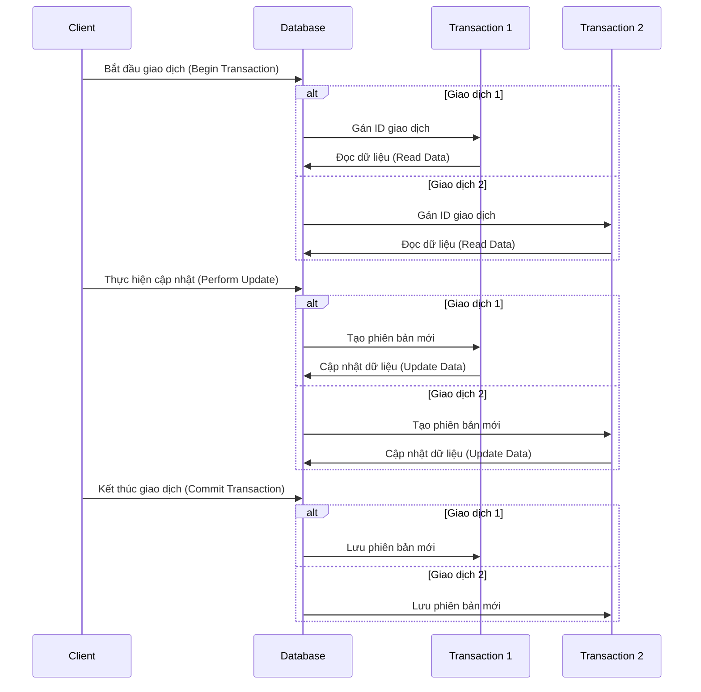
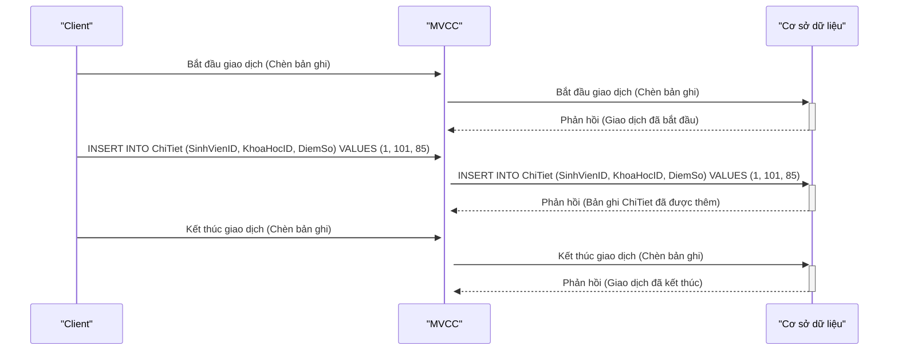
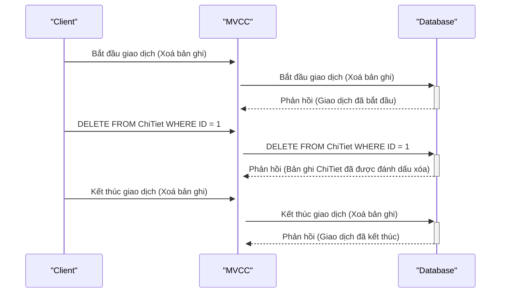
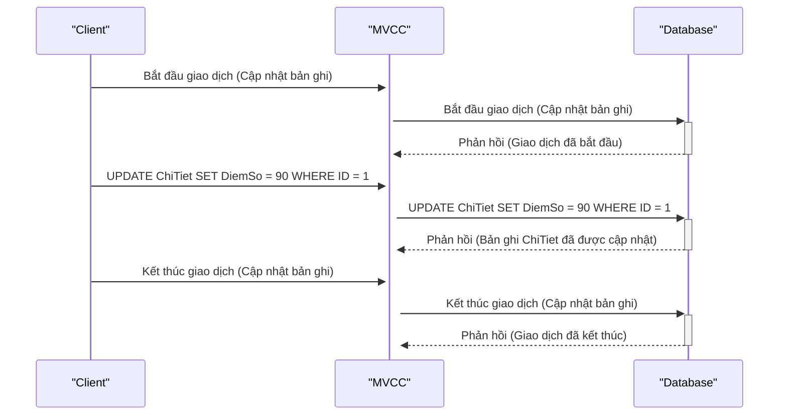
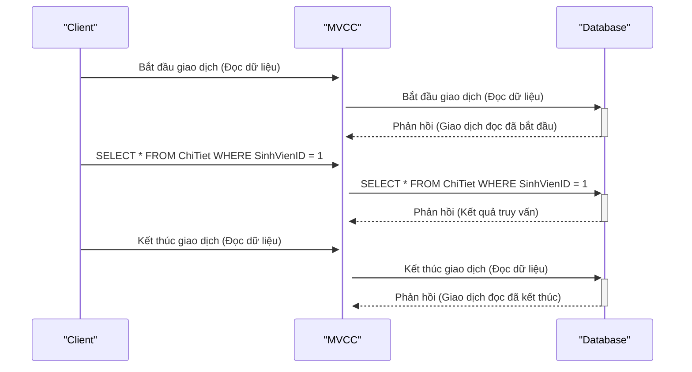

## MVCC là gì?

Một trong những điểm quan trọng và hấp dẫn của hệ quản trị cơ sở dữ liệu PostgreSQL là cách nó xử lý tương tranh giữa các giao dịch (transaction). Trong PostgreSQL, việc đọc dữ liệu không bao giờ chặn việc ghi dữ liệu và ngược lại. Điều này được thực hiện thông qua một cơ chế gọi là "Multi Version Concurrency Control" (MVCC), hay Kiểm soát Tương tranh Đa Phiên Bản.

MVCC không phải là một đặc điểm duy nhất của PostgreSQL, mà nó cũng được triển khai trong một số hệ quản trị cơ sở dữ liệu khác như Oracle, Berkeley DB, CouchDB và nhiều hệ thống khác. Điều quan trọng là hiểu cách PostgreSQL thực hiện MVCC, vì điều này giúp các nhà phát triển phần mềm thiết kế ứng dụng có khả năng hoạt động đồng thời mà sử dụng PostgreSQL, và cũng giúp giải quyết một loạt vấn đề phức tạp có thể xảy ra trong tương lai.

## MVCC hoạt động như thế nào?

Trong sơ đồ tuần tự trên, chúng ta có hai giao dịch, Giao dịch 1 và Giao dịch 2, được thực hiện song song trên cơ sở dữ liệu.

1.  Mỗi giao dịch bắt đầu bằng việc Client gọi "Bắt đầu giao dịch (Begin Transaction)" với cơ sở dữ liệu.
2.  Sau đó, cơ sở dữ liệu gán một ID giao dịch duy nhất cho mỗi giao dịch để theo dõi chúng.
3.  Giao dịch 1 và Giao dịch 2 thực hiện đọc dữ liệu (Read Data) từ cơ sở dữ liệu.
4.  Sau khi đọc dữ liệu, cả hai giao dịch thực hiện cập nhật dữ liệu (Perform Update). Cơ sở dữ liệu tạo phiên bản mới của dữ liệu để đảm bảo tính nhất quán.
5.  Cuối cùng, cả hai giao dịch kết thúc bằng cách gọi "Kết thúc giao dịch (Commit Transaction)" và cơ sở dữ liệu lưu phiên bản mới của dữ liệu.

### Quá trình thực hiện chèn (insert) một bản ghi chi tiết vào cơ sở dữ liệu

1.  **_Client_** bắt đầu giao dịch bằng cách gửi một yêu cầu chèn bản ghi vào **_MVCC_**.

2.  **_MVCC_** nhận được yêu cầu từ **_Client_** và tiếp tục bằng việc gửi một yêu cầu chèn bản ghi vào **_Database_**.

3.  **_Database_** nhận được yêu cầu từ **_MVCC_** và xác nhận rằng giao dịch đã được bắt đầu.

4.  **_Client thực_** hiện câu truy vấn **_INSERT INTO_** để chèn bản ghi vào cơ sở dữ liệu. Trong ví dụ này, bản ghi được chèn vào bảng **_ChiTiet_** với các giá trị **_SinhVienID_**, **_KhoaHocID_** và **_DiemSo_** là **_1_**, **_101_** và **_85_** tương ứng.

5.  **_MVCC_** nhận câu truy vấn **_INSERT INTO_** từ **_Client_** và tiếp tục gửi nó đến **_Database_**.

6.  **_Database_** thực hiện việc chèn bản ghi vào bảng **_ChiTiet_** và sau đó gửi phản hồi cho MVCC để thông báo rằng bản ghi **_ChiTiet_** đã được thêm thành công.

7.  **_Client_** kết thúc giao dịch bằng cách gửi một yêu cầu kết thúc giao dịch đến **_MVCC_**.

8.  **_MVCC_** tiếp tục bằng việc gửi yêu cầu kết thúc giao dịch đến **_Database_**.

9.  **_Database_** nhận yêu cầu kết thúc giao dịch từ **_MVCC_** và xác nhận rằng giao dịch đã kết thúc.

Như vậy, quá trình chèn một bản ghi vào **_Database_** qua MVCC bao gồm các bước bắt đầu giao dịch, thực hiện câu truy vấn INSERT INTO, và kết thúc giao dịch, đảm bảo tính đồng thời và không xảy ra xung đột giữa các giao dịch khác nhau.

### Quá trình thực hiện xoá (delete) một bản ghi chi tiết vào cơ sở dữ liệu

1.  **_Client_** bắt đầu giao dịch bằng cách gửi một yêu cầu xoá bản ghi từ **_MVCC_**.

2.  **_MVCC_** nhận được yêu cầu từ **_Client_** và tiếp tục bằng việc gửi một yêu cầu xoá bản ghi đến **_Database_**.

3.  **_Database_** nhận được yêu cầu từ **_MVCC_** và xác nhận rằng giao dịch đã được bắt đầu.

4.  **_Client_** thực hiện câu truy vấn **_DELETE FROM_** để xoá bản ghi từ bảng **_ChiTiet_** dựa trên điều kiện **_WHERE ID = 1_**. Trong ví dụ này, bản ghi có ID là 1 sẽ bị xoá.

5.  **_MVCC_** nhận câu truy vấn **_DELETE FROM_** từ **_Client_** và tiếp tục gửi nó đến **_Database_**.

6.  Cơ sở dữ liệu thực hiện xoá bản ghi từ bảng **_ChiTiet_** dựa trên điều kiện đã cho và sau đó gửi phản hồi cho MVCC để thông báo rằng bản ghi đã được đánh dấu xóa.

7.  **_Client_** kết thúc giao dịch bằng cách gửi một yêu cầu kết thúc giao dịch đến **_MVCC_**.

8.  **_MVCC_** tiếp tục bằng việc gửi yêu cầu kết thúc giao dịch đến **_Database_**.

9.  Cơ sở dữ liệu nhận yêu cầu kết thúc giao dịch từ **_MVCC_** và xác nhận rằng giao dịch đã kết thúc.

Như vậy, quá trình thực hiện xoá (delete) một bản ghi từ cơ sở dữ liệu thông qua MVCC bao gồm các bước bắt đầu giao dịch, thực hiện câu truy vấn DELETE, và kết thúc giao dịch, đảm bảo tính đồng thời và không xảy ra xung đột giữa các giao dịch khác nhau.

### Quá trình thực hiện cập nhật (update) một bản ghi chi tiết vào cơ sở dữ liệu

1.  **_Client_** bắt đầu giao dịch bằng cách gửi một yêu cầu cập nhật bản ghi từ **_MVCC_**.

2.  **_MVCC_** nhận được yêu cầu từ Client và tiếp tục bằng việc gửi một yêu cầu cập nhật bản ghi đến **_Database_**.

3.  **_Database_** nhận được yêu cầu từ **_MVCC_** và xác nhận rằng giao dịch đã được bắt đầu.

4.  **_Client_** thực hiện câu truy vấn **_UPDATE_** để cập nhật bản ghi trong bảng **_ChiTiet_**. Trong ví dụ này, bản ghi có ID là 1 sẽ được cập nhật với giá trị mới của trường **_DiemSo_** là **_90_**.

5.  **_MVCC_** nhận câu truy vấn **_UPDATE_** từ **_Client_** và tiếp tục gửi nó đến **_Database_**.

6.  **_Database_** thực hiện cập nhật bản ghi trong bảng **_ChiTiet_** dựa trên câu truy vấn **_UPDATE_** đã cho và sau đó gửi phản hồi cho **_MVCC_** để thông báo rằng bản ghi đã được cập nhật.

7.  **_Client_** kết thúc giao dịch bằng cách gửi một yêu cầu kết thúc giao dịch đến **_MVCC_**.

8.  **_MVCC_** tiếp tục bằng việc gửi yêu cầu kết thúc giao dịch đến **_Database_**.

9.  **_Database_** nhận yêu cầu kết thúc giao dịch từ **_MVCC_** và xác nhận rằng giao dịch đã kết thúc.

Quá trình thực hiện cập nhật (update) một bản ghi trong cơ sở dữ liệu thông qua MVCC bao gồm các bước bắt đầu giao dịch, thực hiện câu truy vấn UPDATE và kết thúc giao dịch, đảm bảo tính đồng thời và không xảy ra xung đột giữa các giao dịch khác nhau.

### Quá trình thực hiện đọc (read) dữ liệu từ cơ sở dữ liệu

1.  **_Client_** bắt đầu một giao dịch đọc dữ liệu và gửi yêu cầu đến **_MVCC_**.

2.  **_MVCC_** tiếp tục gửi yêu cầu đọc dữ liệu đến **_Database_**.

3.  **_Database_** xử lý yêu cầu và trả kết quả (dữ liệu) về **_MVCC_**.

4.  **_MVCC_** trả kết quả đọc dữ liệu cho **_Client_**.

5.  Cuối cùng, **_Client_** kết thúc giao dịch đọc dữ liệu.

Trong quá trình này, Client yêu cầu đọc dữ liệu từ cơ sở dữ liệu thông qua MVCC, và sau đó MVCC làm trung gian để gửi yêu cầu đến Database. Kết quả của truy vấn là dữ liệu được trả về từ cơ sở dữ liệu thông qua MVCC. Sau khi giao dịch đọc dữ liệu hoàn tất, Client kết thúc giao dịch.

## Ưu điểm của MVCC

1.  Cung cấp khả năng đồng thời bằng cách cho phép nhiều giao dịch diễn ra cùng lúc.
2.  Mỗi giao dịch độc lập với các giao dịch khác.
3.  Tạo ra nhiều phiên bản của cơ sở dữ liệu, cung cấp khả năng khôi phục dữ liệu trong thời gian thực.

## Nhược điểm của MVCC

1.  MVCC cần nhiều bộ nhớ hơn và có thể phức tạp hơn cơ sở dữ liệu thông thường.
2.  Chúng có thể chậm hơn do xử lý một số truy vấn cùng một lúc.
3.  Các phiên bản cũ của dữ liệu có thể không được xóa khỏi cơ sở dữ liệu, dẫn đến việc tăng kích thước cơ sở dữ liệu.
